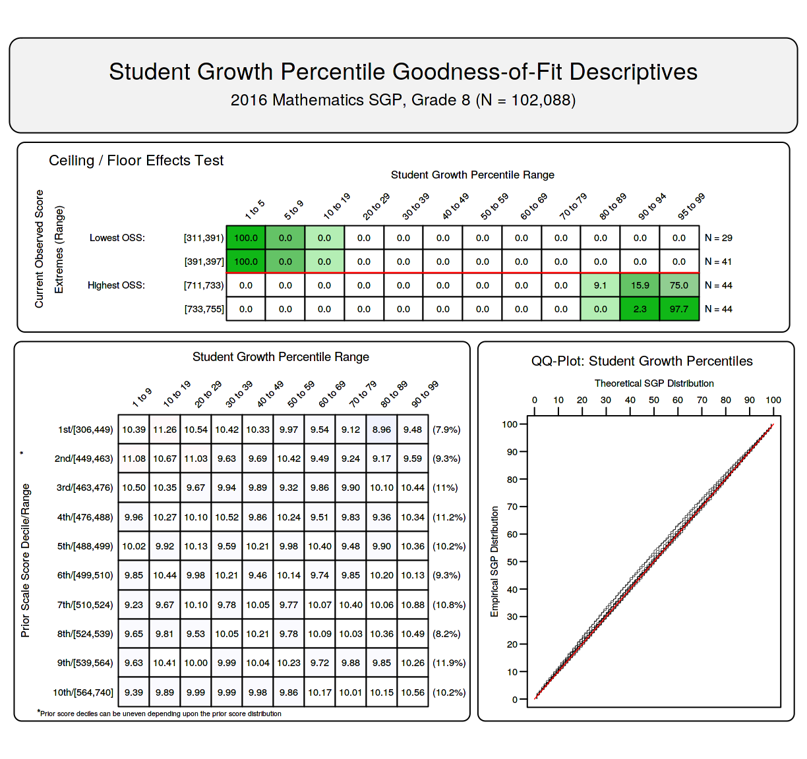
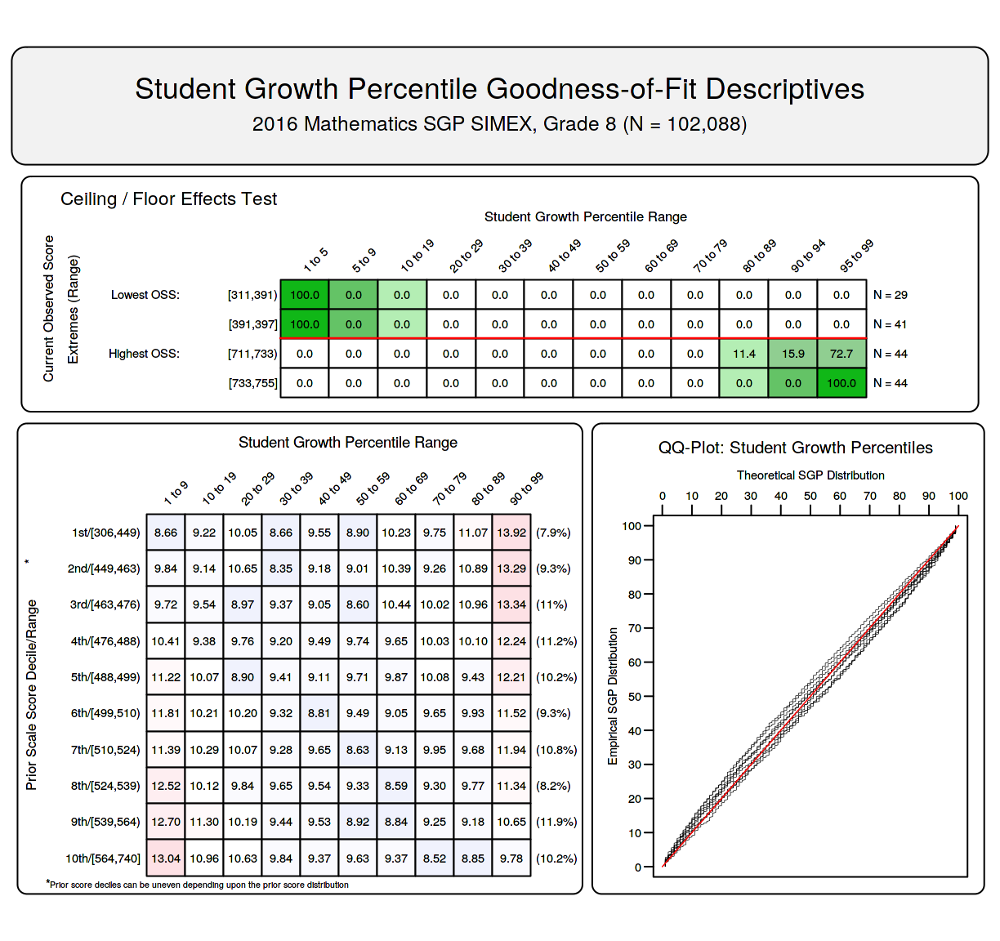
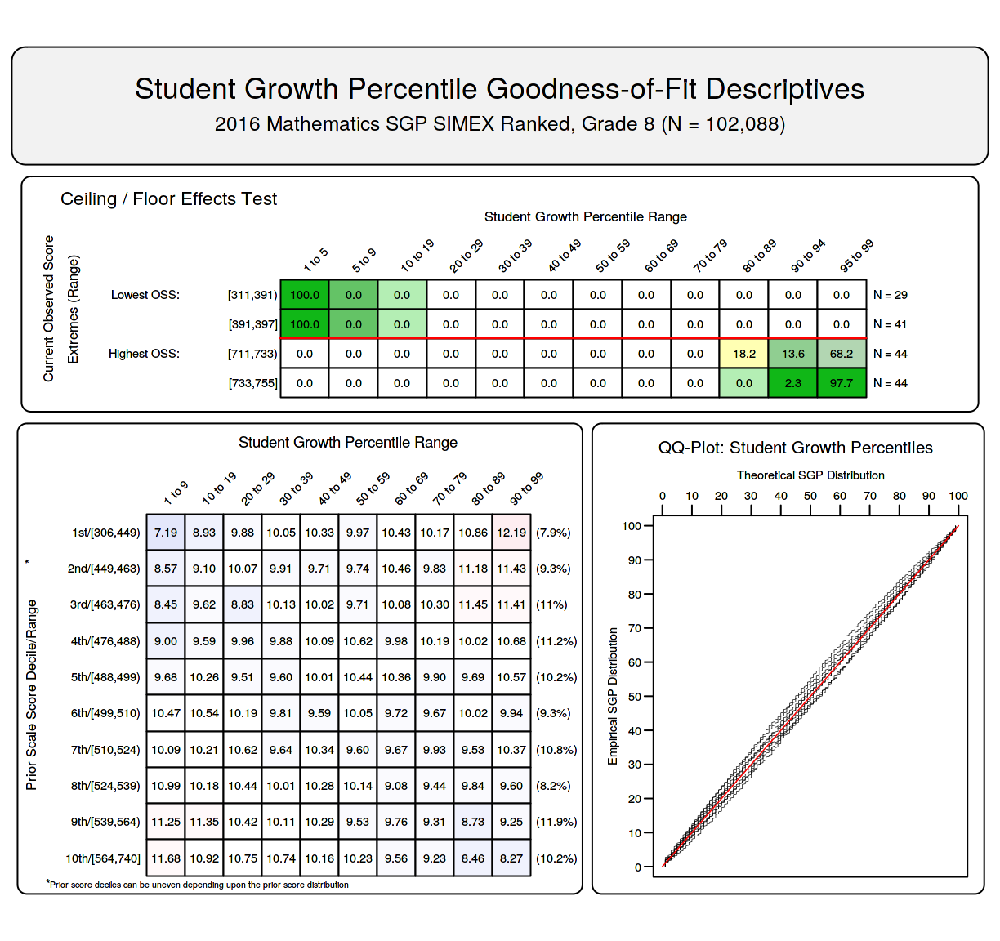

<!--SGPreport-->

<!-- 
This document was written by Adam VanIwaarden for the State of Georgia Department of Education (DOE).

	Original Draft:  April 28, 2017
	Final Draft:     
-->


```{r, echo=FALSE, include=FALSE}
  ## set a universal Cache path
  knitr::opts_chunk$set(cache.path = "_cache/2_pager")

  ##  Load some R packages and functions required for HTML table creation silently.  
  ##  Load SGP and other packages here to avoid messages.
  require(SGP)
	require(data.table)
	require(Gmisc)
  require(htmlTable)

  ##  Set Table, Figure and Equation Counters
  options(table_number=0)
  options("fig_caption_no"=0)
	options(fig_caption_no_sprintf = "**Figure %s:**   %s")
	options("fig_caption_no_roman"=FALSE)
	options("equation_counter" = 0)

	### Lists of grade level subjects.  Used to subset summary tables and data below.
	GL_subjects <- c("ELA", "MATHEMATICS", "SCIENCE", "SOCIAL_STUDIES")

	# use.data.table()

	# renderMultiDocument(rmd_input = "Ranked_SIMEX_SGP.Rmd",
	# 									output_format = c("HTML", "PDF"), # 
	# 									# cleanup_aux_files = FALSE,
	# 									pandoc_args = "--webtex")

```

# Background

Measurement error (ME) is an inherent component of all standardized tests, and the impact that ME can have when test score data are used to compute student growth and teacher/school evaluation measures has been the focus of a growing body of academic research.  Specifically in the area of the Student Growth Percentile (SGP) measures of student progress, ME has been found to create bias that can unfairly disadvantage students with lower prior achievement and vice versa.  This bias is transferred to aggregate measures of educator effectiveness when a disproportionate number of students with relatively low/high prior achievement are concentrated in a classroom or school [@ShangVanIBet:2015; @LockCast:2015].

Researchers have proposed several useful methods for correcting the effects of ME.  The use of Simulation/Extrapolation (SIMEX) techniques has been found to effectively eliminate the ME induced bias related to prior achievement in SGPs [@ShangVanIBet:2015], and this method is a currently available for SGP estimation in the [`SGP` package](https://github.com/CenterForAssessment/SGP) [@sgp2017] for the [`R` statistical program](http://www.r-project.org/).  Currently several states utilize the SIMEX corrected measures in their student growth modeling and evaluation policies.

However, the SIMEX corrected SGPs are also not without their own problems.  At an individual level, the corrected SGPs have larger errors than the uncorrected, or "standard", SGPs [@ShangVanIBet:2015; @McCaLo:2015].  Because of this "bias-variance trade-off" the SIMEX correction is preferred for aggregated SGP results, such as the Mean SGP (MSGP) values typically used for teacher or school evaluation purposes, but the standard SGP is the preferred student level estimate.  McCaffrey, et al. [-@McCaLo:2015] first suggested that ranking the SIMEX SGP values may present a possible alternative that would have the beneficial properties of both SGP estimates.  

The properties of the percentile ranked SIMEX SGP (RS-SGP) were recently investigated at the aggregate level for MSGP estimates of educator effectiveness by Castellano and McCaffrey [-@CastMcCaf:2017].  They found that the majority of the error variance in standard MSGP values is due to "sampling variability" (i.e. a classroom is considered a sample of students), but that a substantial amount was also due to bias caused by ME.  SIMEX correction can remove much of this bias.  By first taking the percentile ranks of the SIMEX corrected values and then aggregating these percentile ranks, the excess variance from the SIMEX estimation is removed.  Furthermore they found that, at the individual level, the distribution of the RS-SGPs is also more uniformly distributed (similar to the standard SGP) rather than the SIMEX SGPs typical U-shaped distribution.  The uniform distribution of the individual SGP values is an important characteristic because it suggests that the full range of SGP values (1-99) is equally likely to be attained.  

Given the potential promise of RS-SGP, it is now calculated along with the SIMEX values in the `SGP` package^[SGP versions 1.7-0.0 and later].  The progress, problems and further insights from that implementation are discussed next.

#  `SGP` Package Implementation of Ranked SIMEX SGP

In their study, Castellano and McCaffrey report simply taking the percentile rank of the computed SIMEX SGP values to get the RS-SGP.  However, unlike the SIMEX SGP values computed in the `SGP` package, they compute their values using a closed-form equation rather than through data simulations.  This strategy helps to understand the theoretical groundings of the various SGP estimates, but it is only appropriate under particular assumptions about the data and ME structures that do not hold in the real world (requiring simulation-base solutions).  Their process also produces continuous SIMEX SGP values, which allow for a more detailed ranking than using the integer values computed in the `SGP` package. 

Without a continuous value, the percentile ranking^[Calculated as (rank(SIMEX SGP)/N) x 100 where N is the number of students. The result is rounded to the nearest integer.] of a set of numbers that is already on a percentile scale did not produce results that differed substantially from the original in absolute value or distribution.  Therefore a solution was required in the simulation process that would allow for a more continuous SIMEX SGP to be established.  The authors suggested that more granular SIMEX SGPs be established in the simulations (personal communication), however this would require the already computationally and time intensive process to take 10 times longer.  A simpler solution was used that allows the estimated SIMEX values to be placed on a 1/8<sup>th</sup> interval by calculating midpoints between the simulated predicted score values for each percentile^[SGP estimates are found by predicting 100 scores for each student - one for each percentile.  The position (1-100) of the predicted score that is closest to a student's observed score is their estimated SGP.].  This resulted in RS-SGP values that were more uniformly distributed in initial tests with real and simulated data.

Figure `r getOption("fig_caption_no")+1` shows the distribution of the three types of SGP estimates for 2016 8<sup>th</sup> Grade Mathematics SGP analyses in Georgia: uncorrected ("standard"), SIMEX corrected and Ranked SIMEX.  Note that these results are from analyses that use up to three years of data (two prior and the current year), which the authors indicate will also greatly reduce ME bias.

##### `r figCapNo("Comparison of the Uniformity of Distributions for 8<sup>th</sup> Grade Mathematics Estimates.")`


By definition, the standard SGP is uniformly distributed *conditional on prior test score*, suggesting that any level of growth is equally likely regardless of prior achievement.  This is a critical distinction, and Castellano and McCaffrey do not discuss the conditional uniformity of the RS-SGP.  We find that this uniformity is not met in either the application of the closed-form equations to simulated data or in our initial tests with real data in the `SGP` package, although the RS-SGP distribution is much closer to uniform than the SIMEX SGP.  

The following figures are "Goodness of Fit" charts that are produced using the `SGP` package for each of the three SGP estimate types, and they can help investigate the SGP distribution in more detail.  The "Student Growth Percentile Range" panel at bottom left shows the empirical distribution of SGPs given prior scale score deciles in the form of a 10 by 10 cell grid.  Percentages of student growth percentiles between the 10<sup>th</sup>, 20<sup>th</sup>, 30<sup>th</sup>, 40<sup>th</sup>, 50<sup>th</sup>, 60<sup>th</sup>, 70<sup>th</sup>, 80<sup>th</sup>, and 90<sup>th</sup> percentiles were calculated based upon the empirical decile of the cohort's prior year scaled score distribution. Perfect uniform distribution conditional on prior score would be indicated by a "10" in each cell.  Deviations from perfect fit are indicated by red and blue shading. The further above 10 the darker the red, and the further below 10 the darker the blue.  The bottom right panel of each plot is a [Q-Q plot](https://en.wikipedia.org/wiki/Q%E2%80%93Q_plot) which compares the observed distribution of SGPs with the theoretical (uniform) distribution.  An ideal plot here will show black step function lines that do not deviate from the ideal, red line which traces the 45 degree angle of perfect fit (as is seen here in the standard SGP plot).

These plots from the same 2016 8<sup>th</sup> Grade Mathematics SGP analyses as depicted above display typical distributions of each SGP variant.  The Standard SGPs are nearly perfectly distributed conditional upon prior achievement.  The SIMEX and, to a lesser extent, the RS-SGP distributions are skewed towards higher percentiles at the lower levels of achievement and vice versa for the higher prior achievement deciles.  

<!-- HTML_Start -->
##### `r figCapNo("Goodness of Fit Plot for 2016 ***Standard*** 8<sup>th</sup> Grade Mathematics SGPs.")`

<!-- LaTeX_Start 
\begin{figure}[H]
  \begin{subfigure}[b]{0.65\textwidth}
    \includegraphics[width=\textwidth]{../img/gofSGP_Grade_8_Standard.png}
  \end{subfigure}
\caption{Goodness of Fit Plot for 2016 \textbf{\textit{Standard}} 8<sup>th</sup> Grade Mathematics SGPs.}
\end{figure}

\pagebreak
LaTeX_End -->


<!-- HTML_Start -->
##### `r figCapNo("Goodness of Fit Plot for 2016 ***SIMEX*** 8<sup>th</sup> Grade Mathematics SGPs.")`

<!-- LaTeX_Start 
\begin{figure}[H]
  \begin{subfigure}[b]{0.65\textwidth}
    \includegraphics[width=\textwidth]{../img/gofSGP_Grade_8_SIMEX.png}
  \end{subfigure}
\caption{Goodness of Fit Plot for 2016 \textbf{\textit{SIMEX}} 8<sup>th</sup> Grade Mathematics SGPs.}
\end{figure}

LaTeX_End -->


<!-- HTML_Start -->
##### `r figCapNo("Goodness of Fit Plot for 2016 ***Ranked SIMEX*** 8<sup>th</sup> Grade Mathematics SGPs.")`


<!-- LaTeX_Start 
\begin{figure}[H]
  \begin{subfigure}[b]{0.65\textwidth}
    \includegraphics[width=\textwidth]{../img/gofSGP_Grade_8_RANKED.png}
  \end{subfigure}
\caption{Goodness of Fit Plot for 2016 \textbf{\textit{Ranked SIMEX}} 8<sup>th</sup> Grade Mathematics SGPs.}
\end{figure}

\pagebreak
LaTeX_End -->

#  Relationship of Ranked SIMEX with Prior Student Achievement

An important consequence from the typical conditional distributions of the SIMEX and RS-SGP is that a negative correlation is created between them and prior test scores.  This is true at the student level and also translates to school and teacher aggregations.  The following tables show the results for the End-of-Grade (EOG) analyses for Georgia over the past several years.  As can be seen, the SIMEX and RS-SGP correlations are nearly identical in both settings.  This is unsurprising as the maximum differences between the two values is between -3 and 3 for all grade-by-subject specific analyses.

```{r, results='asis', echo=FALSE, Student_EOG}
	student.cor.grd <- GA_Agg_Data_Long[YEAR=='2016' & VALID_CASE=='VALID_CASE' & CONTENT_AREA %in% GL_subjects][, list(
		`$\\\rr_ {  Test Scores}$` = round(cor(SCALE_SCORE, SCALE_SCORE_PRIOR_STANDARDIZED, use='pairwise.complete'), 2), 
		`$\\\rr_ {  SGP}$` = format(round(cor(SGP, SCALE_SCORE_PRIOR_STANDARDIZED, use='pairwise.complete'), 2), nsmall = 2), 
		`$\\\rr_ {  SIMEX SGP}$` = round(cor(SGP_SIMEX, SCALE_SCORE_PRIOR_STANDARDIZED, use='pairwise.complete'), 2), 
		`$\\\rr_ {  Ranked SIMEX}$` = round(cor(SGP_SIMEX_RANKED, SCALE_SCORE_PRIOR_STANDARDIZED, use='pairwise.complete'), 2), 
		N_Size = sum(!is.na(SGP))), keyby = list(CONTENT_AREA, GRADE)]
	
	gl_tmp_tbl <- student.cor.grd[!is.na(student.cor.grd[["$\\\rr_ {  Test Scores}$"]])]
	invisible(gl_tmp_tbl[, GRADE := as.numeric(GRADE)])
	setkey(gl_tmp_tbl, CONTENT_AREA, GRADE)
	gl_tmp_tbl <- gl_tmp_tbl[][order(match(gl_tmp_tbl$CONTENT_AREA, GL_subjects))]

	tmp.cap <- "Student Level Correlations between Prior Standardized Scale Score and 1) Current Scale Score, 2) SGP, 3) SIMEX SGP and 4) Ranked SIMEX SGP."
	gl_tmp_tbl$CONTENT_AREA <- sapply(gl_tmp_tbl$CONTENT_AREA, capwords, USE.NAMES=FALSE)
	gl_tmp_tbl$CONTENT_AREA[duplicated(gl_tmp_tbl$CONTENT_AREA)] <- ""
	gl_tmp_tbl$N_Size <- prettyNum(gl_tmp_tbl$N_Size, preserve.width = "individual", big.mark=',')
	setnames(gl_tmp_tbl, c(1:2,7), sapply(names(gl_tmp_tbl)[c(1:2,7)], capwords))

  cat(dualTable(as.matrix(gl_tmp_tbl), align=paste(rep('r', dim(gl_tmp_tbl)[2]), collapse=''), caption = tmp.cap))

```

```{r, cache=TRUE, echo=FALSE, include=FALSE}
smry <- GA_Agg_Data_Long[!is.na(SGP_SIMEX),
	list(Mean_SGP=mean(SGP, na.rm=T),# Median_SGP=median(as.numeric(SGP), na.rm=T), 
       Mean_SIMEX=mean(SGP_SIMEX, na.rm=T),# Median_SIMEX=median(as.numeric(SGP_SIMEX), na.rm=T),
       Mean_Ranked_SIMEX=mean(SGP_SIMEX, na.rm=T),# Median_Ranked_SIMEX=median(as.numeric(SGP_SIMEX), na.rm=T),
		   Prior_SS=mean(SCALE_SCORE_PRIOR_STANDARDIZED, na.rm=T), N=.N),
    keyby=c("SCHOOL_NUMBER", "CONTENT_AREA", "YEAR")]

smry.grd <- GA_Agg_Data_Long[!is.na(SGP_SIMEX),
list(Mean_SGP=mean(SGP, na.rm=T),# Median_SGP=median(as.numeric(SGP), na.rm=T), 
     Mean_SIMEX=mean(SGP_SIMEX, na.rm=T),# Median_SIMEX=median(as.numeric(SGP_SIMEX), na.rm=T),
     Mean_Ranked_SIMEX=mean(SGP_SIMEX, na.rm=T),# Median_Ranked_SIMEX=median(as.numeric(SGP_SIMEX), na.rm=T),
     Prior_SS=mean(SCALE_SCORE_PRIOR_STANDARDIZED, na.rm=T), N=.N),
	keyby=c("SCHOOL_NUMBER", "CONTENT_AREA", "GRADE", "YEAR")]


cor.no.grd <- smry[!is.na(Mean_SGP) & N > 14][,
	list(R_Mean_SGP = round(cor(Mean_SGP, Prior_SS, use="complete"), 2),# R_Median_SGP = round(cor(Median_SGP, Prior_SS, use="complete"), 2),
       R_Mean_SIMEX = round(cor(Mean_SIMEX, Prior_SS, use="complete"), 2),# R_Median_SIMEX = round(cor(Median_SIMEX, Prior_SS, use="complete"), 2),
       R_Mean_Ranked_SIMEX = round(cor(Mean_Ranked_SIMEX, Prior_SS, use="complete"), 2),# R_Median_Ranked_SIMEX = round(cor(Median_Ranked_SIMEX, Prior_SS, use="complete"), 2),
       # Prior_Ach_SD = round(sd(Prior_SS), 3), 
			 N=.N),
		keyby=c("CONTENT_AREA", "YEAR")]

cor.grd <- smry.grd[!is.na(Mean_SGP) & N > 14][,
	list(R_Mean_SGP = round(cor(Mean_SGP, Prior_SS, use="complete"), 2),# R_Median_SGP = round(cor(Median_SGP, Prior_SS, use="complete"), 2),
		 R_Mean_SIMEX = round(cor(Mean_SIMEX, Prior_SS, use="complete"), 2),# R_Median_SIMEX = round(cor(Median_SIMEX, Prior_SS, use="complete"), 2),
     R_Mean_Ranked_SIMEX = round(cor(Mean_Ranked_SIMEX, Prior_SS, use="complete"), 2),# R_Median_Ranked_SIMEX = round(cor(Median_Ranked_SIMEX, Prior_SS, use="complete"), 2),
		 # Prior_Ach_SD = round(sd(Prior_SS), 3), 
		 N=.N),
		 keyby=c("CONTENT_AREA", "GRADE", "YEAR")]

###   Summary of differences between SIMEX and RS-SGP
# GA_Agg_Data_Long[YEAR=='2016' & VALID_CASE=='VALID_CASE' & CONTENT_AREA %in% GL_subjects][, as.list(summary(SGP_SIMEX-SGP_SIMEX_RANKED, digits =2)), keyby = list(CONTENT_AREA, GRADE)][!is.na(Median)]
```


```{r, results='asis', echo=FALSE, School_EOG_Correlations}
	tmp_tbl <- cor.no.grd[order(match(cor.no.grd$CONTENT_AREA, GL_subjects)),][CONTENT_AREA %in% GL_subjects]
	tmp.cap <- "2014 to 2016 School Level EOG Correlations between Mean Prior Standardized Scale Score and Aggregate SGPs by Content Area."	
	tmp_tbl$CONTENT_AREA <- sapply(tmp_tbl$CONTENT_AREA, capwords, USE.NAMES=FALSE)
	tmp_tbl$CONTENT_AREA[duplicated(tmp_tbl$CONTENT_AREA)] <- ""
	setnames(tmp_tbl, sapply(names(tmp_tbl), capwords))

	tmp_tbl[is.na(tmp_tbl)] <- ""
	tmp_tbl$N <- prettyNum(tmp_tbl$N, preserve.width = "individual", big.mark=',')

	cat(dualTable(as.matrix(tmp_tbl), align=c('r', 'r', rep('c', dim(tmp_tbl)[2]-2)), caption = tmp.cap, n.rgroup=rep(3,4)))
	
```
<p></p>

```{r, results='asis', echo=FALSE, School_Grade_EOG_Correlations}
	gl_cor_tbl <- data.frame(cor.grd[CONTENT_AREA %in% GL_subjects & YEAR == '2016'][, YEAR := NULL])

	tmp.cap <- "2016 School Level EOG Correlations between Mean Prior Standardized Scale Score and Aggregate SGPs by Content Area and Grade."
	gl_cor_tbl$CONTENT_AREA <- sapply(gl_cor_tbl$CONTENT_AREA, capwords)
	gl_cor_tbl$CONTENT_AREA[duplicated(gl_cor_tbl$CONTENT_AREA)] <- ""
	setnames(gl_cor_tbl, sapply(names(gl_cor_tbl), capwords))
	gl_cor_tbl$N <- prettyNum(gl_cor_tbl$N, preserve.width = "individual", big.mark=',')
	gl_cor_tbl$N[which(nchar(gl_cor_tbl$N)==3)] <- paste0("  ", gl_cor_tbl$N[which(nchar(gl_cor_tbl$N)==3)])

	cat(dualTable(as.matrix(gl_cor_tbl), align=c('r', 'r', rep('c', dim(gl_cor_tbl)[2]-2)), caption = tmp.cap, n.rgroup=rep(5,4), booktabs = TRUE))
```

<!-- HTML_Start -->
<!-- LaTeX_Start 
\pagebreak
LaTeX_End -->


# References
