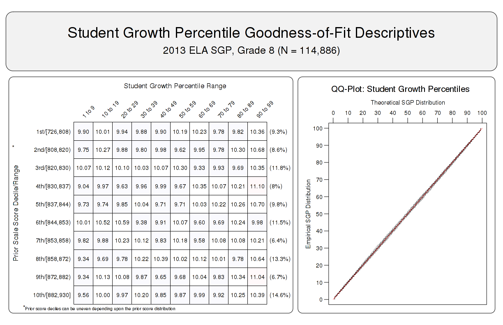
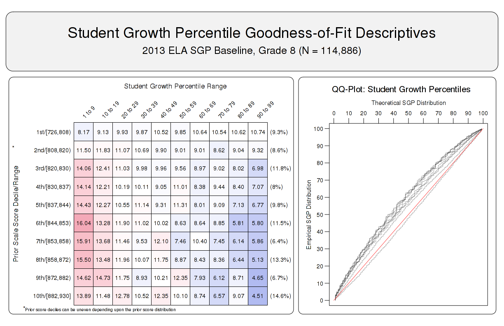
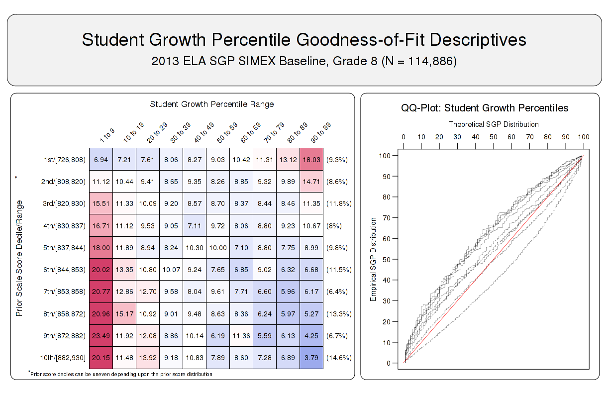

<!--SGPreport-->

<!-- 
This document was written by Damian Betebenner & Adam VanIwaarden for the State of Georgia Department of Education (DOE).

	Original Draft:  August 12, 2014
	Second Draft:  November 14, 2014
	...
-->

<!-- load some R packages and functions required for HTML table creation silently.  Load SGP and other packages here to avoid messages. -->

```{r, echo=FALSE, include=FALSE}
  ## set a universal Cache path
  knitr::opts_chunk$set(cache.path = "_cache/GA_SGP_2013")

  ##  Load some R packages and functions required for HTML table creation silently.  
  ##  Load SGP and other packages here to avoid messages.
  require(SGP)
	require(data.table)
	require(plyr)
	require(Gmisc)
	#require(rmarkdown)
  require(dualTable)
  require(ztable)
  
  options(table_number=0)
  options("fig_caption_no"=0)
	options(fig_caption_no_sprintf = "**Figure %s:**   %s")
	options("fig_caption_no_roman"=FALSE)
	options("equation_counter" = 0)


	subject_order <- c("READING", "ELA","SOCIAL_STUDIES", "SCIENCE",  "MATHEMATICS", 
										 "GRADE_9_LIT", "AMERICAN_LIT", "ECONOMICS", "US_HISTORY", "BIOLOGY", "PHYSICAL_SCIENCE", "MATHEMATICS_I", "MATHEMATICS_II", "COORDINATE_ALGEBRA", "GEOMETRY")
	CRCT_subjects <- c("READING", "ELA","SOCIAL_STUDIES", "SCIENCE",  "MATHEMATICS")
	EOCT_subjects <- c("GRADE_9_LIT", "AMERICAN_LIT", "ECONOMICS", "US_HISTORY", "BIOLOGY", "PHYSICAL_SCIENCE", "MATHEMATICS_I", "MATHEMATICS_II", "COORDINATE_ALGEBRA", "GEOMETRY")
	cohort_subjects <- c("MATHEMATICS_I", "MATHEMATICS_II", "COORDINATE_ALGEBRA", "GEOMETRY")
	baseline_subjects <- c("READING", "ELA","SOCIAL_STUDIES", "SCIENCE",  "MATHEMATICS", 
										 "GRADE_9_LIT", "AMERICAN_LIT", "ECONOMICS", "US_HISTORY", "BIOLOGY", "PHYSICAL_SCIENCE")

	###
	### Lists of EOCT and CRCT subjects and reference types.  Used to subset summary tables and data below.
	###
	eoct.subj <- c('GRADE_9_LIT', 'AMERICAN_LIT', 'US_HISTORY', 'ECONOMICS', 'BIOLOGY', 'PHYSICAL_SCIENCE', 'COORDINATE_ALGEBRA', 'GEOMETRY', 'MATHEMATICS_I', 'MATHEMATICS_II')
	eoct.domain <- c("LIT", "LIT", "SOC_SCI", "SOC_SCI", "SCI", "SCI", "MATH", "MATH", "MATH", "MATH")
	eoct.sgp.ref <- c("BASE", "BASE", "BASE", "BASE", "BASE", "BASE", "COHORT", "COHORT", "COHORT", "COHORT")
	crct.subj <- c('READING', 'ELA', 'MATHEMATICS', 'SCIENCE', 'SOCIAL_STUDIES')
	crct.domain <- c("LIT", "LIT", "MATH", "SCI", "SOC_SCI")
	crct.sgp.ref <- c("BASE", "BASE", "BASE", "BASE", "BASE")
```

# Introduction

This report contains details on the implementation of the student growth percentiles (SGP) model for the state of Georgia. The National Center for the Improvement of Educational Assessment (NCIEA) contracted with the Georgia Department of Education (DOE) to implement the SGP methodology using data derived from the Georgia Student Assessment Program to create the Georgia Student Growth Model. The goal of the engagement with DOE is to create a set of open source analytics techniques and conduct a set of initial analyses that will eventually be conducted by DOE in following years.

The SGP methodology is an open source norm- and criterion-referenced student growth analysis that produces student growth percentiles and student growth projections/targets for each student with longitudinal data in the state. The methodology is currently used for many purposes. States and districts have used the results in various ways including parent/student diagnostic reporting, institutional improvement, and school and educator accountability. Specifics about the manner in which growth is included in school and educator accountability can be found in documents related to those accountability systems. 

The report includes three sections covering Data, SGP Results, and Goodness of Fit:

- *Data* includes details on the decision rules used in the raw data preparation and student record validation.
- *SGP Results* provides basic descriptive statistics from the 2013 analyses.
- *Goodness of Fit* describes how well the statistical models used to produce SGPs fit Georgia students' data.  This includes discussion of goodness of fit plots and the student- and school-level correlations between SGP and prior achievement.

Additionally, multiple appendices are included.  *Appendix A* includes Goodness of Fit plots for all content areas and grades.  *Appendix B* provides a technical description of the SIMEX correction for measurement error with specific applications to Georgia.

# Data

Data for the Georgia Criterion-Referenced Competency Tests (CRCT) and End of Course Tests (EOCT) used in the SGP analyses were supplied by the Georgia DOE to the NCIEA for analysis in the fall of 2013. The current longitudinal data set includes academic years 2006-2007 through 2012-2013. Subsequent years' analyses will augment this multi-year data set allowing DOE to maintain a comprehensive longitudinal data set for all students taking the CRCT and EOCT assessments and transitioning to the Georgia Milestones assessments.

Student Growth Percentiles have been produced for students that have a current score and at least one prior score in the same subject or a related content area.  SGPs were produced for grade-level (CRCT) Reading, English Language Arts (ELA), Social Studies, Science and Mathematics.  For the 2013 academic year SGPs were produced for EOCT courses including Grade 9 Literature, American Literature,  U.S. History, Economics, Biology, Physical Science, Mathematics I & II, Coordinate Algebra and GPS Geometry.

## Longitudinal Data
Growth analyses on assessment data require data which are linked to individual students over time.  Student growth percentile analyses require, at a minimum two, and preferably three years of assessment data for analysis of student progress. To this end it is necessary that a unique student identifier be available so that student data records across years can be merged with one another and subsequently examined. Because some records in the assessment data set contain students with more than one test score in a content area in a given year, a process to create unique student records in each content area by year combination was required in order to carry out subsequent growth analyses.  Furthermore, student records may be invalidated for other reasons. The following business rules were used to either invalidate particular student records or select the appropriate record for use in the analyses.

### General business rules

1. Student records are invalidated if the student identifier is not exactly 10 digits long.
2. Student records with missing ("NA") scores or scale scores outside of the possible range (usually 0) are invalidated.
3. Duplicate records that originated from the "unmatched" data files are invalidated.^[Both "Matched" (where student to school/district links have been verified) and "Unmatched" data files are available.  Unmatched data is added to the initial data file in hopes that it will possibly fill holes in students' score histories, but any current year SGPs produced will not be linked to any school, district or teacher.]
4. If a student has a main and a retest score,^[Retests were available in 2011-12 but retest data are no longer used in SGP calculations as of the 2012-13 school year.] the record with the lower score is invalidated.
5. Student records with any administrative invalidation flag (for example, identifying test irregularities, students that did not attempt the test, or other issues) are invalidated.
6. School years for which CRCT tests were aligned to QCC curriculum are invalidated (SGPs not produced in previous years and not used as prior scores subsequently).

### CRCT specific business rules

1. If a student has multiple records (duplicate from the same subject, grade and administration period), their highest score was selected.
2. Student records from schools identified by the Governor’s Office of Student Achievement (GOSA) as having artificially inflated student test scores from the 2008-2010 are invalidated.
3. If a student took more than one assessment in the same subject and school year, but was identified as being in two different grades, their highest score was selected.
Table `r tblNumNext()` shows the number of valid CRCT student records available for analysis after applying the general and CRCT specific business rules.^[This number does not represent the number of SGPs produced, however, because students are required to have at least one prior score available as well.]

```{r, cache=TRUE, echo=FALSE, include=FALSE}
	n.tbl.crct <- table(Georgia_SGP@Data[YEAR=='2013' & CONTENT_AREA %in% CRCT_subjects & VALID_CASE=='VALID_CASE']$CONTENT_AREA, Georgia_SGP@Data[YEAR=='2013' & CONTENT_AREA %in% CRCT_subjects & VALID_CASE=='VALID_CASE']$GRADE)
```
```{r, results='asis', echo=FALSE, N_tableCRCT}
	n.tbl.crct <- n.tbl.crct[match(CRCT_subjects, row.names(n.tbl.crct)) ,]
	n.tbl.crct <- cbind('Content Area'=sapply(CRCT_subjects, capwords, special.words=c("ELA")), n.tbl.crct)
	n.tbl.crct <- prettyNum(n.tbl.crct, preserve.width = "individual",big.mark=',')
	n.tbl.crct[which(n.tbl.crct==0)] <- ''
# 	n.tbl.crct <- n.tbl.crct[, match(c('Content Area', sort(as.numeric(colnames(n.tbl.crct)[-1]))), colnames(n.tbl.crct))]
# 	n.tbl.crct <- n.tbl.crct[, !is.na(colnames(n.tbl.crct))]
	row.names(n.tbl.crct) <- NULL
	cat(dualTable(as.matrix(n.tbl.crct), title="", align=paste(rep('r', dim(n.tbl.crct)[2]), collapse=''), 
		n.cgroup=c(1, dim(n.tbl.crct)[2]-1), cgroup=c("", "Grades"),
		caption='Number of Valid CRCT Student Records by Grade and Subject for 2013'))
```

### EOCT specific business rules

1. If a student has multiple records (duplicate from the same subject and administration period), their highest score was selected.
2. For students who participate in two main administrations (i.e., students who failed and retook an EOCT course), the first attempt is used as a prior to produce an SGP for the final attempt. In subsequent years, their final attempt may be used as a prior for other EOCT analyses.

Table `r tblNumNext()` shows the total number of valid EOCT student records available for analysis after applying the general and EOCT specific business rules.

```{r, cache=TRUE, echo=FALSE, include=FALSE}
	n.tbl.eoct <- table(Georgia_SGP@Data[YEAR=='2013' & CONTENT_AREA %in% EOCT_subjects & VALID_CASE=='VALID_CASE']$CONTENT_AREA, Georgia_SGP@Data[YEAR=='2013' & CONTENT_AREA %in% EOCT_subjects & VALID_CASE=='VALID_CASE']$GRADE)
```
```{r, results='asis', echo=FALSE, N_tableEOCT}
	n.tbl.eoct <- n.tbl.eoct[match(EOCT_subjects, row.names(n.tbl.eoct)) ,]
	n.tbl.eoct <- cbind('Content Area'=sapply(EOCT_subjects, capwords, special.words=c("ELA", "II")), 'Valid Records' = n.tbl.eoct)
	n.tbl.eoct <- prettyNum(n.tbl.eoct, preserve.width = "individual",big.mark=',')
	row.names(n.tbl.eoct) <- NULL
	cat(dualTable(as.matrix(n.tbl.eoct), title="", align=paste(rep('r', dim(n.tbl.eoct)[2]), collapse=''), 
		n.cgroup=c(1, dim(n.tbl.eoct)[2]-1), #cgroup=c("", "Grades"),
		caption='Total Number of Valid EOCT Student Records by Subject for 2013'))
```

# SGP Results
The following sections provide basic descriptive statistics from the 2013 analyses, including the state-level mean and median growth percentiles.  Currently Georgia uses either cohort or baseline referenced SGPs as the official student-level growth metric, depending upon the content area.  The goal is to eventually use only baseline referenced SGPs, however this requires an assessment program to have been established for several years.  Given that EOCT math courses have undergone changes in recent years, only cohort referenced SGPs are currently available for them.  Similarly, the upcoming transition from the CRCT and EOCT to Georgia Milestones will require the exclusive use of cohort referenced analyses for at least two years until baseline referencing is again feasible.  

Georgia DOE has also recently decided to implement the SIMEX measurement error correction method in the calculation of student-level SGPs.  This correction has been applied to both cohort and baseline referenced SGPs and the descriptive statistics from these analyses are also presented here.

The interested reader can find more in depth discussions of the cohort- and baseline-referenced SGP methodology in the [available literature](https://github.com/CenterForAssessment/SGP_Resources/tree/master/articles), particularly Betebenner's seminal work [-@Betebenner:2009; -@Betebenner:2008a]. For further information on the SIMEX measurement error correction methodology see Shang, VanIwaarden and Betebenner ([-@ShangVanIBet:2015]) and *Appendix B* of this report.

## Cohort Referenced Median SGPs
Growth percentiles, being quantities associated with each individual student, can be easily summarized across numerous grouping indicators to provide summary results regarding growth. The median and mean of a collection of growth percentiles are used as measures of central tendency that summarize the distribution as a single number. With perfect data fit, we expect the state median of all student growth percentiles in any grade to be 50 because the data are norm-referenced across all students in the state.   Median (and mean) growth percentiles well below 50 represent growth less than the state "average" and median growth percentiles well above 50 represent growth in excess of the state "average".

To demonstrate the norm-referenced nature of the growth percentiles viewed at the state level, Table `r tblNumNext()` presents the cohort referenced growth percentile medians and means for the EOCT mathematics based content areas. 

```{r, cache=TRUE, echo=FALSE, include=FALSE}
	chrt_eoct_smry <- Georgia_SGP@Data[CONTENT_AREA %in% cohort_subjects & YEAR=='2013'][,list("Median SGP"=median(as.numeric(SGP), na.rm=TRUE), "Mean SGP"=round(mean(SGP, na.rm=TRUE), 1)), by='CONTENT_AREA']
	setkey(chrt_eoct_smry)
```
```{r, results='asis', echo=FALSE, cohortSmry}
	chrt_eoct_smry_B <- chrt_eoct_smry[match(cohort_subjects, chrt_eoct_smry[["CONTENT_AREA"]]) ,]
	chrt_eoct_smry_B <- chrt_eoct_smry_B[, CONTENT_AREA := sapply(CONTENT_AREA, capwords, special.words="II")] #  need to use <- assignment with := to avoid print out of DT...
	setnames(chrt_eoct_smry_B, "CONTENT_AREA", "Content Area")
	cat(dualTable(as.matrix(chrt_eoct_smry_B), title="", align='rcc', 
		n.cgroup=c(1, dim(chrt_eoct_smry_B)[2]-1), #cgroup=c("", "Grades"),
		caption='EOCT Median and Mean <em>Cohort</em> Referenced Student Growth Percentile by Content Area for 2013'))
```

Based upon perfect model fit to the data, the median of all state growth percentiles in each grade by year by subject combination should be 50. That is, in the conditional distributions, 50 percent of growth percentiles should be less than 50 and 50 percent should be greater than 50. Deviations from 50 indicate imperfect model fit to the data. Imperfect model fit can occur for a number of reasons, some due to issues with the data (e.g., floor and ceiling effects leading to a "bunching" up of the data) as well as issues due to the way that the SGP function fits the data. The results in Table `r tblNum()` are close to perfect, with almost all values equal to 50.

The results are coarse in that they are aggregated across tens of thousands of students. More refined fit analyses are presented in the Goodness-of-Fit section that follows. Depending upon feedback from Georgia DOE, it may be desirable to tweak with some operational parameters and attempt to improve fit even further. The impact upon the operational results based on better fit is expected to be extremely minor.

It is important to note how, at the entire state level, the *norm-referenced* growth information returns little information on annual trends due to its norm-reference nature. What the results indicate is that a typical (or average) student in the state demonstrates 50th percentile growth. That is, "typical students" demonstrate "typical growth". One benefit of the norm-referenced results follows when subgroups are examined (e.g., schools, district, demographic groups, etc.) Examining subgroups in terms of the median of their student growth percentiles, it is then possible to investigate why some subgroups display lower/higher student growth than others. Moreover, because the subgroup summary statistic (i.e., the median) is composed of many individual student growth percentiles, one can break out the result and further examine the distribution of individual results. 

## Baseline Referenced Median SGPs
Baseline SGPs allow one to look at norm-referenced growth through another lens.  Rather than considering a single year's cohort, baseline SGPs are referenced against a "super-cohort" of several years of "baseline" students linked by common course/grade progressions.  This allows for the examination of whether or not the system as a whole might be improving (or declining) in terms of growth over time relative to the established baseline.  That is, if the system is improving in terms of higher rates of growth over time (i.e., higher levels of effectiveness), we would see those higher levels of effectiveness in the form of median SGPs that are greater than 50 (what *was* a higher rate of growth in the past is now typical growth).  An assumption required for the use of baseline referenced SGPs is that the scale scores are well anchored.  If this assumption is violated, then any deviation from "typical" growth may be purely an artifact of the test scaling procedure. States transitioning from old test to new tests, for example, must reset their baseline growth because a new scale is in effect. Table `r tblNumNext()` provides the median and mean baseline referenced results from Georgia's CRCT assessments and Table `r tblNumNext()+1` provides the EOCT results.

```{r, cache=TRUE, echo=FALSE, include=FALSE}
	bsln_crct_smry <- Georgia_SGP@Data[CONTENT_AREA %in% CRCT_subjects & YEAR=='2013'][, list(MEDIAN = median(as.numeric(SGP_BASELINE), na.rm=TRUE), MEAN = round(mean(SGP_BASELINE, na.rm=TRUE), 1)), by=c('CONTENT_AREA', 'GRADE')][!is.na(MEDIAN)]
	setkey(bsln_crct_smry)
```{r, results='asis', echo=FALSE, baseSumCRCT}
	bsln_crct_smryB <- data.frame()
	for (ca in CRCT_subjects){
		tmp.bsln_crct_smry <- paste(t(as.matrix(bsln_crct_smry[CONTENT_AREA==ca,][, list(MEDIAN)])), " (", t(as.matrix(bsln_crct_smry[CONTENT_AREA==ca,][, list(MEAN)])), ")", sep="")
		tmp.bsln_crct_smry <- data.frame(matrix(c(capwords(ca), tmp.bsln_crct_smry), 1, length(tmp.bsln_crct_smry)+1))
		names(tmp.bsln_crct_smry) <- c("Content Area", t(as.matrix(bsln_crct_smry[CONTENT_AREA==ca,][, list(GRADE)])))
		bsln_crct_smryB <- rbind.fill(bsln_crct_smryB, tmp.bsln_crct_smry)
	}
	bsln_crct_smryB[is.na(bsln_crct_smryB)] <- ""
	cat(dualTable(as.matrix(bsln_crct_smryB), title="", align=paste(rep('r', dim(bsln_crct_smryB)[2]), collapse=''), 
		n.cgroup=c(1, dim(bsln_crct_smryB)[2]-1), cgroup=c("", "Grades"),
		# n.rgroup=c(rep(length(unique(bsln_crct_smry$CONTENT_AREA)), length(unique(bsln_crct_smry$YEAR)))), rgroup= gsub('_', ' - ', unique(bsln_crct_smry$YEAR)),
		caption='CRCT Median (Mean) <em>Baseline</em> Student Growth Percentile by Grade and Content Area for 2013'))
```

```{r, cache=TRUE, echo=FALSE, include=FALSE}
	bsln_eoct_smry <- Georgia_SGP@Data[CONTENT_AREA %in% intersect(baseline_subjects, EOCT_subjects) & YEAR=='2013'][,list("Median SGP"=median(as.numeric(SGP_BASELINE), na.rm=TRUE), "Mean SGP"=round(mean(SGP_BASELINE, na.rm=TRUE), 1)), by='CONTENT_AREA']
	setkey(bsln_eoct_smry)
```
```{r, results='asis', echo=FALSE, bslnSmry}
	bsln_eoct_smry_B <- bsln_eoct_smry[match(intersect(baseline_subjects, EOCT_subjects), bsln_eoct_smry[["CONTENT_AREA"]]) ,]
	bsln_eoct_smry_B <- bsln_eoct_smry_B[, CONTENT_AREA := sapply(CONTENT_AREA, capwords, special.words="II")]
	setnames(bsln_eoct_smry_B, "CONTENT_AREA", "Content Area")
	cat(dualTable(as.matrix(bsln_eoct_smry_B), title="", align='rcc', 
		n.cgroup=c(1, dim(bsln_eoct_smry_B)[2]-1), #cgroup=c("", "Grades"),
		caption='EOCT Median and Mean <em>Baseline</em> Referenced Student Growth Percentile by Content Area for 2013'))
```

## SIMEX Adjusted Student Growth Percentiles
The use of error-prone standardized test scores in statistical models can lead to numerous problems.  Understanding the effects of measurement error and correcting it is particularly difficult in the SGP model given that it is based on non-parametric quantile regression.  Preliminary investigations suggest that the use of error-prone measures may lead SGP estimates to be inflated for students with high prior achievement and underestimated for students with lower prior achievement.  This bias at the individual student-level can translate to bias in aggregate measures (such as median and mean SGPs) when student sorting based on prior achievement exists at the level of aggregation (e.g. classrooms or schools).  As a result, growth and prior achievement are (positively) correlated, giving schools and teachers with higher achieving students an undue advantage and disadvantaging those with a preponderance of low achieving students.  

Simulation-extrapolation (SIMEX) methods of correcting for measurement error induced bias in the SGP estimation has been proposed and recently tested in Georgia.  Descriptive statistics from these analyses are provided here and in the *Goodness-of-Fit* section.  Additional technical information about the SIMEX procedure in general and its use in the calculation of cohort and baseline referenced SGPs is provided in *Appendix B* of this report.

```{r, cache=TRUE, echo=FALSE, include=FALSE}
	chrt_SIMEX_smry <- Georgia_SGP@Data[CONTENT_AREA %in% cohort_subjects & YEAR=='2013'][,list("Median SGP"=median(as.numeric(SGP_SIMEX), na.rm=TRUE), "Mean SGP"=round(mean(SGP_SIMEX, na.rm=TRUE), 1)), by='CONTENT_AREA']
	setkey(chrt_SIMEX_smry)
```
```{r, results='asis', echo=FALSE, chrt_SIMEX_smry_B}
	chrt_SIMEX_smry_B <- chrt_SIMEX_smry[match(cohort_subjects, chrt_SIMEX_smry[["CONTENT_AREA"]]) ,]
	chrt_SIMEX_smry_B <- chrt_SIMEX_smry_B[, CONTENT_AREA := sapply(CONTENT_AREA, capwords, special.words="II")]
	setnames(chrt_SIMEX_smry_B, "CONTENT_AREA", "Content Area")
	cat(dualTable(as.matrix(chrt_SIMEX_smry_B), title="", align='rcc', 
		n.cgroup=c(1, dim(chrt_SIMEX_smry_B)[2]-1), #cgroup=c("", "Grades"),
		caption='SIMEX Corrected EOCT Median and Mean <em>Cohort</em> Referenced Student Growth Percentile by Content Area for 2013'))
```


```{r, cache=TRUE, echo=FALSE, include=FALSE}
	bsln_crct_SIMEX <- Georgia_SGP@Data[CONTENT_AREA %in% CRCT_subjects & YEAR=='2013'][, list(MEDIAN = median(as.numeric(SGP_SIMEX_BASELINE), na.rm=TRUE), MEAN = round(mean(SGP_SIMEX_BASELINE, na.rm=TRUE), 1)), by=c('CONTENT_AREA', 'GRADE')][!is.na(MEDIAN)]
	setkey(bsln_crct_SIMEX)
```{r, results='asis', echo=FALSE, baseSumCRCTsimex}
	bsln_crct_SIMEXB <- data.frame()
	for (ca in CRCT_subjects){
		tmp.bsln_crct_SIMEX <- paste(t(as.matrix(bsln_crct_SIMEX[CONTENT_AREA==ca,][, list(MEDIAN)])), " (", t(as.matrix(bsln_crct_SIMEX[CONTENT_AREA==ca,][, list(MEAN)])), ")", sep="")
		tmp.bsln_crct_SIMEX <- data.frame(matrix(c(capwords(ca), tmp.bsln_crct_SIMEX), 1, length(tmp.bsln_crct_SIMEX)+1))
		names(tmp.bsln_crct_SIMEX) <- c("Content Area", t(as.matrix(bsln_crct_SIMEX[CONTENT_AREA==ca,][, list(GRADE)])))
		bsln_crct_SIMEXB <- rbind.fill(bsln_crct_SIMEXB, tmp.bsln_crct_SIMEX)
	}
	bsln_crct_SIMEXB[is.na(bsln_crct_SIMEXB)] <- ""
	cat(dualTable(as.matrix(bsln_crct_SIMEXB), title="", align=paste(rep('r', dim(bsln_crct_SIMEXB)[2]), collapse=''), 
		n.cgroup=c(1, dim(bsln_crct_SIMEXB)[2]-1), cgroup=c("", "Grades"),
		caption='SIMEX Corrected CRCT Median (Mean) <em>Baseline</em> Student Growth Percentile by Grade and Content Area for 2013'))
```

```{r, cache=TRUE, echo=FALSE, include=FALSE}
	bsln_eoct_SIMEX <- Georgia_SGP@Data[CONTENT_AREA %in% intersect(baseline_subjects, EOCT_subjects) & YEAR=='2013'][,list("Median SGP"=median(as.numeric(SGP_SIMEX_BASELINE), na.rm=TRUE), "Mean SGP"=round(mean(SGP_SIMEX_BASELINE, na.rm=TRUE), 1)), by='CONTENT_AREA']
	setkey(bsln_eoct_SIMEX)
```
```{r, results='asis', echo=FALSE, bslnSmrySIMEX}
	bsln_eoct_SIMEX_B <- bsln_eoct_SIMEX[match(intersect(baseline_subjects, EOCT_subjects), bsln_eoct_SIMEX[["CONTENT_AREA"]]) ,]
	bsln_eoct_SIMEX_B <- bsln_eoct_SIMEX_B[, CONTENT_AREA := sapply(CONTENT_AREA, capwords, special.words="II")]
	setnames(bsln_eoct_SIMEX_B, "CONTENT_AREA", "Content Area")
	cat(dualTable(as.matrix(bsln_eoct_SIMEX_B), title="", align='rcc', 
		n.cgroup=c(1, dim(bsln_eoct_SIMEX_B)[2]-1), #cgroup=c("", "Grades"),
		caption='SIMEX Corrected EOCT Median and Mean <em>Baseline</em> Referenced Student Growth Percentile by Content Area'))
```

A comparison of the unadjusted (Tables 3 to 5) and SIMEX corrected (Tables 6 through 8) shows very little difference in the medians and means.  This is not surprising as the majority of the growth percentiles for students in the middle of the prior score distributions change very little, and the larger changes that occur for students in the extremes of the prior score distributions tend to even out. 

# Goodness of Fit
Examination of goodness-of-fit was conducted by comparing the estimated conditional density with the theoretical uniform density of the SGPs. Despite the use of B-splines to accommodate heteroscedasticity and skewness of the conditional density, assumptions are made concerning the number and position of spline knots that impact the percentile curves that are fit. With an infinite population of test takers, at each prior scaled score, with perfect model fit, the expectation is to have 10 percent of the estimated growth percentiles between 1 and 9, 10 and 19, 20 and 29, ..., and 90 and 99. Deviations from 10 percent would be indicative of lack of model fit. 

## Model Fit Plots
Using all available CRCT and EOCT scores as the variables, estimation of student growth percentiles was conducted for each possible student (those with a current score and at least one prior score). Percentages of student growth percentiles between the 10th, 20th, 30th, 40th, 50th, 60th, 70th, 80th, and 90th percentiles were calculated based upon the decile of the prior year's scaled score (the total students in each for the analyses varies depending on grade and subject). Results for the B-spline parameterizations for all CRCT and EOCT analyses are given in *Appendix A*. 

###  Cohort referenced model fit
The results in all subjects are excellent with a few exceptions. Deviations from perfect fit are indicated by red and blue shading.  The further *above* 10 the darker the red, and the further *below* 10 the darker the blue. In instances where large deviations from 10 occur, the likely cause is that there is a mass point associated with certain scale scores that makes it impossible to "split" the score at a dividing point forcing a majority of the scores into an adjacent cell. This is the case with all large deviations observed in the Georgia data. 

Figure `r getOption("fig_caption_no")+1` shows the results for 8<sup>th</sup> grade ELA.  Although this CRCT subject is officially a baseline referenced subject, we provide the plot here as an exemplar of cohort referenced model fit with which to compare with baseline and SIMEX model fit using the same student data in subsequent sections.

##### `r figCapNo("Goodness of Fit Plot for 2013 ***Cohort*** Referenced 8<sup>th</sup> Grade ELA.")`



###  Baseline referenced model fit

Assumptions regarding model fit are much different for baseline referenced models.  Perfect model fit is not expected, or even desired, in these analyses because the student data was not used to produce the baseline model parameter estimates.  As discussed above, these models may allow us to see whether or not the system as a whole might be improving (or declining) over time.  These changes would be indicated by model **misfit** in the goodness of fit plots.  A greater number of students with high growth (red cells on the right hand side of the first plots) would suggest system improvement.  Ideally we would see this for students in the entire range prior achievement.

Figure `r getOption("fig_caption_no")+1` shows how the baseline model fits the 2013 8<sup>th</sup> grade ELA student data.  Here we see that the model suggests student performance has declined relative to the established baseline.  This appears to be generally true for students from all prior achievement levels with the exception of students in the lowest decile of prior scores.

<p></p>

##### `r figCapNo("Goodness of Fit Plot for 2013 ***Baseline*** Referenced 8<sup>th</sup> Grade ELA.")`



###  SIMEX model fit
SIMEX model fit is also assumed to be imperfect.  In this case we expect model misfit in the form of increased high SGPs for students with lower prior performance (and a complementary decrease in low SGPs for those students), and the reverse expectation for high achieving students.  This is visible in the goodness of fit plot in Figure `r getOption("fig_caption_no")+1` where the SIMEX correction method has been applied to the 8<sup>th</sup> grade ELA baseline model.

<p></p>

##### `r figCapNo("Goodness of Fit Plot for 2013 ***SIMEX Corrected,*** Baseline Referenced 8<sup>th</sup> Grade ELA.")`



## Student Level Results
To investigate the possibility that individual level misfit might impact summary level results, student growth percentile analyses were run on all students and the results were examined relative to prior achievement. With perfect fit to data, the correlation between students' most recent prior achievement scores and their student growth percentiles is zero (i.e., the goodness of fit tables would have a uniform distribution of percentiles across all previous scale score levels). To investigate in another way, correlations between prior student scale scores and student growth percentiles were calculated.^[In addition to providing information about model fit, these student-level correlations can assess potential impact of test ceiling effects.] 

Student-level correlations between the various SGP versions (uncorrected and SIMEX corrected cohort and baseline referenced estimates) and prior achievement are presented here. The results are generally as expected.  With cohort referenced percentiles, when the model is perfectly fit to the data, the correlation between students' most recent prior achievement scores and their student growth percentiles is zero (i.e., there is a uniform distribution of percentiles across all previous scale score levels).  Correlations for Georgia cohort referenced SGPs are all essentially zero.  This provides assurance that the models have fit the data well, and indicate that students can demonstrate high (or low) growth regardless of prior achievement using cohort referenced SGPs.

Baseline referenced growth percentiles relax assumptions about correlations and the aspiration for a uniform distribution of percentiles.  Rather than considering a single year's cohort, baseline SGPs are referenced against a "super-cohort" of several years of students linked by common course/grade progressions.  This allows us to examine whether or not the system as a whole might be improving (or declining) over time relative to the established baseline.  That is, if the system is improving over time, we would see that improvement in median SGPs that are greater than 50 (more than half of students would have growth greater than what *was* typical growth in the past).  Furthermore, if students at different levels of prior achievement experience differential growth a correlation greater or less than zero may be observed.^[A major assumption required in producing baseline referenced SGPs is that the scale scores are well anchored.  If this assumption does not hold, then any deviation from "typical" growth may be purely and artifact of the test scaling procedure.  However, it would seem that this type of "scale drift" would be consistent across scale score levels.  Therefore it isn't clear that this would cause a differential impact on growth, and thereby a positive or negative correlation at the student level between growth and prior achievement.]  For example, if lower achieving students had consistently higher growth relative to the baseline cohort and higher achieving students had consistently lower growth, then a negative correlation would be expected at the student-level.  Although small, many correlations between baseline SGPs and prior achievement deviate from zero.

SIMEX corrected SGPs induce a negative correlation between growth and prior achievement (regardless of reference type) as shown in Table 1 below.  Rather than a uniform distribution, SIMEX produces a distribution in which growth for lower prior achieving students' growth is weighted upward and higher prior achieving students' growth is weighted down.  In theory this produces biased student-level SGPs but may decrease the bias in aggregate growth measures as has been documented previous SIMEX reports. This in turn decreases the observed correlations between "uncorrected" SGPs and prior achievement.^[Note that aggregate-level correlations that are initially negative also become increasingly negative rather than return to zero.  This has been noted in test results from other states not presented here.]

```{r, cache=TRUE, echo=FALSE, include=FALSE}
	student.cor.grd <- Georgia_SGP@Data[YEAR=='2013' & VALID_CASE=='VALID_CASE'][, list(
		COHORT_SGP = round(cor(SGP, SCALE_SCORE_PRIOR_STANDARDIZED, use='pairwise.complete'), 2), 
		COHORT_SIMEX = round(cor(SGP_SIMEX, SCALE_SCORE_PRIOR_STANDARDIZED, use='pairwise.complete'), 2), 		
		BASELINE_SGP = round(cor(SGP_BASELINE, SCALE_SCORE_PRIOR_STANDARDIZED, use='pairwise.complete'), 2), 
		BASELINE_SIMEX = round(cor(SGP_SIMEX_BASELINE, SCALE_SCORE_PRIOR_STANDARDIZED, use='pairwise.complete'), 2), 		
		# N = sum(!is.na(SGP_BASELINE))), by = c('CONTENT_AREA')]
		N_Size = sum(!is.na(SGP_BASELINE))), by = c('CONTENT_AREA', 'GRADE')]
		setkey(student.cor.grd, "GRADE")
```
<p></p>

### CRCT

```{r, results='asis', echo=FALSE, Student_CRCT}
	tmp_tbl <- data.frame(student.cor.grd[CONTENT_AREA %in% crct.subj][order(match(student.cor.grd$CONTENT_AREA, crct.subj))][, COHORT_SIMEX := NULL][!is.na(BASELINE_SGP)])
	###  Number of "column groups" - here different aggregates correlated with standardized prior score (and blank for content area and N)
	n.col.group <- c(1, dim(tmp_tbl)[2]-3, 1) # -3 :: 2 for CONTENT_AREA and GRADE, and 1 for N.
	col.group <- c("", "Aggregate Group Type", "")
	###  Number of "row groups" - here I'm breaking on Content area.  
	n.row.group <- diff(c(match(crct.subj, tmp_tbl$CONTENT_AREA), dim(tmp_tbl)[1]+1))
	row.group <- sapply(unique(tmp_tbl$CONTENT_AREA), capwords)
	tmp.cap <- "CRCT Correlations between Student-Level Prior Standardized Scale Score and SGP Versions"
	tmp_tbl <- tmp_tbl[, -1]
  tmp_tbl$N_Size <- prettyNum(tmp_tbl$N_Size, preserve.width = "individual", big.mark=',')
	names(tmp_tbl) <- sapply(names(tmp_tbl), capwords)
	cat(dualTable(as.matrix(tmp_tbl), 
		title="", align=paste(rep('r', dim(tmp_tbl)[2]), collapse=''), 
		n.cgroup=n.col.group, cgroup= col.group, n.rgroup=n.row.group, rgroup= row.group, compatibility="CSS", caption = tmp.cap))
```
<p></p>

### EOCT Baseline Referenced Subjects

```{r, results='asis', echo=FALSE, Student_EOCTBaseline}
	tmp_tbl <- data.frame(student.cor.grd[match(eoct.subj[eoct.sgp.ref == "BASE"], student.cor.grd$CONTENT_AREA)][, COHORT_SIMEX := NULL])
	###  Number of "column groups" - here different aggregates correlated with standardized prior score (and blank for content area and N)
	n.col.group <- c(1, dim(tmp_tbl)[2]-3, 1) # -3 :: 2 for CONTENT_AREA and GRADE, and 1 for N.
	col.group <- c("", "Aggregate Group Type", "")
	###  Number of "row groups" - here I'm breaking on Content area.  
	n.row.group <- NULL
	row.group <- NULL
	tmp.cap <- "Correlations between Student-Level Prior Standardized Scale Score and EOCT Baseline Referenced SGP Versions"
	tmp_tbl <- tmp_tbl[, -2]
	tmp_tbl$CONTENT_AREA <- sapply(tmp_tbl$CONTENT_AREA, capwords)
  tmp_tbl$N_Size <- prettyNum(tmp_tbl$N_Size, preserve.width = "individual", big.mark=',')
	names(tmp_tbl) <- sapply(names(tmp_tbl), capwords)
	cat(dualTable(as.matrix(tmp_tbl), title="", align=paste(rep('r', dim(tmp_tbl)[2]), collapse=''), 
		n.cgroup=n.col.group, cgroup= col.group, compatibility="CSS", caption = tmp.cap))
```
<p></p>

### EOCT Cohort Referenced Subjects

```{r, results='asis', echo=FALSE, Student_EOCTCohort}
	tmp_tbl <- student.cor.grd[match(eoct.subj[eoct.sgp.ref == "COHORT"], student.cor.grd$CONTENT_AREA)]
	tmp_tbl <- data.frame(tmp_tbl[, list(CONTENT_AREA, COHORT_SGP, COHORT_SIMEX, N_Size)])
	###  Number of "column groups" - here different aggregates correlated with standardized prior score (and blank for content area and N)
	n.col.group <- c(1, dim(tmp_tbl)[2]-2, 1) # -2 :: 1 for CONTENT_AREA, and 1 for N.
	col.group <- c("", "Aggregate Group Type", "")
	###  Number of "row groups" - none here.  
	n.row.group <- NULL
	row.group <- NULL
	tmp.cap <- "Correlations between Student-Level Prior Standardized Scale Score and EOCT Cohort Referenced SGP Versions"
	tmp_tbl$CONTENT_AREA <- sapply(tmp_tbl$CONTENT_AREA, capwords)
  tmp_tbl$N_Size <- prettyNum(tmp_tbl$N_Size, preserve.width = "individual", big.mark=',')
	names(tmp_tbl) <- sapply(names(tmp_tbl), capwords)
	cat(dualTable(as.matrix(tmp_tbl), title="", align=paste(rep('r', dim(tmp_tbl)[2]), collapse=''), 
		n.cgroup=n.col.group, cgroup= col.group, compatibility="CSS", caption = tmp.cap))
```

## Group Level Results
Unlike when reporting SGPs at the individual level, when aggregating to the group level (e.g., school) the correlation between aggregate prior student achievement and aggregate growth is rarely zero. The correlation between prior student achievement and growth at the school level is a compelling descriptive statistic because it indicates whether students attending schools serving higher achieving students grow faster (on average) than those students attending schools serving lower achieving students. Results from previous state analyses show a correlation between prior achievement of students associated with a current school (quantified as percent at/above proficient) and the median SGP to be between 0.1 and 0.3. That is, these results indicate that on average, students attending schools serving lower achieving students tend to demonstrate less exemplary growth than those attending schools serving higher achieving students. Equivalently, based upon ordinary least squares (OLS) regression assumptions, the prior achievement level of students attending a school accounts for between 1 and 10 percent of the variability observed in student growth. There are no definitive numbers on what this correlation should be, but studies on value-added models show similar results [@MccaLock:2008].

### School Level Results

To illustrate these relationships visually, the bubble charts in Figures `r getOption("fig_caption_no")+1` through `r getOption("fig_caption_no")+5` depict growth as quantified by the median SGP of students at the school against achievement/status, quantified by percentage of student at/above proficient (advanced) at the school. The charts have been successful in helping to motivate the discussion of the two qualities: student achievement and student growth. Though the figures are not detailed enough to indicate strength of relationship between growth and achievement, they are suggestive and valuable for discussions with stakeholders who are being introduced to the growth model for the first time.

##### `r figCapNo("School-level Bubble Plots for Georgia:  ELA, 2012-2013.")`
.png)

<p></p>
<p></p>

##### `r figCapNo("School-level Bubble Plots for Georgia:  Reading, 2012-2013.")`
.png)

<p></p>
<p></p>

##### `r figCapNo("School-level Bubble Plots for Georgia:  Mathematics, 2012-2013.")`
.png)

<p></p>
<p></p>

##### `r figCapNo("School-level Bubble Plots for Georgia:  Science, 2012-2013.")`
.png)

<p></p>
<p></p>

##### `r figCapNo("School-level Bubble Plots for Georgia:  Social Studies, 2012-2013.")`
.png)


The relationship between average prior student achievement and median SGP observed for Georgia is relatively strong compared to some other states for whom the Center has done SGP analyses. Table `r tblNumNext()` shows correlations between prior achievement (measured as the mean prior standardized scale score as well as the percent at/above proficient at the school^[Percent Prior Proficient in this case is determined by the percent of student's that scored in the Proficient or Advanced range of all student's that received a score.  This measure does not reflect student's that did not receive a score but are included in the denominator of Percent Meeting Standard as displayed in the DOE Georgia Report Card.]). All results shown here are for schools with 15 or more students.

<p></p>

```{r, cache=TRUE, echo=FALSE, include=FALSE}
	sch.msgp <- Georgia_Summary$SCHOOL_NUMBER$SCHOOL_NUMBER__YEAR__SCHOOL_ENROLLMENT_STATUS[!is.na(SCHOOL_NUMBER) & MEDIAN_SGP_COUNT > 14]
	sch.msgp.subj <- Georgia_Summary$SCHOOL_NUMBER$SCHOOL_NUMBER__CONTENT_AREA__YEAR__SCHOOL_ENROLLMENT_STATUS[!is.na(SCHOOL_NUMBER) & MEDIAN_SGP_COUNT > 14]#__
	sch.msgp.grd <- Georgia_Summary$SCHOOL_NUMBER$SCHOOL_NUMBER__CONTENT_AREA__YEAR__GRADE__SCHOOL_ENROLLMENT_STATUS[YEAR == '2013' & !is.na(SCHOOL_NUMBER) & MEDIAN_SGP_COUNT > 14]
	sch.msgp.grd$CONTENT_AREA <- ordered(sch.msgp.grd$CONTENT_AREA, levels = c(crct.subj, eoct.subj)) #___
	##  Table 12. combined subjects - School_Cor_Grand
	sch.cor <- sch.msgp[, list(
						MEDIAN_SGP = round(cor(MEDIAN_SGP_BASELINE, MEAN_SCALE_SCORE_PRIOR_STANDARDIZED, use='complete'), 2),
						MEAN_SGP=round(cor(MEAN_SGP_BASELINE, MEAN_SCALE_SCORE_PRIOR_STANDARDIZED, use='complete'), 2),
						MEDIAN_SIMEX = round(cor(MEDIAN_SGP_SIMEX_BASELINE, MEAN_SCALE_SCORE_PRIOR_STANDARDIZED, use='complete'), 2), 
						MEAN_SIMEX = round(cor(MEAN_SGP_SIMEX_BASELINE, MEAN_SCALE_SCORE_PRIOR_STANDARDIZED, use='complete'), 2)), by = 'YEAR']
	##  Table 13.  CRCT multiple year - School_CRCT_Correlations
	sch.cor.subj <- data.table(sch.msgp.subj[, list(
						MEDIAN_SGP = round(cor(MEDIAN_SGP_BASELINE, MEAN_SCALE_SCORE_PRIOR_STANDARDIZED), 2),
						MEAN_SGP = round(cor(MEAN_SGP_BASELINE, MEAN_SCALE_SCORE_PRIOR_STANDARDIZED), 2),
						MEDIAN_SIMEX = round(cor(MEDIAN_SGP_SIMEX_BASELINE, MEAN_SCALE_SCORE_PRIOR_STANDARDIZED), 2),
						MEAN_SIMEX = round(cor(MEAN_SGP_SIMEX_BASELINE, MEAN_SCALE_SCORE_PRIOR_STANDARDIZED), 2)), by = c('CONTENT_AREA', 'YEAR')]	,
						key=c('CONTENT_AREA', 'YEAR'))					
	## Table 14.  CRCT 2013 by grade - School_Grade_CRCT_Correlations
	sch.cor.grd <- sch.msgp.grd[, list(
							MEDIAN_SGP = round(cor(MEDIAN_SGP_BASELINE, MEAN_SCALE_SCORE_PRIOR_STANDARDIZED), 2),
							MEDIAN_SIMEX = round(cor(MEDIAN_SGP_SIMEX_BASELINE, MEAN_SCALE_SCORE_PRIOR_STANDARDIZED), 2),
							MEAN_SGP = round(cor(MEAN_SGP_BASELINE, MEAN_SCALE_SCORE_PRIOR_STANDARDIZED), 2),
							MEAN_SIMEX = round(cor(MEAN_SGP_SIMEX_BASELINE, MEAN_SCALE_SCORE_PRIOR_STANDARDIZED), 2)), by = c('CONTENT_AREA', 'GRADE')]
	sch.cor.grd <- sch.cor.grd[order(match(sch.cor.grd$CONTENT_AREA, c(crct.subj, eoct.subj))),]
```

```{r, results='asis', echo=FALSE, School_Cor_Grand}
	tmp_tbl <- data.frame(sch.cor)
	###  Number of "column groups" - here different aggregates correlated with mean standardized prior score
	n.col.group <- c(1,4)  # Just aggregate SGP groups.
	col.group <- c("", "SGP Aggregate Type")
	###  Number of "row groups" - none here  
	n.row.group <- NULL
	row.group <- NULL
	tmp.cap <- "Correlations between Mean Prior Standardized Scale Score and Aggregate SGPs - (Combined Subjects)"
	names(tmp_tbl) <- sapply(names(tmp_tbl), capwords)
	cat(dualTable(as.matrix(tmp_tbl), title="", align=paste(rep('r', dim(tmp_tbl)[2]), collapse=''), 
		n.cgroup=n.col.group, cgroup= col.group, compatibility="CSS", caption  = tmp.cap))
```

<p></p>

Correlation tables describing the relationship between prior achievement (defined as mean prior standardized scale score) and aggregate growth percentiles are presented below in separate subsections for CRCT and EOCT subjects.  The school ratings discussed in the second subsection will be based on the grand median or mean SGP.  The first correlation table in the each subsection provides these overall SGP aggregates' relationships with mean prior standardized scale scores. The additional correlation tables are dis-aggregated by content area, and content area and grade to provide more detail.

<p></p>

#### CRCT 
```{r, results='asis', echo=FALSE, School_CRCT_Correlations}
	tmp_tbl <- data.frame(sch.cor.subj[order(match(sch.cor.subj$CONTENT_AREA, crct.subj)),][CONTENT_AREA %in% crct.subj])
	###  Number of "column groups" - here different aggregates correlated with standardized prior score
	n.col.group <- c(1, dim(tmp_tbl)[2]-2) # -1 for CONTENT_AREA, -1 for YEAR
	col.group <- c("", "Aggregate SGP Type")	
	###  Number of "row groups" - none here.  
	n.row.group <- diff(c(match(crct.subj, tmp_tbl$CONTENT_AREA), dim(tmp_tbl)[1]+1))
	row.group <- sapply(unique(tmp_tbl$CONTENT_AREA), capwords)
	tmp.cap <- "CRCT Correlations between School-Level Mean Prior Standardized Scale Score and SGP Aggregations."	
	tmp_tbl$CONTENT_AREA <- NULL
	names(tmp_tbl) <- sapply(names(tmp_tbl), capwords)
	tmp_tbl[is.na(tmp_tbl)] <- ""
	cat(dualTable(as.matrix(tmp_tbl), title="", align=paste(rep('r', dim(tmp_tbl)[2]), collapse=''), 
		n.cgroup=n.col.group, cgroup= col.group, n.rgroup=n.row.group, rgroup= row.group, compatibility="CSS", caption  = tmp.cap))
```
<p></p>

```{r, results='asis', echo=FALSE, School_Grade_CRCT_Correlations}
	###  CRCT Baseline
	tmp_tbl <- data.frame(sch.cor.grd[CONTENT_AREA %in% crct.subj])
	###  Number of "column groups" - here different aggregates correlated with standardized prior score
	n.col.group <- c(1, dim(tmp_tbl)[2]-2) # -2 for both CONTENT_AREA and GRADE.  C_A nulled out below.
	col.group <- c("", "Aggregate Group Type")
	###  Number of "row groups" - here I'm breaking on Content area.  
	n.row.group <- diff(c(match(crct.subj, tmp_tbl$CONTENT_AREA), dim(tmp_tbl)[1]+1))
	row.group <- sapply(unique(tmp_tbl$CONTENT_AREA), capwords)
	tmp.cap <- "2013 CRCT Correlations between School-Level prior standardized scale score and Selected Aggregate SGPs by Grade."
	tmp_tbl <- tmp_tbl[, -1]
	names(tmp_tbl) <- sapply(names(tmp_tbl), capwords)
	cat(dualTable(as.matrix(tmp_tbl), title="", align=paste(rep('r', dim(tmp_tbl)[2]), collapse=''), 
		n.cgroup=n.col.group, cgroup= col.group, n.rgroup=n.row.group, rgroup= row.group, compatibility="CSS", caption = tmp.cap))
```
<p></p>

#### EOCT
```{r, results='asis', echo=FALSE, School_EOCTBaseline_Cor}
	tmp_tbl <- data.frame(sch.cor.subj[order(match(sch.cor.subj$CONTENT_AREA, eoct.subj)),][CONTENT_AREA %in% eoct.subj[eoct.sgp.ref == "BASE"]])
	###  Number of "column groups" - here different aggregates correlated with standardized prior score
	n.col.group <- c(1, dim(tmp_tbl)[2]-2) # -1 for CONTENT_AREA, -1 for YEAR
	col.group <- c("", "Aggregate SGP Type")	
	###  Number of "row groups" - none here.  
	n.row.group <- diff(c(match(eoct.subj[eoct.sgp.ref == "BASE"], tmp_tbl$CONTENT_AREA), dim(tmp_tbl)[1]+1))
	row.group <- sapply(unique(tmp_tbl$CONTENT_AREA), capwords)
	tmp.cap <- "2011 to 2013 Correlations between Mean Prior Standardized Scale Score and Baseline SGPs."
	tmp_tbl$CONTENT_AREA <- NULL
	names(tmp_tbl) <- sapply(names(tmp_tbl), capwords)
	tmp_tbl[is.na(tmp_tbl)] <- ""
	cat(dualTable(as.matrix(tmp_tbl), title="", align=paste(rep('r', dim(tmp_tbl)[2]), collapse=''), 
		n.cgroup=n.col.group, cgroup= col.group, n.rgroup=n.row.group, rgroup= row.group, compatibility="CSS", caption = tmp.cap))
```
<p></p>

```{r, results='asis', echo=FALSE, School_EOCTCohort_Cor}
	tmp_tbl <- data.frame(sch.cor.subj[order(match(sch.cor.subj$CONTENT_AREA, eoct.subj)),][CONTENT_AREA %in% eoct.subj[eoct.sgp.ref == "COHORT"]])
	###  Number of "column groups" - here different aggregates correlated with standardized prior score
	n.col.group <- c(1, dim(tmp_tbl)[2]-2) # -1 for CONTENT_AREA, -1 for YEAR
	col.group <- c("", "Aggregate SGP Type")	
	###  Number of "row groups" - none here.  
	n.row.group <- diff(c(match(eoct.subj[eoct.sgp.ref == "COHORT"], tmp_tbl$CONTENT_AREA), dim(tmp_tbl)[1]+1))
	row.group <- sapply(unique(tmp_tbl$CONTENT_AREA), capwords)
	tmp.cap <- "2011 to 2013 Correlations between Mean Prior Standardized Scale Score and Cohort SGPs."
	tmp_tbl$CONTENT_AREA <- NULL
	names(tmp_tbl) <- sapply(names(tmp_tbl), capwords)
	tmp_tbl[is.na(tmp_tbl)] <- ""
	cat(dualTable(as.matrix(tmp_tbl), title="", align=paste(rep('r', dim(tmp_tbl)[2]), collapse=''), 
		n.cgroup=n.col.group, cgroup= col.group, n.rgroup=n.row.group, rgroup= row.group, compatibility="CSS", caption = tmp.cap))
```
<p></p>


# References
