<!--SGPreport-->

<!-- Appendix A - Model Fit Plots -->

```{r, echo=FALSE, include=FALSE}
  require(SGP)
  require(Gmisc)

  ##  Set Table, Figure and Equation Counters
  options("table_counter"=TRUE)
  options(table_counter_str = "<strong>Table A.%s:</strong> ")
  options("fig_caption_no"=0)
  options(fig_caption_no_sprintf = "**Fig. A.%s:**   %s")
	options("fig_caption_no_roman"=FALSE)
	options("equation_counter" = 0)
	eqnNumNext <- function() {options("equation_counter" = getOption("equation_counter")+1); return(getOption("equation_counter"))}
	eqnNum <- function(eqn.name="t1", em.space=150) {
		if (!is.null(eqn.name)) assign(eqn.name, eqnNumNext(), envir=.GlobalEnv) else eqnNumNext()
		return(cat('\\hspace{', em.space, 'em} \\text{(', getOption('equation_counter'), ')}', sep=""))
	}
```

# Student Growth Percentile Fit Plots

A goodness of fit plot is produced for each unique analysis run in 2014.  Typically each analysis is defined by the norm-group reference type (cohort or baseline), the use of measurement error correction (SIMEX) or not, and, for the end of course test (EOCT) subjects, the unique course progression sequences.  

Each fit plot contains three panels.  The top panel is a mosaic plot that shows the percentage of students that fall into each proficiency level, and the location of the 10<sup>th</sup> through 90<sup>th</sup> quantiles of the Student Growth Percentile (SGP) distribution represented as dashed white lines (with the exception of the solid white line for the median/50<sup>th</sup> percentile).  The bottom left panel shows the empirical distribution of SGPs given prior scale score deciles in the form of a 10 by 10 cell grid.  Percentages of student growth percentiles between the 10<sup>th</sup>, 20<sup>th</sup>, 30<sup>th</sup>, 40<sup>th</sup>, 50<sup>th</sup>, 60<sup>th</sup>, 70<sup>th</sup>, 80<sup>th</sup>, and 90<sup>th</sup> percentiles were calculated based upon the decile of the prior year's scaled score (the total students in each for the analyses varies depending on grade and subject).  Deviations from perfect fit are indicated by red and blue shading. The further above 10 the darker the red, and the further below 10 the darker the blue. A more detailed discussion about the reasons for and implications of model misfit for the various SGP analysis types can be found in the "Goodness of Fit" section of the 2014 Georgia Student Growth Model report.  The bottom right panel of each plot is a Q-Q plot which compares the observed distribution of SGPs with the theoretical (uniform) distribution.

# CRCT Baseline Referenced Plots, (Uncorrected and SIMEX Corrected)

## Reading

##### `r figCapNo("Goodness of Fit Plot for Grade 4 Reading, 2014 (Uncorrected).")` 


##### `r figCapNo("Goodness of Fit Plot for Grade 4 Reading, 2014 (SIMEX Corrected).")` 


##### `r figCapNo("Goodness of Fit Plot for Grade 5 Reading, 2014 (Uncorrected).")` 


##### `r figCapNo("Goodness of Fit Plot for Grade 5 Reading, 2014 (SIMEX Corrected).")` 
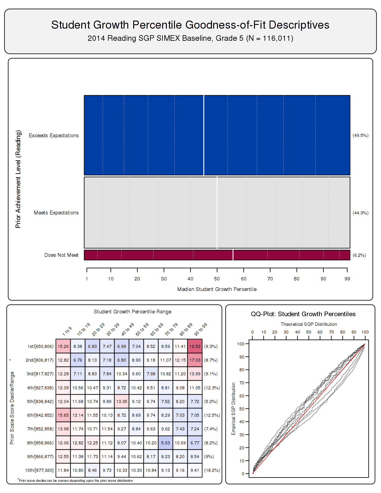

##### `r figCapNo("Goodness of Fit Plot for Grade 6 Reading, 2014 (Uncorrected).")` 


##### `r figCapNo("Goodness of Fit Plot for Grade 6 Reading, 2014 (SIMEX Corrected).")` 
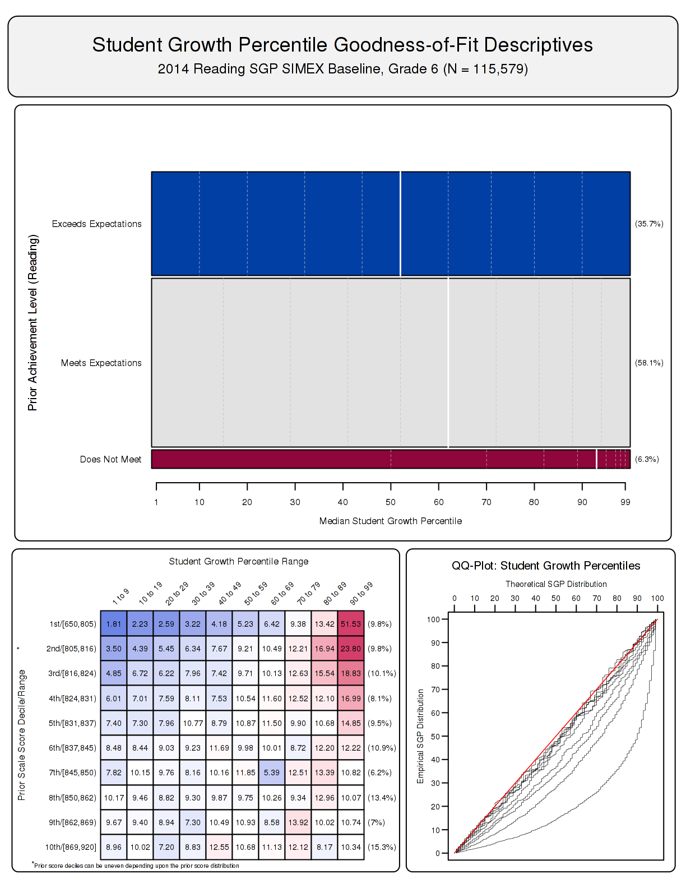

##### `r figCapNo("Goodness of Fit Plot for Grade 7 Reading, 2014 (Uncorrected).")` 


##### `r figCapNo("Goodness of Fit Plot for Grade 7 Reading, 2014 (SIMEX Corrected).")` 


##### `r figCapNo("Goodness of Fit Plot for Grade 8 Reading, 2014 (Uncorrected).")` 


##### `r figCapNo("Goodness of Fit Plot for Grade 8 Reading, 2014 (SIMEX Corrected).")` 


<!-- LaTeX_Start 
\clearpage 
LaTeX_End -->


## ELA

##### `r figCapNo("Goodness of Fit Plot for Grade 4 ELA, 2014 (Uncorrected).")` 
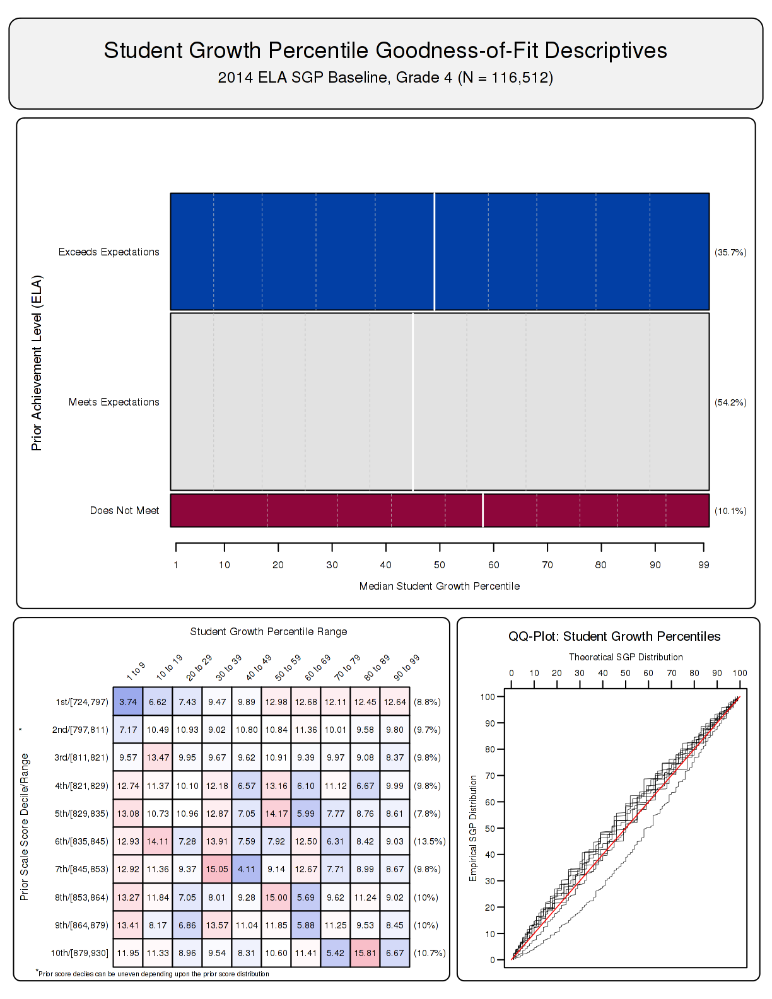
	
##### `r figCapNo("Goodness of Fit Plot for Grade 4 ELA, 2014 (SIMEX Corrected).")` 

	
##### `r figCapNo("Goodness of Fit Plot for Grade 5 ELA, 2014 (Uncorrected).")` 

	
##### `r figCapNo("Goodness of Fit Plot for Grade 5 ELA, 2014 (SIMEX Corrected).")` 

	
##### `r figCapNo("Goodness of Fit Plot for Grade 6 ELA, 2014 (Uncorrected).")` 

	
##### `r figCapNo("Goodness of Fit Plot for Grade 6 ELA, 2014 (SIMEX Corrected).")` 


##### `r figCapNo("Goodness of Fit Plot for Grade 7 ELA, 2014 (Uncorrected).")` 
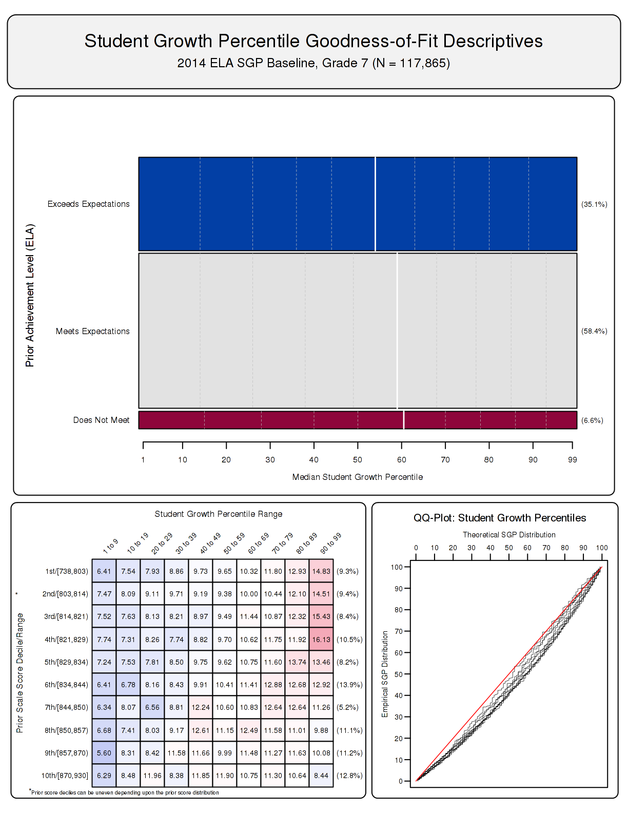
	
##### `r figCapNo("Goodness of Fit Plot for Grade 7 ELA, 2014 (SIMEX Corrected).")` 
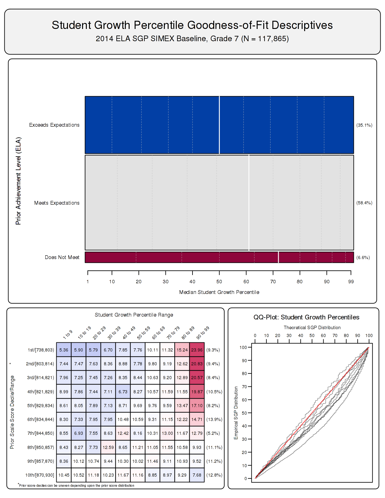
	
##### `r figCapNo("Goodness of Fit Plot for Grade 8 ELA, 2014 (Uncorrected).")` 

	
##### `r figCapNo("Goodness of Fit Plot for Grade 8 ELA, 2014 (SIMEX Corrected).")` 
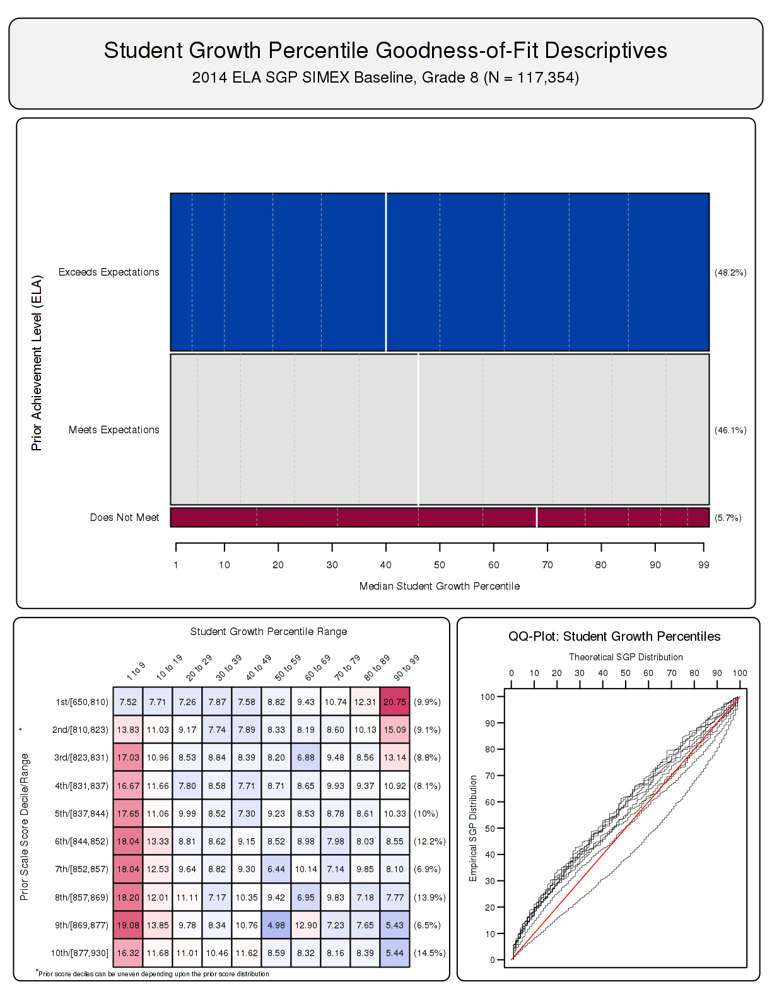
	
<!-- LaTeX_Start 
\clearpage 
LaTeX_End -->


## Mathematics

##### `r figCapNo("Goodness of Fit Plot for Grade 4 Mathematics, 2014 (Uncorrected).")` 


##### `r figCapNo("Goodness of Fit Plot for Grade 4 Mathematics, 2014 (SIMEX Corrected).")` 


##### `r figCapNo("Goodness of Fit Plot for Grade 5 Mathematics, 2014 (Uncorrected).")` 
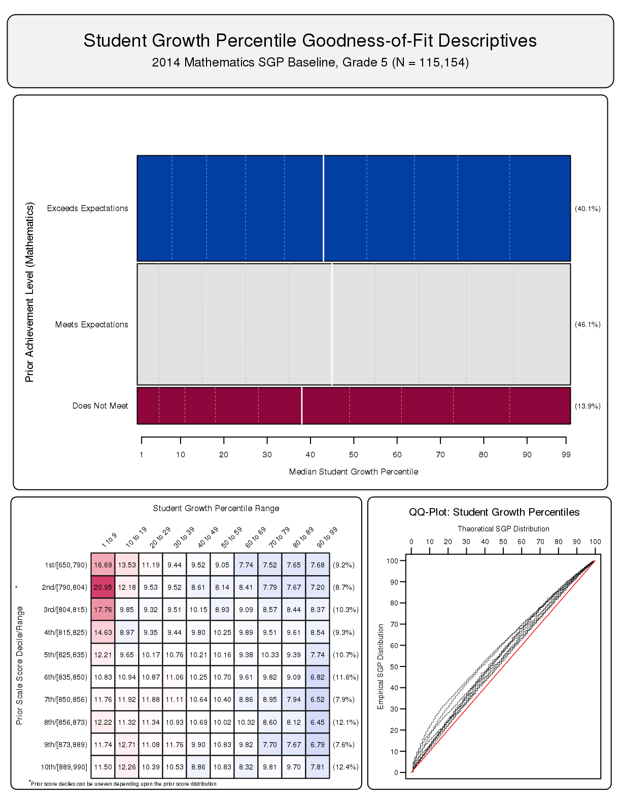

##### `r figCapNo("Goodness of Fit Plot for Grade 5 Mathematics, 2014 (SIMEX Corrected).")` 


##### `r figCapNo("Goodness of Fit Plot for Grade 6 Mathematics, 2014 (Uncorrected).")` 


##### `r figCapNo("Goodness of Fit Plot for Grade 6 Mathematics, 2014 (SIMEX Corrected).")` 


##### `r figCapNo("Goodness of Fit Plot for Grade 7 Mathematics, 2014 (Uncorrected).")` 
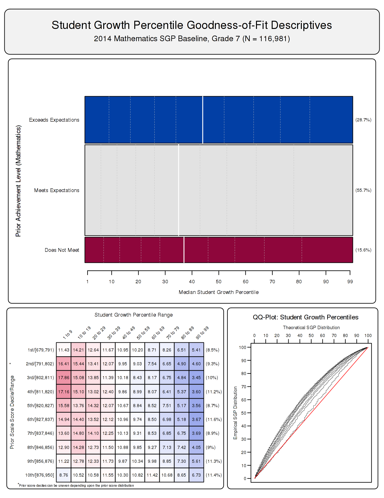

##### `r figCapNo("Goodness of Fit Plot for Grade 7 Mathematics, 2014 (SIMEX Corrected).")` 
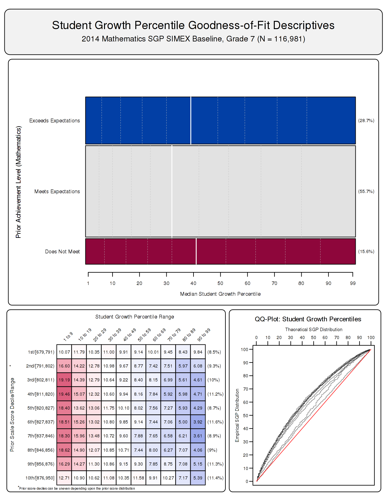

##### `r figCapNo("Goodness of Fit Plot for Grade 8 Mathematics, 2014 (Uncorrected).")` 


##### `r figCapNo("Goodness of Fit Plot for Grade 8 Mathematics, 2014 (SIMEX Corrected).")` 


<!-- LaTeX_Start 
\clearpage 
LaTeX_End -->


## Science

##### `r figCapNo("Goodness of Fit Plot for Grade 4 Science, 2014 (Uncorrected).")` 
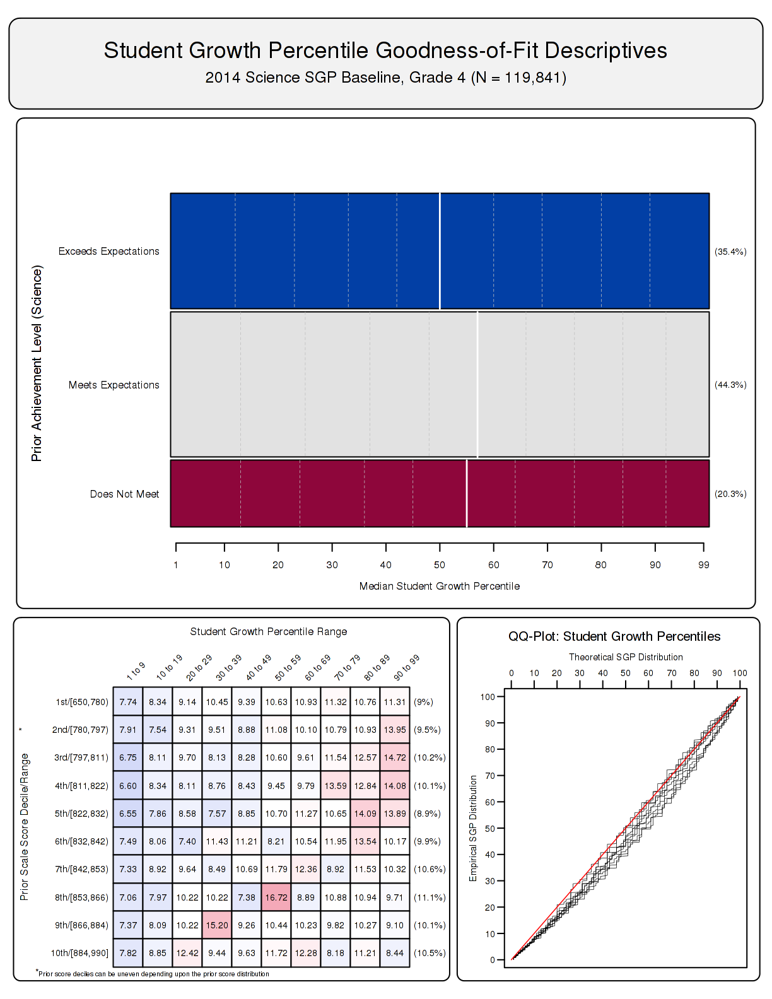
	
##### `r figCapNo("Goodness of Fit Plot for Grade 4 Science, 2014 (SIMEX Corrected).")` 

	
##### `r figCapNo("Goodness of Fit Plot for Grade 5 Science, 2014 (Uncorrected).")` 

	
##### `r figCapNo("Goodness of Fit Plot for Grade 5 Science, 2014 (SIMEX Corrected).")` 

	
##### `r figCapNo("Goodness of Fit Plot for Grade 6 Science, 2014 (Uncorrected).")` 

	
##### `r figCapNo("Goodness of Fit Plot for Grade 6 Science, 2014 (SIMEX Corrected).")` 

	
##### `r figCapNo("Goodness of Fit Plot for Grade 7 Science, 2014 (Uncorrected).")` 
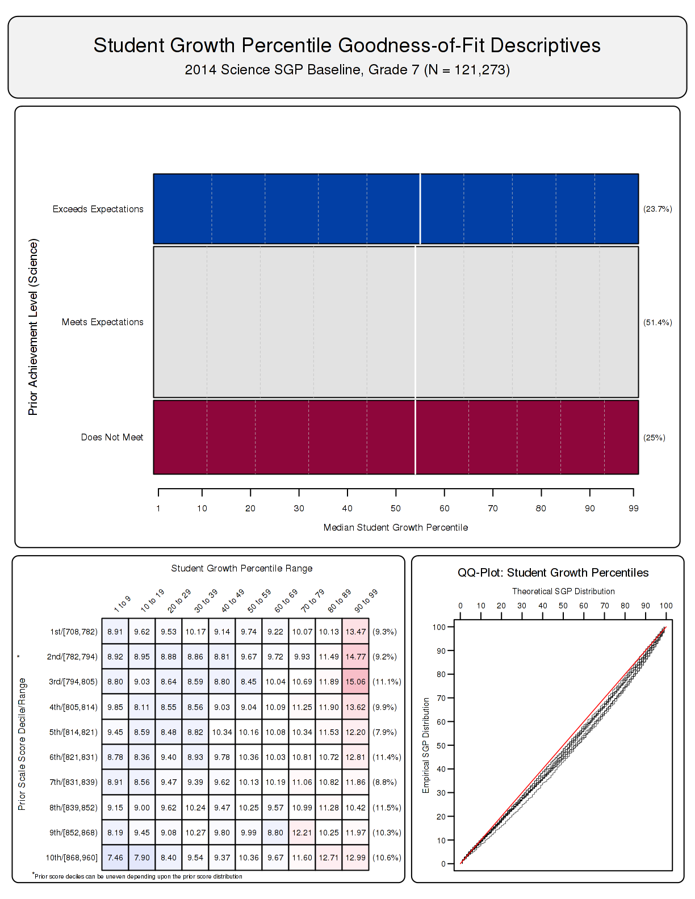
	
##### `r figCapNo("Goodness of Fit Plot for Grade 7 Science, 2014 (SIMEX Corrected).")` 

	
##### `r figCapNo("Goodness of Fit Plot for Grade 8 Science, 2014 (Uncorrected).")` 
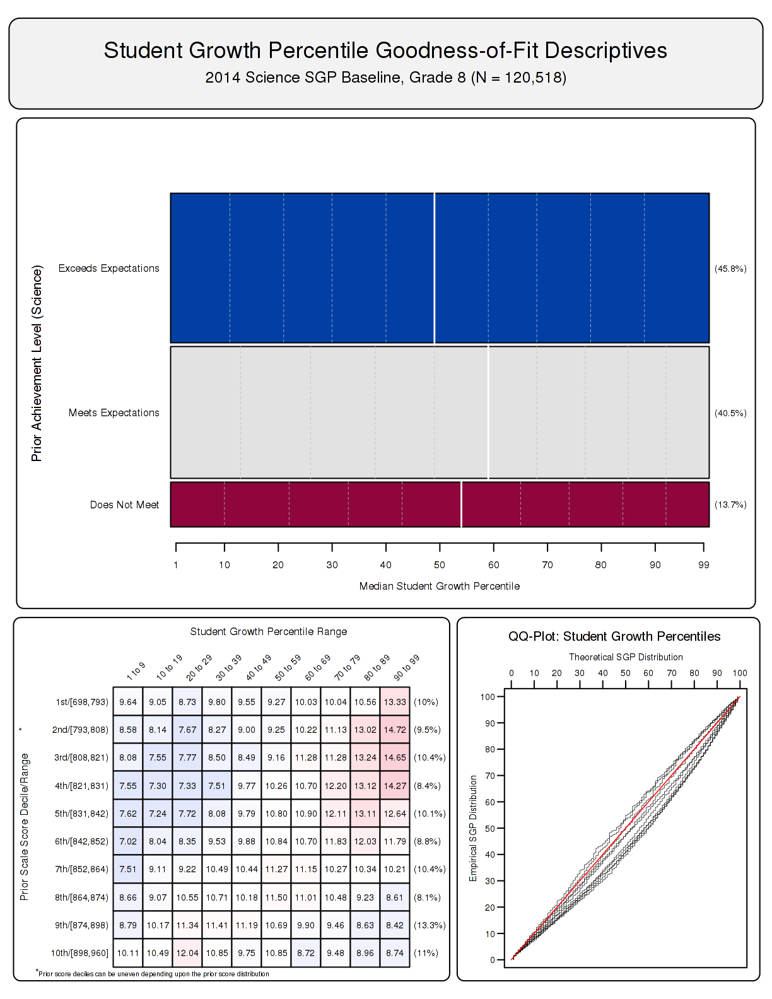
	
##### `r figCapNo("Goodness of Fit Plot for Grade 8 Science, 2014 (SIMEX Corrected).")` 
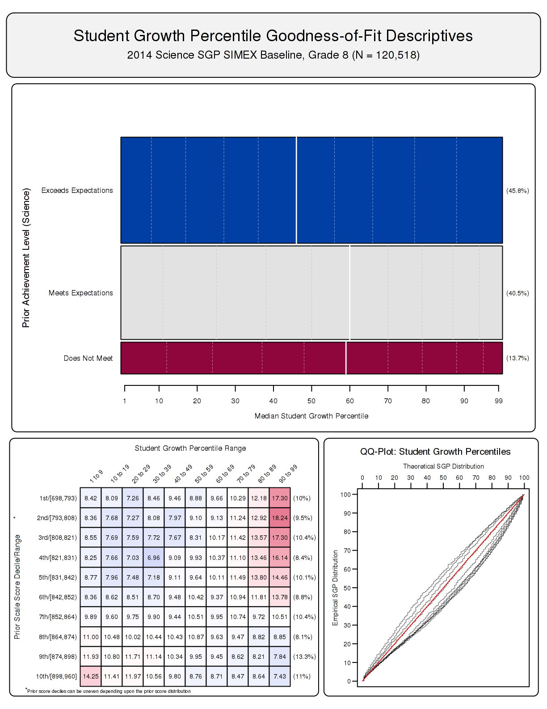
	
<!-- LaTeX_Start 
\clearpage 
LaTeX_End -->


## Social Studies

##### `r figCapNo("Goodness of Fit Plot for Grade 4 Social Studies, 2014 (Uncorrected).")` 
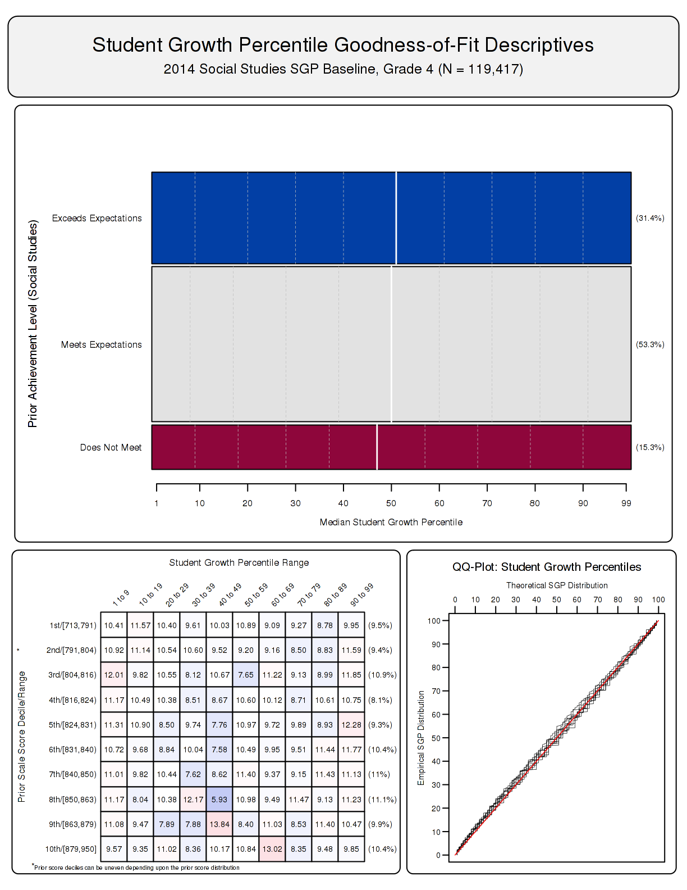
	
##### `r figCapNo("Goodness of Fit Plot for Grade 4 Social Studies, 2014 (SIMEX Corrected).")` 

	
##### `r figCapNo("Goodness of Fit Plot for Grade 5 Social Studies, 2014 (Uncorrected).")` 
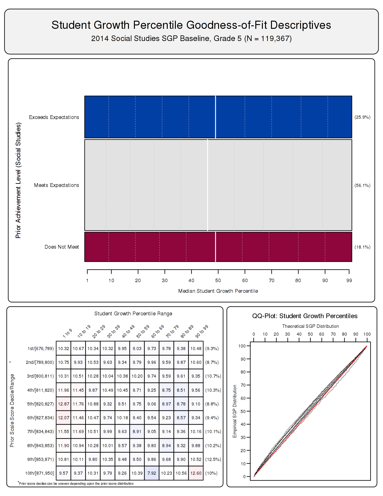
	
##### `r figCapNo("Goodness of Fit Plot for Grade 5 Social Studies, 2014 (SIMEX Corrected).")` 

	
##### `r figCapNo("Goodness of Fit Plot for Grade 6 Social Studies, 2014 (Uncorrected).")` 

	
##### `r figCapNo("Goodness of Fit Plot for Grade 6 Social Studies, 2014 (SIMEX Corrected).")` 

	
##### `r figCapNo("Goodness of Fit Plot for Grade 7 Social Studies, 2014 (Uncorrected).")` 
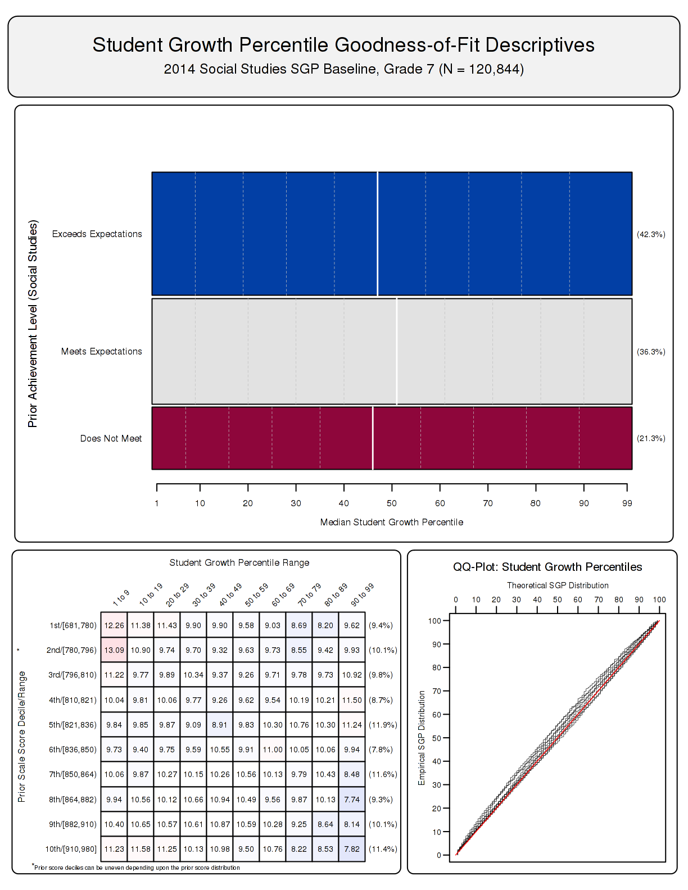
	
##### `r figCapNo("Goodness of Fit Plot for Grade 7 Social Studies, 2014 (SIMEX Corrected).")` 

	
##### `r figCapNo("Goodness of Fit Plot for Grade 8 Social Studies, 2014 (Uncorrected).")` 


##### `r figCapNo("Goodness of Fit Plot for Grade 8 Social Studies, 2014 (SIMEX Corrected).")` 
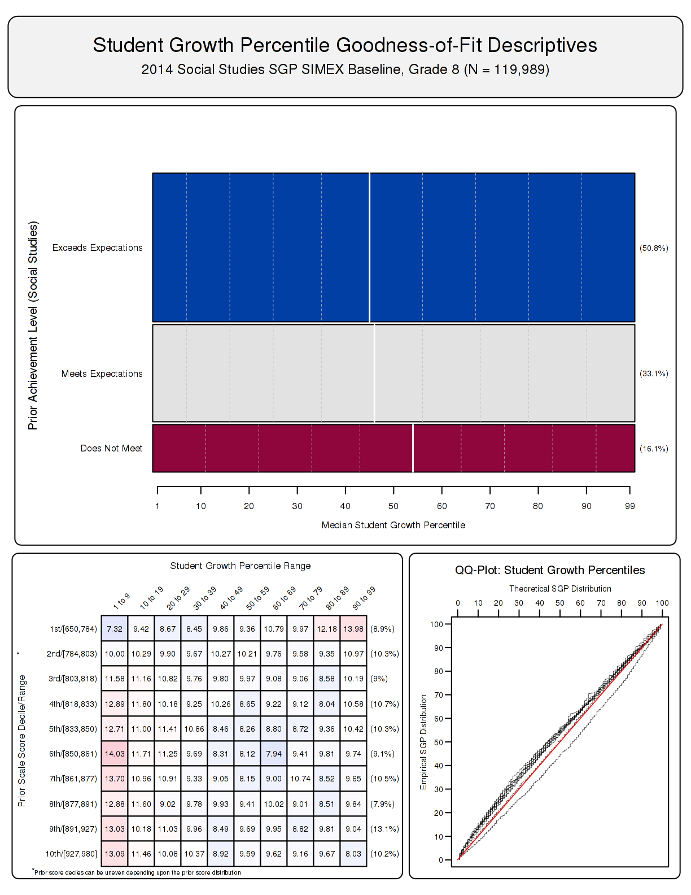


# EOCT - Baseline Referenced Course Plots, (Uncorrected and SIMEX Corrected)

##  Grade 9 Literature

```{r, comment=NA, results='asis', highlight=NA, echo=FALSE, goFit_G9L}
tmp.files <- gsub(".png", "", intersect(list.files("../img/Goodness_of_Fit/GRADE_9_LIT.2014.BASELINE"), list.files("../img/Goodness_of_Fit/GRADE_9_LIT.2014.BASELINE.SIMEX")))

for (gof in tmp.files) {
if (paste(gof, ".png", sep="") %in% list.files("../img/Goodness_of_Fit/GRADE_9_LIT.2014.BASELINE")) {
tmp.priors <- paste(sapply(strsplit(gof, ";")[[1]][-1], function(f) capwords(f, special.words =c("II", "ELA", "EOCT", "US"))), collapse=", ")

tmp.priors <- gsub(" EOCT", "", tmp.priors)
tmp.priors <- gsub("8", "Grade 8", tmp.priors)
tmp.priors <- gsub("7", "Grade 7", tmp.priors)
tmp.priors <- gsub("6", "Grade 6", tmp.priors)
	
cat(paste("
##### ", figCapNo(paste("Goodness of Fit Plot for 2014 Grade 9 Lit (Priors ", tmp.priors, " - Uncorrected).", sep="")), "


", sep=""))
}
if (paste(gof, ".png", sep="") %in% list.files("../img/Goodness_of_Fit/GRADE_9_LIT.2014.BASELINE.SIMEX")) {
cat(paste("
##### ", figCapNo(paste("Goodness of Fit Plot for 2014 Grade 9 Lit (Priors ", tmp.priors, " - SIMEX Corrected).", sep="")), "


", sep=""))
}

cat('<!-- LaTeX_Start 
\\clearpage 
LaTeX_End -->')

}
```

##  American Literature

```{r, comment=NA, results='asis', highlight=NA, echo=FALSE, goFit_AMLit}
tmp.files <- gsub(".png", "", intersect(list.files("../img/Goodness_of_Fit/AMERICAN_LIT.2014.BASELINE"), list.files("../img/Goodness_of_Fit/AMERICAN_LIT.2014.BASELINE.SIMEX")))

for (gof in tmp.files) {
if (paste(gof, ".png", sep="") %in% list.files("../img/Goodness_of_Fit/AMERICAN_LIT.2014.BASELINE")) {
tmp.priors <- paste(sapply(strsplit(gof, ";")[[1]][-1], function(f) capwords(f, special.words =c("II", "ELA", "EOCT", "US"))), collapse=", ")

tmp.priors <- gsub(" EOCT", "", tmp.priors)
tmp.priors <- gsub("8", "Grade 8", tmp.priors)
tmp.priors <- gsub("7", "Grade 7", tmp.priors)
tmp.priors <- gsub("6", "Grade 6", tmp.priors)
	
cat(paste("
##### ", figCapNo(paste("Goodness of Fit Plot for 2014 American Lit (Priors ", tmp.priors, " - Uncorrected).", sep="")), "


", sep=""))
}

if (paste(gof, ".png", sep="") %in% list.files("../img/Goodness_of_Fit/AMERICAN_LIT.2014.BASELINE.SIMEX")) {
cat(paste("
##### ", figCapNo(paste("Goodness of Fit Plot for 2014 American Lit (Priors ", tmp.priors, " - SIMEX Corrected).", sep="")), "


", sep=""))
}
}
```

<!-- LaTeX_Start 
\clearpage 
LaTeX_End -->

##  Economics

```{r, comment=NA, results='asis', highlight=NA, echo=FALSE, goFit_Econ}
tmp.files <- gsub(".png", "", intersect(list.files("../img/Goodness_of_Fit/ECONOMICS.2014.BASELINE"), list.files("../img/Goodness_of_Fit/ECONOMICS.2014.BASELINE.SIMEX")))

for (gof in tmp.files) {
if (paste(gof, ".png", sep="") %in% list.files("../img/Goodness_of_Fit/ECONOMICS.2014.BASELINE")) {
tmp.priors <- paste(sapply(strsplit(gof, ";")[[1]][-1], function(f) capwords(f, special.words =c("II", "ELA", "EOCT", "US"))), collapse=", ")

tmp.priors <- gsub(" EOCT", "", tmp.priors)
tmp.priors <- gsub("8", "Grade 8", tmp.priors)
tmp.priors <- gsub("7", "Grade 7", tmp.priors)
tmp.priors <- gsub("6", "Grade 6", tmp.priors)
	
cat(paste("
##### ", figCapNo(paste("Goodness of Fit Plot for 2014 Economics (Priors ", tmp.priors, " - Uncorrected).", sep="")), "


", sep=""))
}

if (paste(gof, ".png", sep="") %in% list.files("../img/Goodness_of_Fit/ECONOMICS.2014.BASELINE.SIMEX")) {
cat(paste("
##### ", figCapNo(paste("Goodness of Fit Plot for 2014 Economics (Priors ", tmp.priors, " - SIMEX Corrected).", sep="")), "


", sep=""))
}
}
```

<!-- LaTeX_Start 
\clearpage 
LaTeX_End -->

##  US History

```{r, comment=NA, results='asis', highlight=NA, echo=FALSE, goFit_USHist}
tmp.files <- gsub(".png", "", intersect(list.files("../img/Goodness_of_Fit/US_HISTORY.2014.BASELINE"), list.files("../img/Goodness_of_Fit/US_HISTORY.2014.BASELINE.SIMEX")))

for (gof in tmp.files) {
if (paste(gof, ".png", sep="") %in% list.files("../img/Goodness_of_Fit/US_HISTORY.2014.BASELINE")) {
tmp.priors <- paste(sapply(strsplit(gof, ";")[[1]][-1], function(f) capwords(f, special.words =c("II", "ELA", "EOCT", "US"))), collapse=", ")

tmp.priors <- gsub(" EOCT", "", tmp.priors)
tmp.priors <- gsub("8", "Grade 8", tmp.priors)
tmp.priors <- gsub("7", "Grade 7", tmp.priors)
tmp.priors <- gsub("6", "Grade 6", tmp.priors)
	
cat(paste("
##### ", figCapNo(paste("Goodness of Fit Plot for 2014 US History (Priors ", tmp.priors, " - Uncorrected).", sep="")), "


", sep=""))
}

if (paste(gof, ".png", sep="") %in% list.files("../img/Goodness_of_Fit/US_HISTORY.2014.BASELINE.SIMEX")) {
cat(paste("
##### ", figCapNo(paste("Goodness of Fit Plot for 2014 US History (Priors ", tmp.priors, " - SIMEX Corrected).", sep="")), "


", sep=""))
}
}
```

##  Biology

```{r, comment=NA, results='asis', highlight=NA, echo=FALSE, goFit_Biolgy}
tmp.files <- gsub(".png", "", intersect(list.files("../img/Goodness_of_Fit/BIOLOGY.2014.BASELINE"), list.files("../img/Goodness_of_Fit/BIOLOGY.2014.BASELINE.SIMEX")))

for (gof in tmp.files) {
if (paste(gof, ".png", sep="") %in% list.files("../img/Goodness_of_Fit/BIOLOGY.2014.BASELINE")) {
tmp.priors <- paste(sapply(strsplit(gof, ";")[[1]][-1], function(f) capwords(f, special.words =c("II", "ELA", "EOCT", "US"))), collapse=", ")

tmp.priors <- gsub(" EOCT", "", tmp.priors)
tmp.priors <- gsub("8", "Grade 8", tmp.priors)
tmp.priors <- gsub("7", "Grade 7", tmp.priors)
tmp.priors <- gsub("6", "Grade 6", tmp.priors)
	
cat(paste("
##### ", figCapNo(paste("Goodness of Fit Plot for 2014 Biology (Priors ", tmp.priors, " - Uncorrected).", sep="")), "


", sep=""))
}

if (paste(gof, ".png", sep="") %in% list.files("../img/Goodness_of_Fit/BIOLOGY.2014.BASELINE.SIMEX")) {
cat(paste("
##### ", figCapNo(paste("Goodness of Fit Plot for 2014 Biology (Priors ", tmp.priors, " - SIMEX Corrected).", sep="")), "


", sep=""))
}

cat('<!-- LaTeX_Start 
\\clearpage 
LaTeX_End -->')

}
```

##  Physical Science

```{r, comment=NA, results='asis', highlight=NA, echo=FALSE, goFit_PhysSci}
tmp.files <- gsub(".png", "", intersect(list.files("../img/Goodness_of_Fit/PHYSICAL_SCIENCE.2014.BASELINE"), list.files("../img/Goodness_of_Fit/PHYSICAL_SCIENCE.2014.BASELINE.SIMEX")))

for (gof in tmp.files) {
if (paste(gof, ".png", sep="") %in% list.files("../img/Goodness_of_Fit/PHYSICAL_SCIENCE.2014.BASELINE")) {
tmp.priors <- paste(sapply(strsplit(gof, ";")[[1]][-1], function(f) capwords(f, special.words =c("II", "ELA", "EOCT", "US"))), collapse=", ")

tmp.priors <- gsub(" EOCT", "", tmp.priors)
tmp.priors <- gsub("8", "Grade 8", tmp.priors)
tmp.priors <- gsub("7", "Grade 7", tmp.priors)
tmp.priors <- gsub("6", "Grade 6", tmp.priors)
	
cat(paste("
##### ", figCapNo(paste("Goodness of Fit Plot for 2014 Physical Science (Priors ", tmp.priors, " - Uncorrected).", sep="")), "


", sep=""))
}

if (paste(gof, ".png", sep="") %in% list.files("../img/Goodness_of_Fit/PHYSICAL_SCIENCE.2014.BASELINE.SIMEX")) {
cat(paste("
##### ", figCapNo(paste("Goodness of Fit Plot for 2014 Physical Science (Priors ", tmp.priors, " - SIMEX Corrected).", sep="")), "


", sep=""))
}

cat('<!-- LaTeX_Start 
\\clearpage 
LaTeX_End -->')

}
```

# EOCT - Cohort Referenced Course Plots, (Uncorrected and SIMEX Corrected)

##  Coordinate Algebra

```{r, comment=NA, results='asis', highlight=NA, echo=FALSE, goFit_CoordAlg}
tmp.files <- gsub(".png", "", intersect(list.files("../img/Goodness_of_Fit/COORDINATE_ALGEBRA.2014"), list.files("../img/Goodness_of_Fit/COORDINATE_ALGEBRA.2014.SIMEX")))

for (gof in tmp.files) {
if (paste(gof, ".png", sep="") %in% list.files("../img/Goodness_of_Fit/COORDINATE_ALGEBRA.2014")) {
tmp.priors <- paste(sapply(strsplit(gof, ";")[[1]][-1], function(f) capwords(f, special.words =c("II", "ELA", "EOCT", "US"))), collapse=", ")

tmp.priors <- gsub(" EOCT", "", tmp.priors)
tmp.priors <- gsub("8", "Grade 8", tmp.priors)
tmp.priors <- gsub("7", "Grade 7", tmp.priors)
tmp.priors <- gsub("6", "Grade 6", tmp.priors)
	
cat(paste("
##### ", figCapNo(paste("Goodness of Fit Plot for 2014 Coordinate Algebra (Priors ", tmp.priors, " - Uncorrected).", sep="")), "


", sep=""))
}

if (paste(gof, ".png", sep="") %in% list.files("../img/Goodness_of_Fit/COORDINATE_ALGEBRA.2014.SIMEX")) {
cat(paste("
##### ", figCapNo(paste("Goodness of Fit Plot for 2014 Coordinate Algebra (Priors ", tmp.priors, " - SIMEX Corrected).", sep="")), "


", sep=""))
}
}
```

<!-- LaTeX_Start 
\clearpage 
LaTeX_End -->


##  Analytic Geometry

```{r, comment=NA, results='asis', highlight=NA, echo=FALSE, goFit_Geom}
tmp.files <- gsub(".png", "", intersect(list.files("../img/Goodness_of_Fit/ANALYTIC_GEOMETRY.2014"), list.files("../img/Goodness_of_Fit/ANALYTIC_GEOMETRY.2014.SIMEX")))

for (gof in tmp.files) {
if (paste(gof, ".png", sep="") %in% list.files("../img/Goodness_of_Fit/ANALYTIC_GEOMETRY.2014")) {
tmp.priors <- paste(sapply(strsplit(gof, ";")[[1]][-1], function(f) capwords(f, special.words =c("II", "ELA", "EOCT", "US"))), collapse=", ")

tmp.priors <- gsub(" EOCT", "", tmp.priors)
tmp.priors <- gsub("8", "Grade 8", tmp.priors)
tmp.priors <- gsub("7", "Grade 7", tmp.priors)
tmp.priors <- gsub("6", "Grade 6", tmp.priors)
	
cat(paste("
##### ", figCapNo(paste("Goodness of Fit Plot for 2014 Analytic Geometry (Priors ", tmp.priors, " - Uncorrected).", sep="")), "


", sep=""))
}

if (paste(gof, ".png", sep="") %in% list.files("../img/Goodness_of_Fit/ANALYTIC_GEOMETRY.2014.SIMEX")) {
cat(paste("
##### ", figCapNo(paste("Goodness of Fit Plot for 2014 Analytic Geometry (Priors ", tmp.priors, " - SIMEX Corrected).", sep="")), "


", sep=""))
}
}
```

<!-- LaTeX_Start 
\clearpage 
LaTeX_End -->


##  Mathematics II

```{r, comment=NA, results='asis', highlight=NA, echo=FALSE, goFit_MathII}
tmp.files <- gsub(".png", "", intersect(list.files("../img/Goodness_of_Fit/MATHEMATICS_II.2014"), list.files("../img/Goodness_of_Fit/MATHEMATICS_II.2014.SIMEX")))

for (gof in tmp.files) {
if (paste(gof, ".png", sep="") %in% list.files("../img/Goodness_of_Fit/MATHEMATICS_II.2014")) {
tmp.priors <- paste(sapply(strsplit(gof, ";")[[1]][-1], function(f) capwords(f, special.words =c("II", "ELA", "EOCT", "US"))), collapse=", ")

tmp.priors <- gsub(" EOCT", "", tmp.priors)
tmp.priors <- gsub("8", "Grade 8", tmp.priors)
tmp.priors <- gsub("7", "Grade 7", tmp.priors)
tmp.priors <- gsub("6", "Grade 6", tmp.priors)
	
cat(paste("
##### ", figCapNo(paste("Goodness of Fit Plot for 2014 Mathematics II (Priors ", tmp.priors, " - Uncorrected).", sep="")), "


", sep=""))
}

if (paste(gof, ".png", sep="") %in% list.files("../img/Goodness_of_Fit/MATHEMATICS_II.2014.SIMEX")) {
cat(paste("
##### ", figCapNo(paste("Goodness of Fit Plot for 2014 Mathematics II (Priors ", tmp.priors, " - SIMEX Corrected).", sep="")), "


", sep=""))
}
}
```
