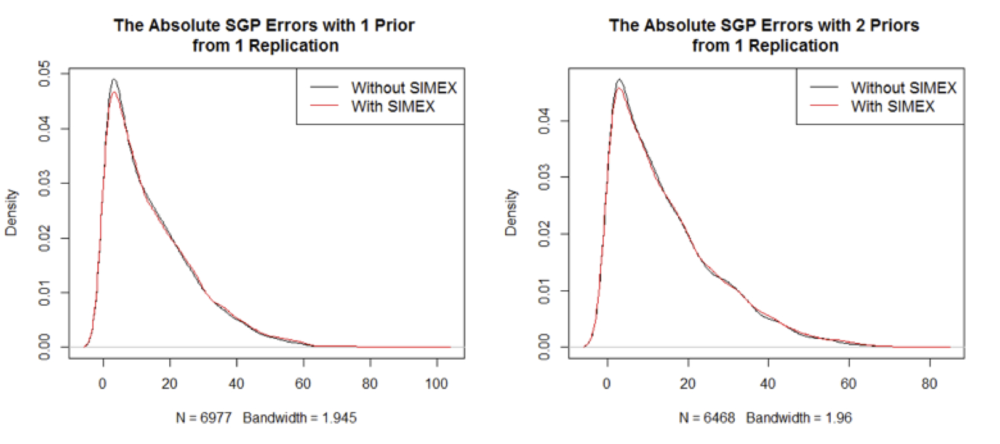
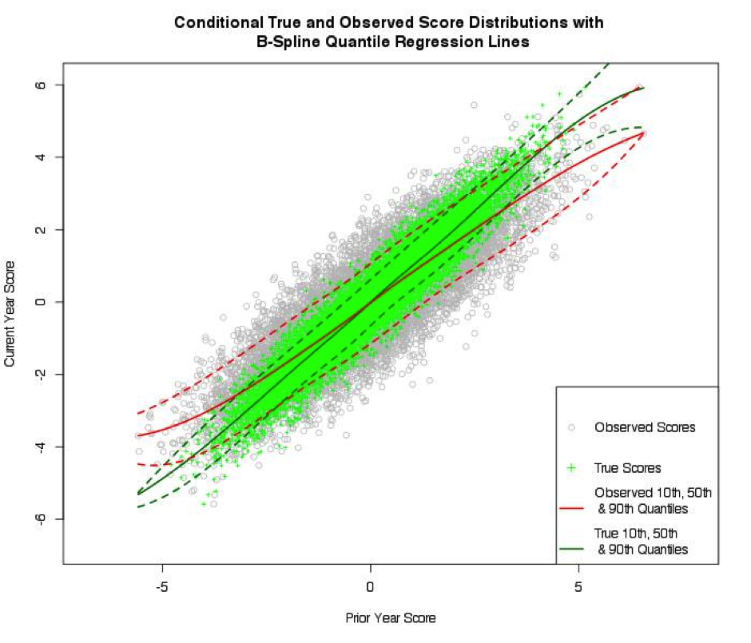
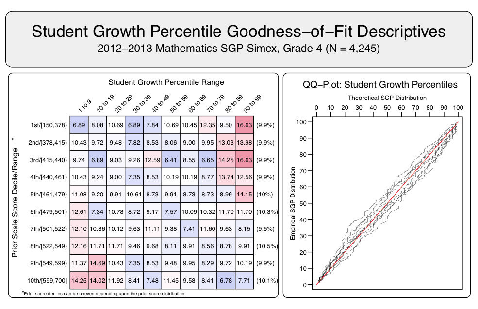
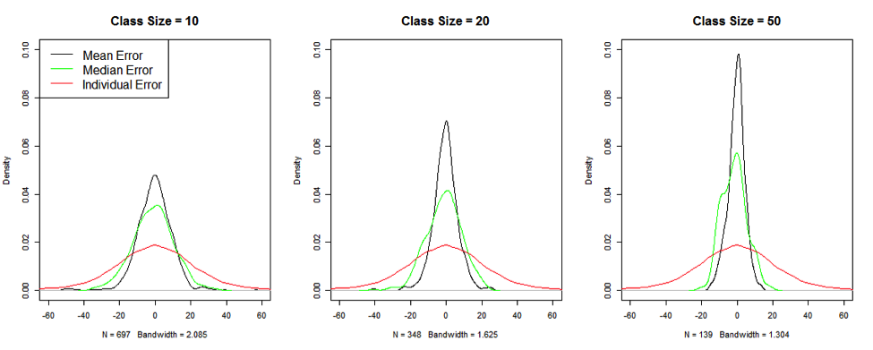
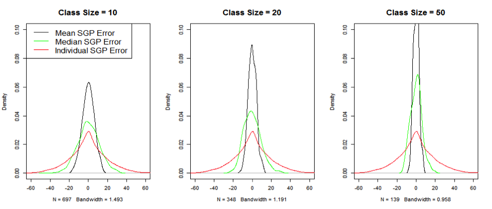
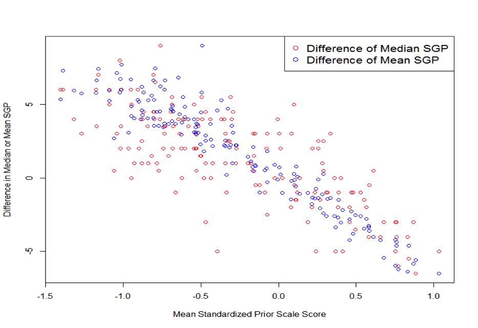
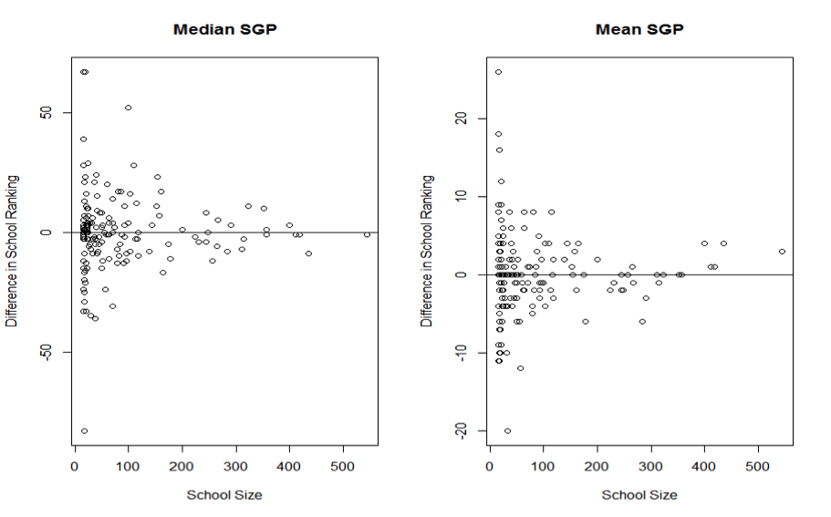

<!--SGPreport-->

```{r, echo=FALSE, include=FALSE}
  ##  Reset Table, Figure and Equation Counters
  options("table_number"=0)
  options(table_counter_str = "<strong>Table B.%s:</strong> ")
  options("fig_caption_no"=0)
  options(fig_caption_no_sprintf = "**Fig. B.%s:**   %s")
  options("fig_caption_no_roman"=FALSE)
	options("equation_counter" = 0)
	eqnNumNext <- function() {options("equation_counter" = getOption("equation_counter")+1); return(getOption("equation_counter"))}
	eqnNum <- function(eqn.name="t1", em.space=150) {
		if (!is.null(eqn.name)) assign(eqn.name, eqnNumNext(), envir=.GlobalEnv) else eqnNumNext()
		return(cat('\\hspace{', em.space, 'em} \\text{(', getOption('equation_counter'), ')}', sep=""))
	}
```

# The SIMEX Method
 The SIMEX method was proposed by Cook and Stefanski [-@CookStef:1994] as a measurement error (ME) correction technique when the standard error of measurement (SEM) is known or can be reasonably well estimated.  The SIMEX method is a functional approach that does not make strong assumptions about variable distributions [@battauz2011covariate].  Compared with other methods, SIMEX is much easier to implement for measurement error models that are less understood, such as that involving nonparametric quantile regression (QR).  It relies on repeated random sampling to solve the problem, similar to bootstrap or jackknife, hence its simplicity and generality [@stefanski1995simulation].  For a detailed description and discussion of SIMEX see Carroll, Ruppert, Stefanski, & Crainiceanu [-@Carroll:2006].

The basic idea of the method is to gauge the dependence of the ME effect on SEM through a series of experiments.  Increasing amounts of simulated ME are added to observed values, and results from these experiments are then used to extrapolate the relationship of interest to the point where SEM is equal to zero.  To explain further, let ${\sigma}^{2}_ {ui}$ stand for the variance of the ME term, $u_ i$.  In the simulation phase, additional ME with known variance is generated and added to the observed test scores, $w_ i$, to create increasingly error-prone "pseudo" data sets and then "pseudo" parameter estimates in the following steps.  First, choose a set of monotonically increasing small numbers, denoted as ${\lambda}$.  For example, let ${\lambda}$ = 0.5, 1, 1.5, 2.  Then, for each value of ${\lambda}$, produce an artificial error $\sqrt{\lambda}v_ i$, where $v_ i$ is randomly generated from the distribution of $u_ i$.  The inflated ME, $u_ i + \sqrt{\lambda}v_ i$, would have a variance equal to $(1+{\lambda}){\sigma}^{2}_ {ui}$.  Next, the "pseudo" data sets which are contaminated with the inflated ME are used to produce the "pseudo" parameter estimates with the chosen statistical model.  In order to reduce sampling noise, the simulation and "pseudo" estimation are repeated for $B$ times, and the sample mean of the $B$ "pseudo" parameter estimates is calculated at each given ${\lambda}$.  In the extrapolation stage, the averaged "pseudo" parameter estimates and the "naive" estimates (the original estimates obtained from the unperturbed data) are regressed on ${\lambda}$.  Finally, when ${\lambda}$ is set to be equal to -1, the predicted value of the extrapolant function would be the SIMEX estimate of the error-free parameter.

In the SGP model, the interest lies in estimating ${\widehat{SGP}_ X}$, and these quantities are derived from the fitted values of the model, not its regression coefficients.  Following the example of Carroll et.  al.  (1999), the SIMEX process described above is carried out on the fitted values: "pseudo" fitted value estimates, $\hat{Q}^{({\tau})}_ W({\lambda},b)$, for each of the ${\tau}$ = 1, 2, ...  99 percentiles are obtained with the repeatedly perturbed "pseudo" data sets.  These values are averaged over $B$ at each ${\lambda}$, regressed on ${\lambda}$, and finally extrapolated to ${\lambda}=-1$ to produce the SIMEX estimate $\hat{Q}^{({\tau})}_ {(X, SIMEX)}$.  In the case of quantile crossing, $\hat{Q}^{({\tau})}_ {(X, SIMEX)}$ is sorted at the specific $x_ i$, as recommended in Dette and Volgushev [-@dette2008non] and Chernozhukov, Fernandez-Val and Glichon [-@chernozhukov2010quantile].

The choices of ${\lambda}$, $B$, and extrapolation function demand explanations.  Various authors provided rules-of-thumb [see, for example, @stefanski1995simulation; @Carroll:2006, etc.].  The commonly adopted values for ${\lambda}$ are a few equally spaced numbers between 0 and 2; $B$ is usually fixed at 100; and the extrapolant function is often specified to be linear, quadratic, or non-linear regressions.  We conducted Monte Carlo experiments to compare linear with quadratic extrapolants under various ${\lambda}$ specifications.  Our results show that the linear extrapolation is generally a better choice than the quadratic.  With very fine ${\lambda}$ grid, such as ${\lambda}=0, 2/25, 4/25, \ldots, 50/25$, the quadratic SIMEX estimator of SGP is slightly less biased than the linear one, but, with a much larger variability, its MSE is still considerably higher than that of the linear estimator.  As for the choice of ${\lambda}$, a finer grid significantly improves the quadratic estimator but makes little difference for the linear one.  The MSE of the SIMEX estimator decreases monotonically as $B$ increases, but the return diminishes for $B > 30$.  The detailed results are omitted.  For additional information on the use of the SIMEX method to correct for covariate measurement error, see Shang, VanIwaarden and Betebenner [-@ShangVanIBet:2015].

# The Effect of the SIMEX Method on Individual SGPs
The following sections examine the effect of the SIMEX method on individual SGP estimates and aggregations of them at the class/school level respectively.  Results from several simulation studies are presented, followed by a discussion section.  Findings from the application of the SIMEX method to Georgia 2012 assessment data and practical issues to consider based for production level application of SIMEX are also provided.

The performance of the SIMEX method with the SGP model is tested in the following steps.  Scale scores in `sgpData` of the `SGP` package (a toy dataset extracted from longitudinal assessment data) were treated as the "true scores" for a two cohorts of students.  The first cohort consists of 6,977 4<sup>th</sup> grade students with a single 3<sup>rd</sup> grade prior scale score available.  The other consists of 6,468 5<sup>th</sup> grade students with 4<sup>th</sup> and 3<sup>rd</sup> grade priors scores available.  Missing values were excluded.  Normally distributed measurement errors were then generated using the conditional standard errors of measurement of the various grades provided in `SGPstateData` in the same package.  The "observed" scores are the sum of the "true" scores and the generated measurement errors.  SGP analysis on the "true" scores and the SGP with SIMEX analysis on the "observed" scores are then respectively to produce "true" SGPs, "observed" (or "naive") SGPs, and SIMEX corrected SGPs.  To minimize sampling errors, 100 "observed" data sets were generated using the above method.  Each student ultimately has a true SGP, 100 observed SGPs from the 100 generated data sets, and 100 SIMEX SGPs from the same data sets.  

## Quantifying the Performance of the SIMEX Method

Bias and Mean Squared Error (MSE) are the usual ways of quantifying the performance of statistical methods.  In a simulation study where the major outcome is the estimation of a few model parameters, both are usually straight forward to calculate—bias is the difference between the estimated and the true parameter averaged over simulation replications, and MSE is the squared difference between the estimated and the true parameter averaged over simulation replications.  

In the simulation study of the SGP analysis, however, each replication of the analysis produces results for thousands of students.  To evaluate the estimators, a way to summarize across both students and replications is needed.  The following statistics to compare SGPs estimated with and without SIMEX are derived for this purpose:

$$\hspace{2pt} \text{(`r eqnNumNext()`)} \hspace{55pt} \textit{Total MSE } = \frac{1}{n} \sum_ {i=1}^n \frac{1}{R} \sum_ {r=1}^R (\widehat{SGP}_ {i,r} - SGP_ i)^2$$

Where $i=1, 2,\text{ ...  },n$ indicates students, $r=1, 2,\text{ ...  },R$ indicates simulation replications, $\widehat{SGP}_ {i,r}$ denotes the estimated SGP (either with or without SIMEX) for student $\textit{i}$ in replication $\textit{r}$, and $SGP_ i$ denotes the "true" SGP for student $\textit{i}$.

$$\hspace{2pt} \text{(`r eqnNumNext()`)} \hspace{55pt} \textit{Mean Bias } = \frac{1}{n} \sum_ {i=1}^n \frac{1}{R} \sum_ {r=1}^R (\widehat{SGP}_ {i,r} - SGP_ i )$$

$$\hspace{2pt} \text{(`r eqnNumNext()`)} \hspace{55pt} \textit{SD Bias = Standard Deviation}_ {\textit{ across }i} (\frac{1}{R} \sum_ {r=1}^R \widehat{SGP}_ {i,r} - SGP_ i)$$

*Total MSE* is a comprehensive standard which accounts for both bias and variability.  *Mean Bias* is the bias averaged over students and replications, but since *Mean Bias* of either estimator is likely to be very close to 0, we also calculated *SD Bias*, which is derived by taking the difference between the estimated and the true SGPs averaged across replications, and then calculate the standard deviation of these differences across students.  *SD Bias* may be a better indicator of the magnitude of bias than *Mean Bias*, just like Standard Error of Measurement is a better indicator of the magnitude of measurement errors than the mean, which is usually 0.

## Results
The following table presents the results of the simulation study.

<div class='caption' style='page-break-before:always;'> **Table B.1** </div>

|      |**SGP**|  **Without**  |**SIMEX**|| **SGP With**   | **SIMEX** |
|:---------- | ---------:| ---------:| -------:| ---------:| ---------:| -------:|
|      |*Total MSE*|*Mean Bias*|*SD Bias*|*Total MSE*|*Mean Bias*|*SD Bias*|
|Gr 4 ~ Gr 3    | 362.980   |  0.019    | 8.004   |393.244    | -0.107    | 6.612   |
|Gr 5 ~ Gr 4, 3 | 360.795   | -0.001    | 7.512   |379.277    |  0.088    | 6.602   |


## *Why Are the Total MSEs So Large?*
The total MSEs are all very large.  The square roots of the MSEs, generally considered a measure of the average magnitude of errors, are around 19, far greater than the *Mean Bias* or the *SD Bias*.  

Figure B.1 shows the density of the absolute values of the SGP (with and without SIMEX) errors with 1 and 2 prior year scores respectively from a single replication of the simulation study.  Plots of other replications are highly similar.  Figure B.1 shows that, in any given replication of the simulation study, the absolute differences between estimated and true SGPs are highly skewed with a thin but long tail to the right.  A small number of the errors in SGPs estimated with 1 prior are close to 100.  Among SGPs estimated with 2 priors, it seems that there are less extreme outliers.  SGPs estimated with SIMEX seem to mirror those without SIMEX closely, although the former tend to have more very large errors.  The relatively small number of outliers can have dramatic influence on the MSE because, when squared, they become *much* larger and the skewness of the distributions of the squared errors will dramatically increase compared with those in Figure B.1.

<!-- HTML_Start -->
<div class='content-node image' id='errorDensity'>
<div class='caption'>**Fig.  B.1**  *Absolute values of SGP Errors with 1 and 2 Priors Used*</div>
<div class='image-content'>
</div>
</div>

<!-- LaTeX_Start

LaTeX_End -->

##  *Comparing the SIMEX Results with the Non-SIMEX Results*
Due to the skewness discussed in the section above, the root mean square error is not a good measure of the magnitude of errors in this context.  The results of the SGP analysis with and without SIMEX are therefore based on two criteria—*SD Bias* and *MSE*.  The comparison is straightforward: the SIMEX results have smaller biases but larger MSEs which indicates larger variability across replications.  Furthermore it seems that in both scenarios (i.e. with 1 and 2 priors) the increase of variability outweighs the reduction of bias.

There is, however, something strange here.  In earlier studies of the SIMEX method for correcting biased model coefficients, we noticed much bigger bias reductions than those presented in Table B.1.  The SIMEX estimators do generally have larger variability, but usually this drawback is outweighed by the prominent gains in bias reduction.  Why is the SIMEX method not doing well this time?

##  *Why Doesn’t the SIMEX Method Perform Well in Correcting Individual SGP?*
The question about the validity of using the SIMEX method to correct individual level SGPs can be raised with the following rationale.  Suppose that the model $\hat{y}_ {GOOD}=a+bx_ {OBSERVED}$ is estimated when $x_ {OBSERVED}$ is measured with errors, but $\hat{y}_ {BETTER}=\alpha+\beta x_ {TRUE}$ is the actual model desired.  Now the SIMEX method, or any other measurement error correction, moves us from $a$ and $b$ closer to $\alpha$ and $\beta$, and often times the goal is achieved at this stage.  But in the SGP analysis, simply obtaining $\alpha$ and $\beta$ is not enough.  To get more accurate SGPs, we need to obtain $\hat{y}_ {BETTER}$, which is not obtainable unless we have $x_ {TRUE}$.

Therefore, when estimating individual SGPs with SIMEX, what is roughly estimated is $\alpha+\beta x_ {TRUE}$, which is neither $\hat{y}_ {GOOD}$ nor $\hat{y}_ {BETTER}$.  Thus some bias reduction is achieved because the observed scores are usually not far from the true scores, but the effect is much discounted.

To test this theory, the "true" scores were plugged into the SIMEX process.  Table B.2 presents the outcomes of SGP without SIMEX and with SIMEX combined with "true" scores from 100 simulation replications.

<div class='caption' style='page-break-before:always;'> **Table B.2** </div>

|            |**SGP**|  **Without**  |**SIMEX**|| **SGP With SIMEX**   | **and "True" Score** |
|:---------- | ---------:| ---------:| -------:| ---------:| ---------:| -------:|
|                |*Total MSE*|*Mean Bias*|*SD Bias*|*Total MSE*|*Mean Bias*|*SD Bias*|
| Gr 4 ~ Gr 3    | 362.980   |  0.019    | 8.004   |    248.836|     -0.428|    5.652|
| Gr 5 ~ Gr 4, 3 | 360.795   | -0.001    | 7.512   |    287.078|     -0.057|    6.225|

In Table B.2, the SIMEX method greatly reduces both bias and MSE when used in combination with true scores.  This shows that the fundamental reason for increased MSE in Table B.1 is the use of SIMEX in combination with observed scores.

## *Can We Use Estimated True Scores?*
Results in Table B.2 are obviously not obtainable in reality.  As a possible alternative, the estimated true scores were substituted:

$$\hspace{2pt} \text{(`r eqnNumNext()`)} \hspace{55pt} X_ {Est.  True}= \text{Reliability} \times (X_ {OBSERVED}-\bar{X}_ {OBSERVED})+\bar{X}_ {OBSERVED}$$

The results obtained are almost exactly the same as those in Table B.1, which suggests that the inaccessibility of the true scores is a problem that is insurmountable without measurement replications.  The transformation of the observed scores to estimated true scores does not change the rank order of the observations, and so their use in the SIMEX model yields very similar results to the use of observed scores in that model.

## Visual representations of the SIMEX method corrections

Visualizations that highlight the impact of implementing the SIMEX method may provide a more intuitive understanding of the SIMEX SGP corrections and how they are obtained.  Figure B.2 shows true and observed score distributions with quantile regression models fit to those two distributions.  The simulated data points are bivariate normally distributed with homoscedastic, classical error structure in the prior year data.  As expected, the slopes of quantile regression lines fit to the observed data are attenuated.  Another notable feature is that the separation between the True 10<sup>th</sup> and 90<sup>th</sup> percentile lines is narrower than that between the corresponding lines fit to the observed data.

<!-- HTML_Start -->
<div class='content-node image' id='trueVobsRegression'>
<div class='caption'>**Fig.  B.2**</div>
<div class='image-content'>    

</div>
</div>

<!-- LaTeX_Start

LaTeX_End -->

The SIMEX method attempts to use quantile regression to produce a "map" of the observed score distribution that more closely resembles the map of the unobserved, True score map.  If the observed data (grey circles in Figure B.2) were fit with the True quantile regression models (green lines), a disproportionately large amount of high SGPs would be expected at the lower tail of the prior score distribution and, conversely, more low SGPs at the upper end of the prior score distribution.  Additionally, the compressed quantile lines in the SIMEX model of the distribution would likely create fewer than expected SGPs in the middle percentile ranges.  This would result in clustering of SGPs where the model cannot differentiate between similar (but not identical) score histories.

<!-- HTML_Start -->
<div class='content-node image' id='trueVobsRegression'>
<div class='caption'>**Figure B.3**  *Goodness of Fit plot for SIMEX SGPs obtained from one 4<sup>th</sup> grade simulation*</div>
<div class='image-content'>    

</div>
</div>

<!-- LaTeX_Start

LaTeX_End -->


These two expected features are present in Figure B.3, which is a goodness of fit plot produced from a 4th grade Math SIMEX simulation.  These plots obtained from the simulations conducted for this report suggest that the SIMEX method has produced a "better" map of what the True conditional distribution *may* look like.

## Baseline Referenced SGPs

In addition to the issues discussed above for individual cohort SGPs, there are some theoretical issues that should be taken into account for the decision to use SIMEX corrections for baseline referenced SGPs.  An ideal baseline model would show perfect fit (10 percent of kids in each cell of the left hand table in Figure 3).  From this baseline model we hope to find evidence of system wide improvement when future scores are fit to it.  That is, the baseline-referenced model can be seen as a predictive model in which we use past *observed* score distributions to predict the distribution of current *observed* scores.  Unlike predictive models that attempt to predict future observations with the greatest accuracy possible, we hope that fitting the current data with this model will show misfit due to systemic changes in the student population.  In particular, we hope to see higher growth in the present than what was expected (typical) in the past.  This would be show up as red cells on the right side of the fit table in Figure B.3.  Starting from a baseline that is already shifted due to measurement error "correction" can muddle this picture.

The measurement error literature suggests that predictive models should not use correction methods for measurement error when error prone data will be used to produce predicted values.  Carroll et al.  [-@Carroll:2006, pp.  38] provide this explanation, 

>Generally, there is no need for the modeling of measurement error to play a role in the prediction problem.  If a predictor, $X$, is measured with error and one wants to predict a response based on the error-prone version $W$ of $X$, then … it rarely makes any sense to worry about measurement error.  The reason for this is quite simple:  $W$ is an error-free as a measurement of itself! If one has an original set of data $[Y, W]$, one can fit a convenient model to $Y$ as a function of $[W]$.  Predicting $Y$ from $[W]$ is merely a mater of using this model for prediction, that is substituting known values of $W$ into the regression model for $Y$ on $[W]$; the prediction errors from this model will minimize the expected squared prediction errors in the class of all linear unbiased predictors.  Predications with $W$ naively substituted for $X$ in the regression of $Y$ on $[X]$ will be biased and can have large prediction errors.

In the SIMEX SGP analyses, using observed scores in place of true scores in a SIMEX corrected baseline model is equivalent to making "[p]redications with $W$ naively substituted for $X$ in the regression of $Y$ on $[X]$".  The large prediction errors would be evidenced in the initial non-uniform distribution of SGPs expected in the SIMEX model as shown in figure 3.  These "prediction errors" would confound any information about system wide improvement (or decline) that we hope to see through model misfit as detailed above.

On the other hand, Carroll et al.  [-@Carroll:2006] also specify an exception: "The one situation requiring that we correctly model the measurement error occurs when we develop a prediction model using data from one population but we wish to predict in another population.  A naïve prediction model that ignores measurement error may not be transportable" (p.  39).  We do not presently believe that this situation applies to the baseline-referenced analysis.  We begin by assuming that current and future annual cohorts come from the baseline cohort population.  If the model shows that this assumption is not reasonable, then we potentially have evidence that the system may be changing.  Further research and simulations may provide some empirical evidence to clarify the issue.
 
# The Effect of the SIMEX Method on Aggregated SGPs at the Class or School Level

Our conclusion that the SIMEX method should not be used to estimate individual SGPs does not automatically lead to the conclusion that the SIMEX method is not useful for correcting SGP aggregations (e.g. median growth percentiles, or MGPs), either.  On the one hand, the aggregated mean/median prior scores of a class/school should be much closer to the true aggregated scores compared with individual scores, which means that the problem mentioned in preceding sections is partially solved and the SIMEX correction could be beneficial.  On the other hand, the aggregated mean/median SGPs of a class/school should also be close to the true aggregated SGPs, which raises the question whether the SIMEX correction is necessary.

To investigate the utility of the SIMEX method at the school level, we examined three scenarios—randomly assigned schools, perfectly sorted schools, and actual schools which are usually somewhere in the middle.  In each scenario, we looked at the bias of aggregated scale scores and SGPs, the MSE of MGPs estimated with and without SIMEX, and the correlation between MGP (with and without SIMEX) and prior aggregated scores.  From now on, we use the word "school" to refer to a collective student body, which may be a class or a school.  Since we simulate schools of small and large sizes (as small as 10 students, and as large as 100), the investigation may generalize to both classes and schools.

##  Randomly Assigned Schools
Because measurement errors are random and independent of each other *aggregated* scale scores or SGPs are much more accurate than *individual* scale scores or SGPs.  We test this claim empirically in the simulation described in the [first section of this appendix](#simex-and-individual-sgps).  Students are randomly sampled without replacement into schools of various sizes.  We calculated the difference between mean observed and true scores, the difference between median observed and true scores, and the difference between individual observed and true scores.  Figure B.4 plots the errors of Grade 3 scores with school sizes of 10, 20, and 50.  Figure B.5 plots the errors of aggregated and individual SGPs of Grade 4.  The data are drawn from a single replication of the simulation study.  Plots of other grades and other replications are similar.  The same plots drawn in the other scenarios, i.e. perfectly sorted schools and actual schools, are also highly similar and are not presented.

<!-- HTML_Start -->
<div class='content-node image' id='trueVobsRegression'>
<div class='caption'>**Figure B.4**   *Errors of Aggregated and Individual Scale Scores of Grade 3*</div>
<div class='image-content'>    

</div>
</div>

<!-- LaTeX_Start

LaTeX_End -->

<!-- HTML_Start -->
<div class='content-node image' id='trueVobsRegression'>
<div class='caption'>**Figure B.5**  *Errors of Aggregated and Individual SGPs of Grade 4*</div>
<div class='image-content'>    

</div>
</div>

<!-- LaTeX_Start

LaTeX_End -->

Figure B.4 and B.5 show that, when error-prone scores and SGPs are aggregated, even in schools of just 10 students, the magnitudes of errors are greatly reduced.  The error reduction improves considerably as school sizes go up.

The next question is, can the SIMEX method improve the accuracy and precision of aggregated SGPs when students are randomly assigned to schools? Table B.3 presents MSE of mean and median SGPs of schools of various sizes.

<!--##### **Table B.3:**  *Mean Squared Errors of Aggregated SGPs of Randomized Schools of Various Sizes*-->

<div>
<table class='gmisc_table breakboth' style='border-collapse: collapse;'>
<a name='Table B.3.'></a>
<thead>
<tr><td colspan='10' style='text-align: left;'>
**Table B.3:**  Mean Squared Errors of Aggregated SGPs of Randomized Schools of Various Sizes</td></tr>
<tr>
<th style='font-weight: 900; border-top: 4px double grey;'></th>
<th align='center' colspan='4' style='font-weight: 900; border-bottom: 1px solid grey; border-top: 4px double grey;'>Mean School SGP</th><th style='border-top: 4px double grey;'>&nbsp;</th>
<th align='center' colspan='4' style='font-weight: 900; border-bottom: 1px solid grey; border-top: 4px double grey;'>Median School SGP </th>
</tr>
<tr>
<th style=';'>&nbsp;</th>
<th align='center' style='border-bottom: 1px solid grey;'>MSE 10*</th>
<th align='center' style='border-bottom: 1px solid grey;'>MSE 20</th>
<th align='center' style='border-bottom: 1px solid grey;'>MSE 50</th>
<th align='center' style='border-bottom: 1px solid grey;'>MSE 100</th>
<th style='border-bottom: 1px solid grey;'>&nbsp;</th>
<th align='center' style='border-bottom: 1px solid grey;'>MSE 10</th>
<th align='center' style='border-bottom: 1px solid grey;'>MSE 20</th>
<th align='center' style='border-bottom: 1px solid grey;'>MSE 50</th>
<th align='center' style='border-bottom: 1px solid grey;'>MSE 100</th>
</tr>
</thead><tbody>
<tr><td align='left' style='border-bottom: 1px solid grey; font-weight: 900;'>Grade 4 ~ 3</td></tr>
<tr>
<td align='right' style=';'>No SIMEX </td>
<td align='right' style=';'> 36.39</td>
<td align='right' style=';'> 17.82</td>
<td align='right' style=';'>  7.15</td>
<td align='right' style=';'>  3.57</td>
<th style=';'>&nbsp;</th>
<td align='right' style=';'>131.21</td>
<td align='right' style=';'> 83.29</td>
<td align='right' style=';'> 39.07</td>
<td align='right' style=';'> 18.49</td>
</tr>
<tr>
<td align='right' style=';'>SIMEX </td>
<td align='right' style=';'> 39.29</td>
<td align='right' style=';'> 19.45</td>
<td align='right' style=';'>  7.79</td>
<td align='right' style=';'>  3.96</td>
<th style=';'>&nbsp;</th>
<td align='right' style=';'>142.2</td>
<td align='right' style=';'> 89.92</td>
<td align='right' style=';'> 42.82</td>
<td align='right' style=';'> 20.48</td>
</tr>
<tr><td align='left' style='border-bottom: 1px solid grey; font-weight: 900;'>Grade 5 ~ 4 and 3</td></tr>
<tr>
<td align='right' style=';'>No SIMEX </td>
<td align='right' style=';'> 35.95</td>
<td align='right' style=';'> 17.94</td>
<td align='right' style=';'>  7.10</td>
<td align='right' style=';'>  3.50</td>
<th style=';'>&nbsp;</th>
<td align='right' style=';'>129.90</td>
<td align='right' style=';'> 83.99</td>
<td align='right' style=';'> 35.50</td>
<td align='right' style=';'> 18.89</td>
</tr>
<tr>
<td align='right' style=';'>SIMEX </td> 
<td align='right' style=';'> 37.78</td>
<td align='right' style=';'> 18.85</td>
<td align='right' style=';'>  7.49</td>
<td align='right' style=';'>  3.69</td>
<th style=';'>&nbsp;</th>
<td align='right' style=';'>137.00</td>
<td align='right' style=';'> 88.66</td>
<td align='right' style=';'> 38.32</td>
<td align='right' style=';'> 20.11</td>
</tr>
</tbody>
<tfoot><tr><td colspan='10'>
<br></br>\* *MSE 10 Means "Mean Squared Error for schools of 10 Students"*</td></tr></tfoot>
</table>
</div>

Table B.3 shows that MSE of aggregated SGP_SIMEX are very close to and always slightly larger than MSE of non-corrected SGPs.  It also shows that mean SGP seems to have much smaller MSE than median SGPs.

Lastly, we look at the correlation between aggregated SGP and prior scale scores.  Table B.4 presents the correlations between aggregated observed SGP (No SIMEX) and prior scores, the correlations between SGP_SIMEX and prior scores, and the correlations between error-free SGP (true) and prior scores for schools of various sizes.  Table B.4 shows that aggregated SGPs hardly correlate with aggregated prior scores in randomly assigned schools, and that the SIMEX correction tends to make the correlation estimations more erroneous rather than accurate, if only at a small scale.

<!-- ##### **Table B.4:**  *Correlations of Aggregated SGPs and prior scores of Randomized Schools of Various Sizes* -->

<div>
<table class='gmisc_table breakboth' style='border-collapse: collapse;'>
<a name='Table B.4.'></a>
<thead>
<tr><td colspan='10' style='text-align: left;'>
**Table B.4:**  Correlations of Aggregated SGPs and prior scores of Randomized Schools of Various Sizes</td></tr>
<tr>
<th style='font-weight: 900; border-top: 4px double grey;'></th>
<th align='center' colspan='4' style='font-weight: 900; border-bottom: 1px solid grey; border-top: 4px double grey;'>Correlation of <em>Mean</em> SGP and prior score</th><th style='border-top: 4px double grey;'>&nbsp;</th>
<th align='center' colspan='4' style='font-weight: 900; border-bottom: 1px solid grey; border-top: 4px double grey;'>Correlation of <em>Median</em> SGP and prior score</th>
</tr>
<tr>
<th style=';'>&nbsp;</th>
<th align='center' style='border-bottom: 1px solid grey;'>Size 10*</th>
<th align='center' style='border-bottom: 1px solid grey;'>Size 20</th>
<th align='center' style='border-bottom: 1px solid grey;'>Size 50</th>
<th align='center' style='border-bottom: 1px solid grey;'>Size 100</th>
<th style='border-bottom: 1px solid grey;'>&nbsp;</th>
<th align='center' style='border-bottom: 1px solid grey;'>Size 10</th>
<th align='center' style='border-bottom: 1px solid grey;'>Size 20</th>
<th align='center' style='border-bottom: 1px solid grey;'>Size 50</th>
<th align='center' style='border-bottom: 1px solid grey;'>Size 100</th>
</tr>
</thead><tbody>
<tr><td align='left' style='border-bottom: 1px solid grey; font-weight: 900;'>Grade 4 ~ 3</td></tr>
<tr>
<td align='right' style=';'>No SIMEX </td>
<td align='right' style=';'> 0.061</td>
<td align='right' style=';'> 0.018</td>
<td align='right' style=';'> 0.014</td>
<td align='right' style=';'>-0.004</td>
<th style=';'>&nbsp;</th>
<td align='right' style=';'> 0.045</td>
<td align='right' style=';'> 0.028</td>
<td align='right' style=';'>-0.004</td>
<td align='right' style=';'> 0.036</td>
</tr>
<tr>
<td align='right' style=';'>SIMEX </td>
<td align='right' style=';'> 0.040</td>
<td align='right' style=';'>-0.084</td>
<td align='right' style=';'>-0.083</td>
<td align='right' style=';'>-0.117</td>
<th style=';'>&nbsp;</th>
<td align='right' style=';'>-0.029</td>
<td align='right' style=';'>-0.040</td>
<td align='right' style=';'>-0.067</td>
<td align='right' style=';'>-0.033</td>
</tr>
<tr>
<td align='right' style=';'>True </td>
<td align='right' style=';'> 0.071</td>
<td align='right' style=';'> 0.025</td>
<td align='right' style=';'> 0.016</td>
<td align='right' style=';'>-0.026</td>
<th style=';'>&nbsp;</th>
<td align='right' style=';'> 0.057</td>
<td align='right' style=';'> 0.027</td>
<td align='right' style=';'> 0.107</td>
<td align='right' style=';'>-0.062</td>
</tr>
<tr><td align='left' style='border-bottom: 1px solid grey; font-weight: 900;'>Grade 5 ~ 4 and 3</td></tr>
<tr>
<td align='right' style=';'>No SIMEX </td>
<td align='right' style=';'> 0.003</td>
<td align='right' style=';'> 0.062</td>
<td align='right' style=';'> 0.122</td>
<td align='right' style=';'> 0.040</td>
<th style=';'>&nbsp;</th>
<td align='right' style=';'>-0.016</td>
<td align='right' style=';'> 0.013</td>
<td align='right' style=';'> 0.104</td>
<td align='right' style=';'> 0.051</td>
</tr>
<tr>
<td align='right' style=';'>SIMEX </td> 
<td align='right' style=';'>-0.058</td>
<td align='right' style=';'> 0.002</td>
<td align='right' style=';'> 0.066</td>
<td align='right' style=';'>-0.019</td>
<th style=';'>&nbsp;</th>
<td align='right' style=';'>-0.062</td>
<td align='right' style=';'>-0.029</td>
<td align='right' style=';'> 0.062</td>
<td align='right' style=';'> 0.020</td>
</tr>
<tr>
<td align='right' style=';'>True </td> 
<td align='right' style=';'> 0.003</td>
<td align='right' style=';'> 0.078</td>
<td align='right' style=';'> 0.167</td>
<td align='right' style=';'> 0.031</td>
<th style=';'>&nbsp;</th>
<td align='right' style=';'>-0.039</td>
<td align='right' style=';'> 0.000</td>
<td align='right' style=';'> 0.130</td>
<td align='right' style=';'> 0.059</td>
</tr>
</tbody>
<tfoot><tr><td colspan='10'>
<br></br>\* *Size 10 Means schools of 10 Students*</td></tr></tfoot>
</table>
</div>

## Perfectly Sorted Schools

For the second scenario, we assume that the assignment of students to different schools is completely based on the ranking of their prior true scores.  Table B.5 and B.6 present the MSE and correlations calculated in this scenario similar to that of Tables B.3 and B.4.  These tables show that MSE of aggregated SGPs increases dramatically when students are sorted compared with random assignment into schools.  The large MSEs are somewhat mitigated when SGPs are conditioned on more than one prior scores.  

Correlations between aggregated SGPs and prior scores are also greatly inflated, suggesting underestimation of MGP for under-achieving schools and overestimation of MGP at the other end.  The good news is that the SIMEX method seems to be effective to a certain degree in reducing MSE, especially for larger schools.  The SIMEX method also performs well in reducing the correlation between MGP and prior scores.  In fact, it almost completely removes the inflation of the correlations.  This confirms our earlier expectation that the SIMEX method might not be able to eliminate errors, but it can, under the right circumstances, quite effectively turn systematic bias into random errors.

<!-- ##### **Table B.5:**  *Mean Squared Errors of Aggregated SGPs of Sorted Schools of Various Sizes* -->

<div>
<table class='gmisc_table breakboth' style='border-collapse: collapse;'>
<a name='Table B.5.'></a>
<thead>
<tr><td colspan='10' style='text-align: left;'>
**Table B.5:**  Mean Squared Errors of Aggregated SGPs of Sorted Schools of Various Sizes</td></tr>
<tr>
<th style='font-weight: 900; border-top: 4px double grey;'></th>
<th align='center' colspan='4' style='font-weight: 900; border-bottom: 1px solid grey; border-top: 4px double grey;'>Mean School SGP</th><th style='border-top: 4px double grey;'>&nbsp;</th>
<th align='center' colspan='4' style='font-weight: 900; border-bottom: 1px solid grey; border-top: 4px double grey;'>Median School SGP </th>
</tr>
<tr>
<th style=';'>&nbsp;</th>
<th align='center' style='border-bottom: 1px solid grey;'>MSE 10*</th>
<th align='center' style='border-bottom: 1px solid grey;'>MSE 20</th>
<th align='center' style='border-bottom: 1px solid grey;'>MSE 50</th>
<th align='center' style='border-bottom: 1px solid grey;'>MSE 100</th>
<th style='border-bottom: 1px solid grey;'>&nbsp;</th>
<th align='center' style='border-bottom: 1px solid grey;'>MSE 10</th>
<th align='center' style='border-bottom: 1px solid grey;'>MSE 20</th>
<th align='center' style='border-bottom: 1px solid grey;'>MSE 50</th>
<th align='center' style='border-bottom: 1px solid grey;'>MSE 100</th>
</tr>
</thead><tbody>
<tr><td align='left' style='border-bottom: 1px solid grey; font-weight: 900;'>Grade 4 ~ 3</td></tr>
<tr>
<td align='right' style=';'>No SIMEX </td>
<td align='right' style=';'>161.88</td>
<td align='right' style=';'> 95.51</td>
<td align='right' style=';'> 47.97</td>
<td align='right' style=';'> 32.29</td>
<th style=';'>&nbsp;</th>
<td align='right' style=';'>376.52</td>
<td align='right' style=';'>238.27</td>
<td align='right' style=';'>126.00</td>
<td align='right' style=';'> 84.25</td>
</tr>
<tr>
<td align='right' style=';'>SIMEX </td>
<td align='right' style=';'>159.43</td>
<td align='right' style=';'> 85.32</td>
<td align='right' style=';'> 40.57</td>
<td align='right' style=';'> 24.12</td>
<th style=';'>&nbsp;</th>
<td align='right' style=';'>388.88</td>
<td align='right' style=';'>231.30</td>
<td align='right' style=';'>114.85</td>
<td align='right' style=';'> 69.78</td>
</tr>
<tr><td align='left' style='border-bottom: 1px solid grey; font-weight: 900;'>Grade 5 ~ 4 and 3</td></tr>
<tr>
<td align='right' style=';'>No SIMEX </td>
<td align='right' style=';'>161.93</td>
<td align='right' style=';'> 81.13</td>
<td align='right' style=';'> 36.93</td>
<td align='right' style=';'> 25.73</td>
<th style=';'>&nbsp;</th>
<td align='right' style=';'>350.78</td>
<td align='right' style=';'>206.40</td>
<td align='right' style=';'> 97.86</td>
<td align='right' style=';'> 67.87</td>
</tr>
<tr>
<td align='right' style=';'>SIMEX </td> 
<td align='right' style=';'>161.87</td>
<td align='right' style=';'> 78.91</td>
<td align='right' style=';'> 32.44</td>
<td align='right' style=';'> 19.32</td>
<th style=';'>&nbsp;</th>
<td align='right' style=';'>360.49</td>
<td align='right' style=';'>209.31</td>
<td align='right' style=';'> 90.24</td>
<td align='right' style=';'> 57.81</td>
</tr>
</tbody>
<tfoot><tr><td colspan='10'>
<br></br>\* *MSE 10 Means "Mean Squared Error for schools of 10 Students"*</td></tr></tfoot>
</table>
</div>


<!-- ##### **Table B.6:**  *Correlations of Aggregated SGPs and prior scores of Sorted Schools of Various Sizes* -->

<div>
<table class='gmisc_table breakboth' style='border-collapse: collapse;'>
<a name='Table B.6.'></a>
<thead>
<tr><td colspan='10' style='text-align: left;'>
**Table B.6:**  Correlations of Aggregated SGPs and prior scores of Sorted Schools of Various Sizes</td></tr>
<tr>
<th style='font-weight: 900; border-top: 4px double grey;'></th>
<th align='center' colspan='4' style='font-weight: 900; border-bottom: 1px solid grey; border-top: 4px double grey;'>Correlation of <em>Mean</em> SGP and prior score</th><th style='border-top: 4px double grey;'>&nbsp;</th>
<th align='center' colspan='4' style='font-weight: 900; border-bottom: 1px solid grey; border-top: 4px double grey;'>Correlation of <em>Median</em> SGP and prior score</th>
</tr>
<tr>
<th style=';'>&nbsp;</th>
<th align='center' style='border-bottom: 1px solid grey;'>Size 10*</th>
<th align='center' style='border-bottom: 1px solid grey;'>Size 20</th>
<th align='center' style='border-bottom: 1px solid grey;'>Size 50</th>
<th align='center' style='border-bottom: 1px solid grey;'>Size 100</th>
<th style='border-bottom: 1px solid grey;'>&nbsp;</th>
<th align='center' style='border-bottom: 1px solid grey;'>Size 10</th>
<th align='center' style='border-bottom: 1px solid grey;'>Size 20</th>
<th align='center' style='border-bottom: 1px solid grey;'>Size 50</th>
<th align='center' style='border-bottom: 1px solid grey;'>Size 100</th>
</tr>
</thead><tbody>
<tr><td align='left' style='border-bottom: 1px solid grey; font-weight: 900;'>Grade 4 ~ 3</td></tr>
<tr>
<td align='right' style=';'>No SIMEX </td>
<td align='right' style=';'> 0.305</td>
<td align='right' style=';'> 0.420</td>
<td align='right' style=';'> 0.577</td>
<td align='right' style=';'> 0.645</td>
<th style=';'>&nbsp;</th>
<td align='right' style=';'> 0.263</td>
<td align='right' style=';'> 0.364</td>
<td align='right' style=';'> 0.515</td>
<td align='right' style=';'> 0.602</td>
</tr>
<tr>
<td align='right' style=';'>SIMEX </td>
<td align='right' style=';'> 0.018</td>
<td align='right' style=';'> 0.057</td>
<td align='right' style=';'> 0.113</td>
<td align='right' style=';'> 0.133</td>
<th style=';'>&nbsp;</th>
<td align='right' style=';'> 0.011</td>
<td align='right' style=';'> 0.047</td>
<td align='right' style=';'> 0.100</td>
<td align='right' style=';'> 0.120</td>
</tr>
<tr>
<td align='right' style=';'>True </td>
<td align='right' style=';'> 0.005</td>
<td align='right' style=';'>-0.058</td>
<td align='right' style=';'> 0.077</td>
<td align='right' style=';'> 0.107</td>
<th style=';'>&nbsp;</th>
<td align='right' style=';'> 0.007</td>
<td align='right' style=';'>-0.039</td>
<td align='right' style=';'> 0.006</td>
<td align='right' style=';'> 0.029</td>
</tr>
<tr><td align='left' style='border-bottom: 1px solid grey; font-weight: 900;'>Grade 5 ~ 4 and 3</td></tr>
<tr>
<td align='right' style=';'>No SIMEX </td>
<td align='right' style=';'> 0.203</td>
<td align='right' style=';'> 0.298</td>
<td align='right' style=';'> 0.415</td>
<td align='right' style=';'> 0.496</td>
<th style=';'>&nbsp;</th>
<td align='right' style=';'> 0.173</td>
<td align='right' style=';'> 0.252</td>
<td align='right' style=';'> 0.356</td>
<td align='right' style=';'> 0.443</td>
</tr>
<tr>
<td align='right' style=';'>SIMEX </td> 
<td align='right' style=';'> 0.021</td>
<td align='right' style=';'> 0.047</td>
<td align='right' style=';'> 0.070</td>
<td align='right' style=';'> 0.084</td>
<th style=';'>&nbsp;</th>
<td align='right' style=';'> 0.013</td>
<td align='right' style=';'> 0.036</td>
<td align='right' style=';'> 0.054</td>
<td align='right' style=';'> 0.076</td>
</tr>
<tr>
<td align='right' style=';'>True </td> 
<td align='right' style=';'> 0.005</td>
<td align='right' style=';'> 0.009</td>
<td align='right' style=';'>-0.011</td>
<td align='right' style=';'>-0.220</td>
<th style=';'>&nbsp;</th>
<td align='right' style=';'>-0.015</td>
<td align='right' style=';'> 0.005</td>
<td align='right' style=';'>-0.111</td>
<td align='right' style=';'>-0.192</td>
</tr>
</tbody>
<tfoot><tr><td colspan='10'>
<br></br>\* *Size 10 Means schools of 10 Students*</td></tr></tfoot>
</table>
</div>


## Actual Classes/Schools

Neither the randomized or perfectly sorted schools scenarios are very realistic.  To get a sense of what may happen in reality, we turn to the `sgpData_LONG` dataset contained in the `SGP` R package, which is a toy dataset based on real schools in a different state.  We consider scale scores in this dataset as "true" scores, and perturb them in the same way as in the previous simulations.  For each perturbed data, individual and aggregated SGP and SGP_SIMEX are estimated.  We calculated the total MSE, the Mean Bias, and the SD Bias, defined in equations (1), (2), and (3).  Results from the Reading test in Grades 4 and 5 conditioning on 1 and 2 priors respectively are presented in Table B.7.  Correlations of aggregated SGP and prior scores are presented in Table B.8.  

<!-- ##### **Table B.7:**  *Mean Squared Errors of Aggregated SGPs of Actual Schools of Various Sizes* -->

<div>
<table class='gmisc_table breakboth' style='border-collapse: collapse;'>
<a name='Table B.7.'></a>
<thead>
<tr><td colspan='8' style='text-align: left;'>
**Table B.7:**  Mean Squared Errors of Aggregated SGPs of Actual Schools of Various Sizes</td></tr>
<tr>
<th style='font-weight: 900; border-top: 4px double grey;'></th>
<th align='center' colspan='3' style='font-weight: 900; border-bottom: 1px solid grey; border-top: 4px double grey;'>Mean School SGP</th><th style='border-top: 4px double grey;'>&nbsp;</th>
<th align='center' colspan='3' style='font-weight: 900; border-bottom: 1px solid grey; border-top: 4px double grey;'>Median School SGP </th>
</tr>
<tr>
<th style=';'>&nbsp;</th>
<th align='center' style='border-bottom: 1px solid grey;'>Total MSE</th>
<th align='center' style='border-bottom: 1px solid grey;'>Mean Bias</th>
<th align='center' style='border-bottom: 1px solid grey;'>SD Bias</th>
<th style='border-bottom: 1px solid grey;'>&nbsp;</th>
<th align='center' style='border-bottom: 1px solid grey;'>Total MSE</th>
<th align='center' style='border-bottom: 1px solid grey;'>Mean Bias</th>
<th align='center' style='border-bottom: 1px solid grey;'>SD Bias</th>
</tr>
</thead><tbody>
<tr><td align='left' style='border-bottom: 1px solid grey; font-weight: 900;'>Grade 4 ~ 3</td></tr>
<tr>
<td align='right' style=';'>Without SIMEX </td>
<td align='right' style=';'> 5.574</td>
<td align='right' style=';'>-0.196</td>
<td align='right' style=';'> 2.360</td>
<th style=';'>&nbsp;</th>
<td align='right' style=';'>23.366</td>
<td align='right' style=';'>-0.104</td>
<td align='right' style=';'> 5.137</td>
</tr>
<tr>
<td align='right' style=';'>With SIMEX </td>
<td align='right' style=';'> 4.741</td>
<td align='right' style=';'>-0.075</td>
<td align='right' style=';'> 2.177</td>
<th style=';'>&nbsp;</th>
<td align='right' style=';'>28.364</td>
<td align='right' style=';'> 0.034</td>
<td align='right' style=';'> 5.329</td>
</tr>
<tr><td align='left' style='border-bottom: 1px solid grey; font-weight: 900;'>Grade 5 ~ 4 and 3</td></tr>
<tr>
<td align='right' style=';'>Without SIMEX </td>
<td align='right' style=';'> 5.948</td>
<td align='right' style=';'>-0.263</td>
<td align='right' style=';'> 2.433</td>
<th style=';'>&nbsp;</th>
<td align='right' style=';'>27.101</td>
<td align='right' style=';'>-0.266</td>
<td align='right' style=';'> 5.199</td>
</tr>
<tr>
<td align='right' style=';'>With SIMEX </td> 
<td align='right' style=';'> 4.519</td>
<td align='right' style=';'> 0.094</td>
<td align='right' style=';'> 2.125</td>
<th style=';'>&nbsp;</th>
<td align='right' style=';'>25.679</td>
<td align='right' style=';'> 0.084</td>
<td align='right' style=';'> 5.060</td>
</tr>
</tbody>
</table>
</div>

Table B.7 shows that MSEs of mean SGP from actual schools are quite small to begin with, and the SIMEX method is able to further reduce it to a limited extent.  Bias and MSEs of median SGPs are much larger, and the effect of the SIMEX method on median SGPs seems to be mixed.  Table B.8 shows that there are considerable correlations between observed aggregated SGPs and prior scores, and that even the error-free SGPs correlate significantly with prior scores.  This indicates that measurement error is not the only source of the correlation.  When conditioned on more than one prior score, the correlations are much reduced.  When the SIMEX method is applied, the correlations are further reduced to a level that is quite close to the correlation between error-free SGPs and prior scores.

<!-- ##### **Table B.8:**  *Correlations of Aggregated SGPs and prior scores of Actual Schools of Various Sizes* -->

<div>
<table class='gmisc_table breakboth' style='border-collapse: collapse;'>
<a name='Table B.8.'></a>
<thead>
<tr><td colspan='6' style='text-align: left;'>
**Table B.8:**  Correlations of Aggregated SGPs and prior scores of Actual Schools of Various Sizes</td></tr>
<tr>
<th style='font-weight: 900; border-top: 4px double grey;'></th>
<th align='center' colspan='2' style='font-weight: 900; border-bottom: 1px solid grey; border-top: 4px double grey;'>Correlation of <em>Mean</em> SGP and prior score</th><th style='border-top: 4px double grey;'>&nbsp;</th>
<th align='center' colspan='2' style='font-weight: 900; border-bottom: 1px solid grey; border-top: 4px double grey;'>Correlation of <em>Median</em> SGP and prior score</th>
</tr>
<tr>
<th style=';'>&nbsp;</th>
<th align='center' style='border-bottom: 1px solid grey;'>Mathematics</th>
<th align='center' style='border-bottom: 1px solid grey;'>Reading</th>
<th style='border-bottom: 1px solid grey;'>&nbsp;</th>
 <th align='center' style='border-bottom: 1px solid grey;'>Mathematics</th>
<th align='center' style='border-bottom: 1px solid grey;'>Reading</th>
</tr>
</thead><tbody>
<tr><td align='left' style='border-bottom: 1px solid grey; font-weight: 900;'>Grade 4 ~ 3</td></tr>
<tr>
<td align='right' style=';'>No SIMEX </td>
<td align='right' style=';'> 0.384</td>
<td align='right' style=';'> 0.403</td>
<th style=';'>&nbsp;</th>
<td align='right' style=';'> 0.372</td>
<td align='right' style=';'> 0.404</td>
</tr>
<tr>
<td align='right' style=';'>SIMEX </td>
<td align='right' style=';'> 0.294</td>
<td align='right' style=';'> 0.291</td>
<th style=';'>&nbsp;</th>
<td align='right' style=';'> 0.281</td>
<td align='right' style=';'> 0.299</td>
</tr>
<tr>
<td align='right' style=';'>True </td>
<td align='right' style=';'> 0.292</td>
<td align='right' style=';'> 0.301</td>
<th style=';'>&nbsp;</th>
<td align='right' style=';'> 0.284</td>
<td align='right' style=';'> 0.330</td>
</tr>
<tr><td align='left' style='border-bottom: 1px solid grey; font-weight: 900;'>Grade 5 ~ 4 and 3</td></tr>
<tr>
<td align='right' style=';'>No SIMEX </td>
<td align='right' style=';'> 0.220</td>
<td align='right' style=';'> 0.256</td>
<th style=';'>&nbsp;</th>
<td align='right' style=';'> 0.172</td>
<td align='right' style=';'> 0.252</td>
</tr>
<tr>
<td align='right' style=';'>SIMEX </td> 
<td align='right' style=';'> 0.152</td>
<td align='right' style=';'> 0.138</td>
<th style=';'>&nbsp;</th>
<td align='right' style=';'> 0.105</td>
<td align='right' style=';'> 0.140</td>
</tr>
<tr>
<td align='right' style=';'>True </td> 
<td align='right' style=';'> 0.159</td>
<td align='right' style=';'> 0.121</td>
<th style=';'>&nbsp;</th>
<td align='right' style=';'> 0.093</td>
<td align='right' style=';'> 0.119</td>
</tr>
</tbody>
</table>
</div>

# Summary of Preliminary Results of Georgia SIMEX Analyses (2012)

The following sections provide summaries of the preliminary results of SIMEX analyses run using 2012 data.

## *How much does the SIMEX-corrected SGP differ from non-corrected SGP?*

**Answer:** Not much.  And when more priors are included, SGP and SGP_SIMEX appear to converge to each other, i.e. their differences have smaller means and standard deviations.  The pattern is clear and consistent in Tables B.9 to B.13 which present the median, mean, and standard deviation of the SIMEX corrected SGP minus the uncorrected SGP for all students.

<div class='caption' style='page-break-before:always;'> **Table B.9:**  *Reading* </div>

|        *2012*     | **Median** |  **Mean**  |**Std. Dev.**|
|:------------------|:----------:|:----------:|:-----------:|
|...................|............|............|.............|
|Gr 4, 1 prior     |      0      |    1.41    |     5.44    |
|Gr 5, 1 prior     |0|1.43|5.55
|Gr 5, 2 priors    |0|0.4|5.62|
|Gr 6, 1 prior     |0|1.21|5.9|
|Gr 6, 2 priors    |0|0.34|4.9|
|Gr 6, 3 priors    |0|0.14|4.41|
|Gr 7, 1 prior     |0|1.4|6.15|
|Gr 7, 2 priors    |0|0.39|5.43|
|Gr 7, 3 priors    |0|0.2|4.72|
|Gr 7, 4 priors    |0|0.15|4.35|
|Gr 8, 1 prior     |0|1.49|5.77|
|Gr 8, 2 priors    |0|0.45|4.91|
|Gr 8, 5 priors    |0|0.16|3.7|
|...................|............|............|.............|


<div class='caption' style='page-break-before:always;'> **Table B.10:**  *ELA* </div>

|        *2012*     | **Median** |  **Mean**  |**Std. Dev.**|
|:------------------|:----------:|:----------:|:-----------:|
|...................|............|............|.............|
|Gr 4, 1 prior|0|1.16|5.43|
|Gr 5, 2 priors|0|0.25|4.67|
|Gr 6, 2 priors|0|0.27|4.69|
|Gr 7, 2 priors|0|0.41|4.89|
|Gr 8, 2 priors|0|0.44|5.33|
|...................|............|............|.............|


<div class='caption' style='page-break-before:always;'> **Table B.11:**  *Mathematics* </div>

|        *2012*     | **Median** |  **Mean**  |**Std. Dev.**|
|:------------------|:----------:|:----------:|:-----------:|
|...................|............|............|.............|
|Gr 4, 1 prior|0|0.62|6.66|
|Gr 5, 1 prior|0|0.82|4.75|
|Gr 5, 2 priors|0|0.29|3.58|
|Gr 6, 1 prior|0|0.71|5.47|
|Gr 6, 2 priors|0|0.27|4.63|
|Gr 7, 1 prior|0|0.65|5.35|
|Gr 7, 2 priors|0|0.25|4.6|
|Gr 8, 1 prior|0|0.75|4.91|
|Gr 8, 2 priors|0|0.25|3.99|
|...................|............|............|.............|

<div class='caption' style='page-break-before:always;'> **Table B.12:**  *Science* </div>

|        *2012*     | **Median** |  **Mean**  |**Std. Dev.**|
|:------------------|:----------:|:----------:|:-----------:|
|...................|............|............|.............|
|Gr 4, 1 prior|0|0.48|5.13|
|Gr 5, 2 priors|0|0.15|4.37|
|Gr 6, 2 priors|0|0.1|4.17|
|Gr 7, 2 priors|0|0.18|4.39|
|Gr 8, 2 priors|0|0.15|3.87|
|...................|............|............|.............|

<div class='caption' style='page-break-before:always;'> **Table B.13:**  *Social Studies* </div>

|        *2012*     | **Median** |  **Mean**  |**Std. Dev.**|
|:------------------|:----------:|:----------:|:-----------:|
|...................|............|............|.............|
|Gr 4, 1 prior|0|0.47|4.72|
|Gr 5, 2 priors|0|0.11|4.31|
|Gr 6, 2 priors|0|0.21|3.71|
|Gr 7, 2 priors|0|0.15|4.2|
|Gr 8, 2 priors|0|0.11|3.5|
|...................|............|............|.............|


## *Does the SIMEX correction work differently for different schools?*

**Answer:** Yes.  For schools with lower mean scores, the SIMEX correction tends to raise their corrected mean and median SGP, whereas for schools with higher mean scores, the SIMEX correction tends to lower their corrected mean and median SGP.  This shows that SIMEX is correcting the attenuation created by measurement errors.  

<!-- HTML_Start -->
<div class='content-node image' id='trueVobsRegression'>
<div class='caption'>**Figure B.6**  *SGP_SIMEX minus SGP Plotted against School Mean Standardized Prior Scores for American Literature*</div>
<div class='image-content'>    

</div>
</div>

<!-- LaTeX_Start

LaTeX_End -->


## *Can the SIMEX correction lower correlations between aggregated school SGP and school prior scores?*

**Answer:** Yes, SIMEX does reduce the correlations between aggregated SGP and prior mean scores at the school level (Tables B.14 - B.18).  To be more specific:

* The magnitude of reduction ranges from 21% to close to 70%.  The median magnitude of reduction is 38% for Median SGP and 40% for Mean SGP in READING, and 44% for Median and 38% for Mean in MATHEMATICS.
* SIMEX achieves this correlation reduction by generally raising the aggregated SGP for lower-performing schools and lowering the aggregated SGP for high-performing schools, as illustrated in Figure B.1.  
* In a few cases, such as grades 5 and 7 for Science, and grades 5 and 8 for Social Studies, the correlations between SGP and prior scores are quite small to begin with, and SIMEX correction leads to negative correlations.  In these cases, both the original and the corrected correlations are insignificant.

<div class='caption' style='page-break-before:always;'> **Table B.14:**  *Reading* </div>

|    *2012* | **Median SGP** |  **Mean SGP**  | **Median SIMEX** |  **Mean SIMEX**  |
|:-----------------|:--------:|:--------:|:--------:|:--------:|
|..................|..........|..........|..........|..........|
|Gr 4, 1 prior|0.325|0.357|0.139|0.157|
|Gr 5, 1 prior|0.336|0.35|0.16|0.165|
|Gr 5, 2 priors|0.255|0.277|0.08|0.091|
|Gr 6, 1 prior|0.459|0.476|0.286|0.286|
|Gr 6, 2 priors|0.368|0.387|0.209|0.214|
|Gr 6, 3 priors|0.331|0.358|0.187|0.203|
|Gr 7, 1 prior|0.648|0.661|0.499|0.525|
|Gr 7, 2 priors|0.499|0.521|0.354|0.363|
|Gr 7, 3 priors|0.472|0.493|0.348|0.369|
|Gr 7, 4 priors|0.456|0.472|0.351|0.364|
|Gr 8, 1 prior|0.546|0.566|0.346|0.365|
|Gr 8, 2 priors|0.457|0.484|0.253|0.277|
|Gr 8, 5 priors|0.383|0.394|0.253|0.265|
|..................|..........|..........|..........|..........|


<div class='caption' style='page-break-before:always;'> **Table B.15:**  *ELA* </div>

|     *2012*  | **Median SGP** |  **Mean SGP**  | **Median SIMEX** |  **Mean SIMEX**  |
|:-----------------|:--------:|:--------:|:--------:|:--------:|
|..................|..........|..........|..........|..........|
|Gr 4, 1 prior|0.233|0.24|0.105|0.11|
|Gr 5, 2 priors|0.314|0.324|0.191|0.205|
|Gr 6, 2 priors|0.406|0.41|0.302|0.306|
|Gr 7, 2 priors|0.338|0.34|0.194|0.207|
|Gr 8, 2 priors|0.399|0.418|0.223|0.246|
|..................|..........|..........|..........|..........|


<div class='caption' style='page-break-before:always;'> **Table B.16:**  *Mathematics* </div>

|     *2012*  | **Median SGP** |  **Mean SGP**  | **Median SIMEX** |  **Mean SIMEX**  |
|:-----------------|:--------:|:--------:|:--------:|:--------:|
|..................|..........|..........|..........|..........|
|Gr 4, 1 prior|0.268|0.28|0.159|0.175|
|Gr 5, 1 prior|0.216|0.23|0.122|0.139|
|Gr 5, 2 priors|0.176|0.193|0.098|0.119|
|Gr 6, 1 prior|0.208|0.225|0.088|0.099|
|Gr 6, 2 priors|0.156|0.168|0.063|0.071|
|Gr 7, 1 prior|0.298|0.293|0.161|0.164|
|Gr 7, 2 priors|0.296|0.29|0.187|0.184|
|Gr 8, 1 prior|0.309|0.319|0.215|0.229|
|Gr 8, 2 priors|0.272|0.283|0.196|0.212|
|..................|..........|..........|..........|..........|


<div class='caption' style='page-break-before:always;'> **Table B.17:**  *Science* </div>

|     *2012*  | **Median SGP** |  **Mean SGP**  | **Median SIMEX** |  **Mean SIMEX**  |
|:-----------------|:--------:|:--------:|:--------:|:--------:|
|..................|..........|..........|..........|..........|
|Gr 4, 1 prior|0.269|0.294|0.14|0.164|
|Gr 5, 2 priors|0.064|0.076|-0.033|-0.029|
|Gr 6, 2 priors|0.2|0.221|0.12|0.14|
|Gr 7, 2 priors|0.05|0.068|-0.06|-0.042|
|Gr 8, 2 priors|0.277|0.286|0.205|0.215|
|..................|..........|..........|..........|..........|


<div class='caption' style='page-break-before:always;'> **Table B.18:**  *Social Studies* </div>

|     *2012*  | **Median SGP** |  **Mean SGP**  | **Median SIMEX** |  **Mean SIMEX**  |
|:-----------------|:--------:|:--------:|:--------:|:--------:|
|..................|..........|..........|..........|..........|
|Gr 4, 1 prior |0.24 |0.252|0.147 | 0.154|
|Gr 5, 2 priors|0.041|0.059|-0.054|-0.039|
|Gr 6, 2 priors|0.132|0.152|0.071|0.091|
|Gr 7, 2 priors|0.196|0.222|0.117|0.136|
|Gr 8, 2 priors|0.007|0.013|-0.059|-0.052|
|..................|..........|..........|..........|..........|

## *What about the correlations between Grand Aggregated SGP and Prior Grand Mean School Scale Scores?*

**Answer:** Tables B.19 and B.20 show that SIMEX does reduce correlation at the aggregate level across grades and subjects.  The magnitude of reduction is about 1/5 to 1/3 depending on how many subjects are included.

<div class='caption' style='page-break-before:always;'> **Table B.19:**  *Reading and Mathematics* </div>

|     *2012*  | **Median SGP** |  **Mean SGP**  | **Median SIMEX** |  **Mean SIMEX**  |  **School Count**  |
|:------------|:--------:|:--------:|:--------:|:--------:|:--------:|
|.............|..........|..........|..........|..........|..........|
|Grs 4-5, priors 1-2|0.449|0.466|0.297|0.314|1,266|
|.............|..........|..........|..........|..........|..........|

<div class='caption' style='page-break-before:always;'> **Table B.20:**  *Reading, ELA, Mathematics, Science and Social Studies* </div>

|     *2012*  | **Median SGP** |  **Mean SGP**  | **Median SIMEX** |  **Mean SIMEX**  |  **School Count**  |
|:------------|:--------:|:--------:|:--------:|:--------:|:--------:|
|.............|..........|..........|..........|..........|..........|
|Grs 4-8, priors 1-2|0.576|0.586|0.447|0.463|1,792|
|.............|..........|..........|..........|..........|..........|


## *How stable are the SIMEX results?*

**Answer:** The stability depends on the methods of aggregation, school size, and number of SIMEX iterations.  Specifically,

* With 20 SIMEX iterations, school Median SGP_SIMEX correlate with each other at above 0.95.
* With 20 SIMEX iterations, school Mean SGP_SIMEX correlate with each other at above 0.99.
* Because many schools are very close in terms of their median or mean SGP, we could see rather large difference in school rankings even if the difference in MGP is small, especially when school size is small, as illustrated in Figure 2.  
* Figure 2 also shows that Mean SGP_SIMEX is much more stable than Median SGP_SIMEX.

<!-- HTML_Start -->
<div class='content-node image' id='trueVobsRegression'>
<div class='caption'>**Figure B.7**  *Difference in School Ranking in Different SIMEX Trials Plotted Against School Size for American Literature*</div>
<div class='image-content'>    

</div>
</div>

<!-- LaTeX_Start

LaTeX_End -->


## *What are the consequences of including more priors?*

* Without SIMEX correction, including more priors leads to the mitigation of correlations between aggregated SGP and prior mean scores.  The pattern is obvious and consistent in Tables B.14 - B.18, especially Table B.14, since it includes the same grade with different numbers of priors.
* Including more priors generally makes the SIMEX correction more powerful.  The pattern is not always consistent (Tables B.14 - B.18).

## *What about Goodness-of-Fit?*
The uncorrected SGP generally has better fit than the SIMEX corrected SGP.  This is expected because goodness-of-fit means the extent to which the model fits the observed data, which is error-prone.  Since SIMEX aims to adjust for measurement error, it naturally deviates from the observed data to a limited degree.  Our confidence that SIMEX corrected SGP gets closer to the "true" results comes from the outcome of the simulation studies presented in the second section of this report.


# SIMEX implementation in the SGP package
The `SGP` package (Betebenner, VanIwaarden, Domingue & Shang, 2014) allows the user to specify many of the parameters used in the production of SIMEX SGP estimates.  The `calculate.simex` argument of the `studentGrowthPercentiles` function requires the user to specify the following SIMEX parameters in a list with the following named elements:

* **`state`** identifies the two letter state abbreviation under which the test specific CSEMs are located in `SGPstateData`, 
* **`lambda`** and **`simulation.iterations`** specify the desired values of ${\lambda}$ and $B$ respectively, and
* **`extrapolation`** to select a "linear" or "quadratic" extrapolant function.

The user may also request optional functionality, including

* **`simex.sample.size`** to specify a sample size of the data to be used in the production of the coefficient matrices^[Because the time taken to produce a coefficient matrix increases exponentially as the number of students increases a sample size smaller than the population can allow for satisfactory coefficient matrices to be produced in a more time efficient manner.  When specified, the student population must be greater than the argument value.  Note that the sample is only used to produce these matrices, and all students still receive SIMEX corrected SGP estimates.], 
* **`save.matrices`** to choose to save the coefficient matrices produced during each simulation experiment (`TRUE` or left `NULL` if not desired), and
* **`simex.use.my.coefficient.matrices`** to use previously computed coefficient matrices, if available (`TRUE` or left `NULL` if not), to produce fitted value estimates.

When the `calculate.simex` argument is `TRUE` in the high-level function `analyzeSGP` (rather than providing a list as described above) the package defaults are used.  These defaults are to set ${\lambda}$ to 0.5, 1, 1.5, 2 and $B$ as 50, the sample size is set at 25,000, and the linear extrapolant is used.  When computing cohort referenced SIMEX SGPs new coefficient matrices will be produced, used and saved.  Previously computed coefficient matrices are used for baseline referenced SGPs (see the section below regarding SIMEX baseline matrix construction).  These defaults were used in producing all Georgia's SIMEX corrected SGPs.  

Internally, the `studentGrowthPercentiles` function first uses the "naive" coefficient matrices (either calculated previously or during the current run) to obtain the "naive" fitted values from the unperturbed observed test scores.  The (non-zero) values of ${\lambda}$ are then iterated over, simulating $B$ new data sets from the observed values each time.  New coefficient matrices are produced if requested using each of the $B$ data sets.^[This includes producing the knots and boundaries used in the quantile regressions.]  The function then finds the appropriate coefficient matrix that was either just produced, or is available in the `panel.data` list provided by the user or included in the package's `SGPstateData`.  Once the appropriate matrices have been located, the fitted value predictions at each percentile value are produced and then averaged over the $B$ simulation iterations.  Once these averages are obtained for each value of ${\lambda}$, the extrapolant function is applied to them to estimate the predicted value at ${\lambda} = -1$ is extrapolated for each student.  These (extrapolated) predicted value estimates and the original observed scores are then used to produce SGP values in the typical manner.^[From documentation sections not included here - the observed score is compared to all 100 predicted values.  A students' SGP is equal to the highest percentile at which the students observed score is greater than or equal to the corresponding predicted (fitted) value.]

##  Baseline referenced coefficient matrix production
As with the construction of the "naive" baseline coefficient matrices, Georgia's SIMEX adjusted coefficient matrices were produced using a "super-cohort" of students.  That is, students with the same grade progression and/or course sequence from four or five academic year cohorts are combined into a single baseline norm group.  The process of constructing the "naive" baseline coefficient matrices has been spread out over the years due to the availability of adequate prior test types for the various content areas, and care was taken to ensure that the same years' data were used in the construction of the SIMEX matrices.  For example, baseline referenced SGPs for Social Science were first produced in 2014 using data from 2010 through 2013 while the other CRCT subjects used data from 2008 to 2011 and *only* these same years were used to produce the SIMEX baseline matrices as well.

These combined cohort norm groups can range in size from several thousand in some of the less typical EOCT course progressions to well over 400,000 in the CRCT norm groups.  Initial tests of the SIMEX SGP routine on the larger super-cohorts proved to be impossible in the `R` environment, causing numerous technical issues including total memory consumption and other memory related seg-faults.  In order to deal with these issues, the ability to take a random sample of the student score histories for construction of the matrices was added to the `SGP` package.  The sample size of 25,000 students was found to be adequate for providing consistent results, and the number of simulation iterations, $B$, was increased to 50 in order to compensate for added error from the sampling process (up from 30, the number identified earlier as the point at which the returns to reducing the MSE diminished).

The production of these SIMEX adjusted baseline matrices required several days to produce despite the use of parallel processing.  After their construction, the matrices were added to the `SGPstateData` object and used to produce SIMEX adjusted SGPs for the 2011 - 2014 academic years.  

# References
