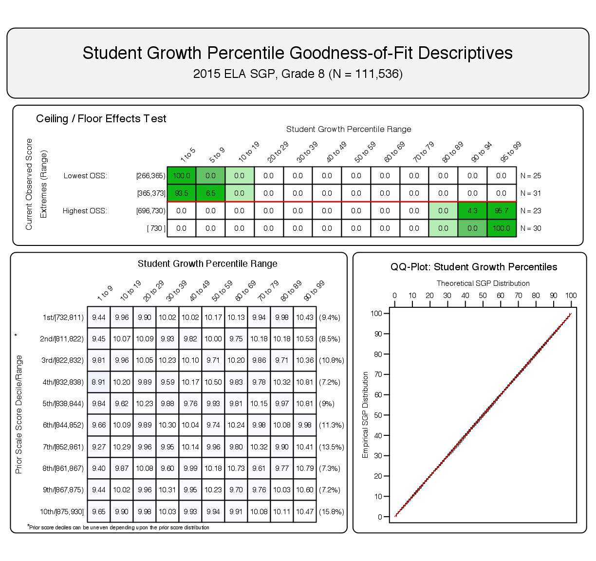
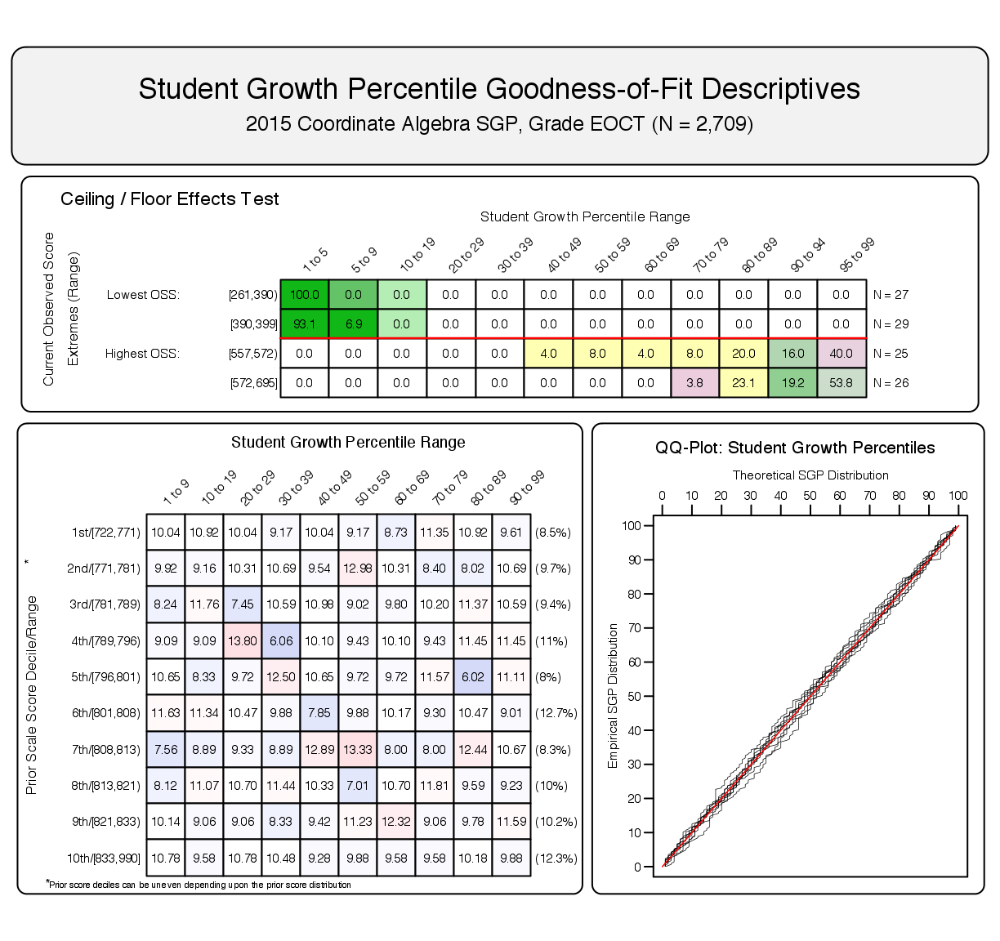
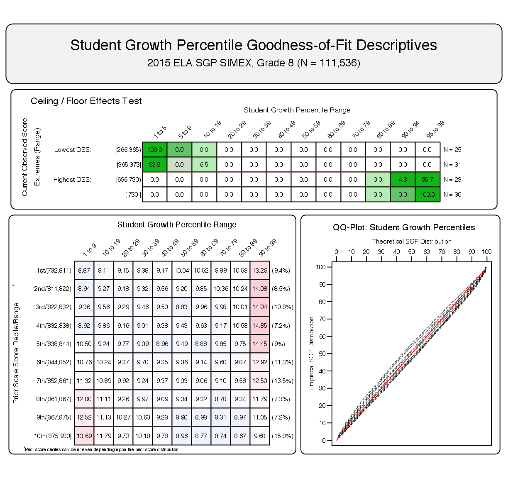
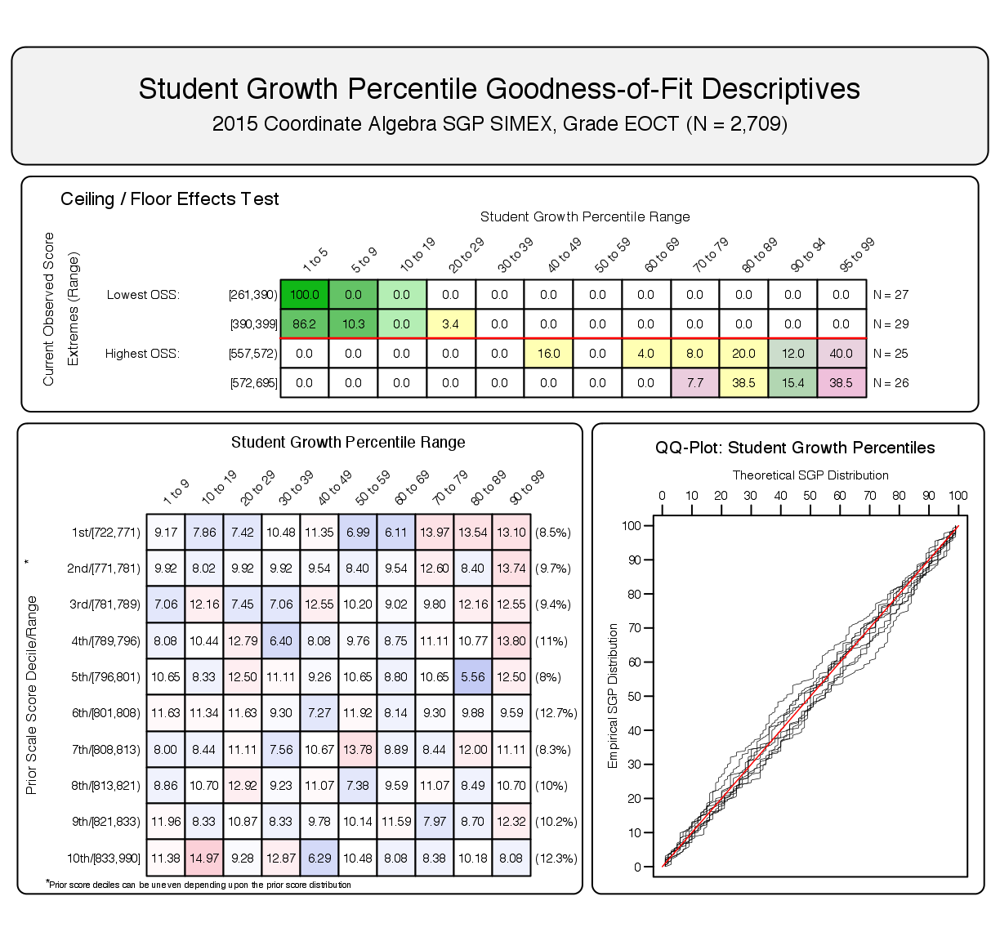

<!--SGPreport-->

<!-- 
This document was written by Damian Betebenner & Adam VanIwaarden for the State of Georgia Department of Education (DOE).

	Original Draft:  February 3, 2016
	Final Draft:     April 13, 2016
-->


```{r, echo=FALSE, include=FALSE}
  ## set a universal Cache path
  knitr::opts_chunk$set(cache.path = "_cache/GA_SGP_2015")

  ##  Load some R packages and functions required for HTML table creation silently.  
  ##  Load SGP and other packages here to avoid messages.
  require(SGP)
	require(data.table)
	require(Gmisc)
  require(htmlTable)

  ##  Set Table, Figure and Equation Counters
  options(table_number=0)
  options("fig_caption_no"=0)
	options(fig_caption_no_sprintf = "**Figure %s:**   %s")
	options("fig_caption_no_roman"=FALSE)
	options("equation_counter" = 0)

  ###
	### Lists of EOG and EOC subjects and reference types.  Used to subset summary tables and data below.
	###

  subject_order<-c("ELA", "MATHEMATICS", "SCIENCE", "SOCIAL_STUDIES", 
									 "GRADE_9_LIT", "AMERICAN_LIT", "COORDINATE_ALGEBRA", "ANALYTIC_GEOMETRY", "PHYSICAL_SCIENCE", "BIOLOGY", "US_HISTORY", "ECONOMICS")
	GL_subjects <- c("ELA", "MATHEMATICS", "SCIENCE", "SOCIAL_STUDIES")
	EOC_subjects <-c("GRADE_9_LIT", "AMERICAN_LIT", "COORDINATE_ALGEBRA", "ANALYTIC_GEOMETRY", "PHYSICAL_SCIENCE", "BIOLOGY", "US_HISTORY", "ECONOMICS")

	source('~/Dropbox (SGP)/Github_Repos/Packages/SGPreports/R/dualTable.R', echo=TRUE)
	
```

# Introduction

This report contains details on the 2014-2015 implementation of the student growth percentiles (SGP) model for the state of Georgia.  The National Center for the Improvement of Educational Assessment (NCIEA) contracted with the Georgia Department of Education (DOE) to implement the SGP methodology using data derived from the [Georgia Milestones Assessment System](http://www.gadoe.org/Curriculum-Instruction-and-Assessment/Assessment/Pages/Georgia-Milestones-Assessment-System.aspx) to create the [Georgia Student Growth Model](http://www.gadoe.org/Curriculum-Instruction-and-Assessment/Assessment/Pages/Georgia-Student-Growth-Model.aspx).  The goal of the engagement with DOE is to create a set of open source analytics techniques and conduct a set of initial analyses that will eventually be conducted exclusively by DOE in following years.

The SGP methodology is an open source norm- and criterion-referenced student growth analysis that produces student growth percentiles and student growth projections/targets for each student in the state with adequate longitudinal data.  The methodology is currently used for many purposes.  States and districts have used the results in various ways including parent/student diagnostic reporting, institutional improvement, and school and educator accountability.  Specifics about the manner in which growth is included in school and educator accountability can be found in documents related to those accountability systems.  

This report includes four sections:

- ***Data - *** includes details on the decision rules used in the raw data preparation and student record validation.
- ***Analytics - *** introduces some of the basic statistical methods and the computational process implemented in the 2015 analyses.^[More in-depth treatment of the SGP Methodology can be found [here](https://github.com/CenterForAssessment/SGP_Resources/tree/master/articles).]
- ***Goodness of Fit - *** investigates how well the statistical models used to produce SGPs fit Georgia students' data.  This includes discussion of goodness of fit plots and the student-level correlations between SGP and prior achievement.
- ***SGP Results - *** provides basic descriptive statistics from the 2015 analyses at both the state and school levels.

This report also includes multiple appendices.  Appendix A displays Goodness of Fit plots for each analysis conducted in 2015.  Appendix B provides a technical description of the SIMEX correction for measurement error with specific applications to Georgia.  Appendix C is an investigation of potential ceiling and/or floor effects present in the Georgia assessment data and growth analyses.

<!-- HTML_Start -->
<!-- LaTeX_Start 
\pagebreak
LaTeX_End -->


# Data

Data for the Georgia Milestones end-of-grade (EOG) and end-of-course (EOC) tests used in the SGP analyses were supplied by the Georgia DOE to the NCIEA for analysis in the winter of 2015.  The Milestones test records were added to existing Georgia Criterion-Referenced Competency Tests (CRCT) and EOCT assessment program data from the 2010-2011 through 2013-2014 academic years to create the longitudinal data set from which the 2015 SGPs were calculated.  Subsequent years' analyses will augment this multi-year data set allowing DOE to maintain a comprehensive longitudinal data set for all students taking the EOG and EOC Milestones assessments.

Student Growth Percentiles have been produced for students that have a current score and at least one prior score in the same subject or a related content area.  For the 2015 academic year SGPs were produced for grade-level English Language Arts (ELA), Mathematics, Science and Social Studies, as well as for EOC test subjects including 9<sup>th</sup> Grade Literature, American Literature, Coordinate Algebra, Analytic Geometry, Physical Science, Biology, U.S. History and Economics.

## Longitudinal Data
Growth analyses on assessment data require data that are linked to individual students over time.  Student growth percentile analyses require, at a minimum two, and preferably three years of assessment data for analysis of student progress.  To this end it is necessary that a unique student identifier be available so that student data records across years can be merged with one another and subsequently examined.  Because some records in the assessment data set contain students with more than one test score in a content area in a given year, a process to create unique student records in each content area by year combination was required in order to carry out subsequent growth analyses.  Furthermore, student records may be invalidated for other reasons.  The following business rules were used to either invalidate particular student records or select the appropriate record for use in the analyses.

### General business rules

1.  Student records are invalidated if the student identifier is not exactly 10 digits long.
2.  Student records with missing ("NA") scores or scale scores outside of the possible range (usually 0) are invalidated.
3.  Student records with any administrative invalidation flag (for example, identifying test irregularities, students that did not attempt the test, or other issues) are invalidated.

Beginning in 2014 the majority of the selection and invalidation of student records was performed by Georgia DOE.  Whereas in previous years NCIEA staff conducted the data cleaning prior to running the data analytics, Georgia DOE incorporated these and other business rules into the `SQL` code used to pull student records from Georgia DOE's data warehouse.

<!-- HTML_Start -->
<!-- LaTeX_Start 
\pagebreak
LaTeX_End -->


### EOG specific business rules

1.  If a student has multiple records (duplicate from the same subject, grade and administration period), their highest score was selected.
2.  If a student took more than one assessment in the same subject and school year but was identified as being in two different grades, the record with the highest grade level was selected.

Table `r tblNumNext()` shows the number of valid EOG student records available for analysis after applying the general and EOG specific business rules.^[This number does not represent the number of SGPs produced, however, because students are required to have at least one prior score available as well.]

```{r, cache=TRUE, echo=FALSE, include=FALSE}
	n_tbl_EOG <- table(Georgia_SGP@Data[YEAR=='2015' & CONTENT_AREA %in% GL_subjects & VALID_CASE=='VALID_CASE']$CONTENT_AREA, Georgia_SGP@Data[YEAR=='2015' & CONTENT_AREA %in% GL_subjects & VALID_CASE=='VALID_CASE']$GRADE)
```
```{r, results='asis', echo=FALSE, N_tableEOG}
	n_tbl_EOG_B <- n_tbl_EOG[match(GL_subjects, row.names(n_tbl_EOG)) ,]
	n_tbl_EOG_B <- cbind('Content Area'=sapply(GL_subjects, capwords, special.words=c("ELA", "US")), n_tbl_EOG_B)
	n_tbl_EOG_B <- prettyNum(n_tbl_EOG_B, preserve.width = "individual",big.mark=',')
	n_tbl_EOG_B[which(n_tbl_EOG_B==0)] <- ''
	row.names(n_tbl_EOG_B) <- NULL

  cat(dualTable(as.matrix(n_tbl_EOG_B), 
  	align=paste(rep('r', dim(n_tbl_EOG_B)[2]), collapse=''),
		n.cgroup=c(1, dim(n_tbl_EOG_B)[2]-1), cgroup=c("", "Grades"),
		caption='Number of Valid EOG Student Records by Grade and Subject for 2015'))
```

<!-- HTML_Start -->
<!-- LaTeX_Start 
\pagebreak
LaTeX_End -->


### EOC specific business rules

1.  If a student has multiple records (duplicate from the same subject and administration period), their highest score was selected.
2.  For students who participate in two main administrations (i.e., students who failed and retook an EOC course), the first attempt is used as a prior to produce an SGP for the final attempt.  In subsequent years, their final attempt may be used as a prior for other EOC analyses.
3.  Students who have tested out of EOC courses are invalidated.^[Beginning in 2013-2014, students had the opportunity to test out of an EOC course by taking the test early and scoring at the "Exceeds Expectations" for EOCT, or at "Distinguished Learner" for Georgia Milestones EOC performance level. SGPs are not calculated for any current year test out attempt. Successful attempts, however, are used as prior scores in subsequent years' analyses.]

Table `r tblNumNext()` shows the total number of valid EOC student records available for analysis after applying the general and EOC specific business rules.

```{r, cache=TRUE, echo=FALSE, include=FALSE}
	n_tbl_EOC <- table(Georgia_SGP@Data[YEAR=='2015' & CONTENT_AREA %in% EOC_subjects & VALID_CASE=='VALID_CASE']$CONTENT_AREA, Georgia_SGP@Data[YEAR=='2015' & CONTENT_AREA %in% EOC_subjects & VALID_CASE=='VALID_CASE']$GRADE)
```
```{r, results='asis', echo=FALSE, N_tableEOC}
	n_tbl_EOC_B <- n_tbl_EOC[match(EOC_subjects, row.names(n_tbl_EOC)) ,]
	n_tbl_EOC_B <- cbind('Content Area'=sapply(EOC_subjects, capwords, special.words=c("ELA", "II", "US")), 'Valid Records' = n_tbl_EOC_B)
	n_tbl_EOC_B <- prettyNum(n_tbl_EOC_B, preserve.width = "individual",big.mark=',')
	row.names(n_tbl_EOC_B) <- NULL

  cat(dualTable(as.matrix(n_tbl_EOC_B), align=paste(rep('r', dim(n_tbl_EOC_B)[2]), collapse=''), 
		caption='Total Number of Valid EOC Student Records by Subject for 2015'))

```

<!-- HTML_Start -->
<!-- LaTeX_Start 
\pagebreak
LaTeX_End -->


# Analytics

This section provides basic details about the calculation of student growth percentiles from Georgia state assessment data using the [`R` Software Environment](http://www.r-project.org/) [@Rsoftware] in conjunction with the [`SGP` package](https://github.com/CenterForAssessment/SGP) [@sgp2015].  More in depth treatment of the data analysis process with code examples has been provided to Georgia DOE staff in the 2015 Calculation Manual.

Broadly, the SGP analysis of the Georgia longitudinal student assessment data takes place in two steps:

1. Data Preparation
2. Data Analysis

Those familiar with data analysis know that the bulk of the effort in the above two step process lies with Step 1: Data Preparation.  Following thorough data cleaning and preparation, data analysis using the `SGP` package takes clean data and makes it as easy as possible to calculate, summarize, output and visualize the results from SGP analyses.

## Data Preparation

The data preparation step involves taking data provided by the Georgia DOE and producing a `.Rdata` file that will subsequently be analyzed in Step 2. This process is carried out annually as new data becomes available from the state assessment program.  The data housed by the Georgia DOE Information Technology department is extracted, cleaned and processed using a two step process:

<div class='caption'>**Step 1a.** *Initial data extraction and cleaning*</div>

In this first step a formatted data set is extracted from the Georgia student data warehouse using an internal `SQL` connection and command script. Through this process, student records are selected and invalidated based upon the business rules discussed above. The end result is an exported, pipe-delimited file where a each valid student record is unique by content area, school year, student identifier (GTID), and test administration period.

<div class='caption'>**Step 1b.** *Final data cleaning and preparation in* `R`</div>

In this step the data from step 1a is read into [`R`](http://www.r-project.org/) and modified slightly with regard to variable types/classes. The result is a `.Rdata` file that is suitable for analysis with the [`SGP` package](https://github.com/CenterForAssessment/SGP).  In previous years' analyses the bulk of the data cleaning and implementation of business rule validation from step 1a was also performed in `R` by NCIEA staff.  However, the division of the cleaning and validation tasks used in 2015 is an important step in moving towards Georgia DOE self-sufficiency in calculating growth percentiles in subsequent years.

The cleaned and formatted data is finally combined with the existing longitudinal data set from previous years' analyses.  The existing data is housed in a new [`SGP` class object](http://cran.r-project.org/web/packages/SGP/SGP.pdf) created from a select subset of CRCT and EOCT data necessary to complete the 2015 and future Milestones analyses.  With an appropriate longitudinal data set prepared, we move to the calculation and estimation of student-level SGPs.

## 2015 Data Analysis

The objective of the student growth percentile (SGP) analysis is to describe how (a)typical a student's growth is by examining his/her current achievement relative to students with a similar achievement history; i.e his/her *academic peers* (see [Section 2 of the GSGM FAQ](https://docs.google.com/viewer?url=http%3A%2F%2Fwww.gadoe.org%2FCurriculum-Instruction-and-Assessment%2FAssessment%2FDocuments%2FSGP%2520FAQ%2520072214.pdf) and [this presentation](https://github.com/CenterForAssessment/SGP_Resources/blob/master/presentations/Academic_Peer_Slides.pdf))). The estimation of this norm-referenced growth quantity is conducted using quantile regression [@Koenker:2005] to model curvilinear functional relationships between student's prior and current scores.  One hundred such regression models are calculated for each separate analysis (defined as a unique ***year** by **content area** by **grade** by **prior order*** combination).  The end product of these 100 separate regression models is a single coefficient matrix, which serves as a look-up table to relate prior student achievement to current achievement for each percentile. This process ultimately leads to tens of thousands of model calculations (and many more when SIMEX measurement error corrections are performed) during each of Georgia's annual batch of analyses.  For a more in-depth discussion of SGP calculation, see Betebenner [-@Betebenner:2009], and see Shang, VanIwaarden and Betebenner [-@ShangVanIBet:2015] and Appendix B of this report for further information on the SIMEX measurement error correction methodology.

The 2015 Georgia SGP analyses follow a work flow established in previous years that includes the following 4 steps:

1. Update the Georgia assessment meta-data required for SGP calculations using the `SGP` package.
2. Create annual SGP configurations for analyses.
3. Conduct all EOG and EOC SGP analyses concurrently.
4. Combine results into the master longitudinal data set, summarize results and output data.

### Update Georgia meta-data

The use of higher-level functions included in the `SGP` package (e.g. `analyzeSGP`) requires the availability of state specific assessment information.  This meta-data is compiled in a `R` object named `SGPstateData` that is housed in the package.  The required updates for the 2015 analyses included *a)* the additions of Milestones knots and boundaries, proficiency level cutscores and other configuration metadata, and *b)* updating the norm group preferences object.

<div class='caption'>**Knots and boundaries**</div>
Cubic B-spline basis functions are used in the calculation of SGPs to more adequately model the heteroscedasticity and non-linearity found in assessment data.^[It should be noted that the independent estimation of the regression functions can potentially result in the crossing of the quantile functions.  This occurs near the extremes of the distributions and is potentially more likely to occur given the use of non-linear functions.  A potential result of allowing the quantile functions to cross would be *lower* percentile estimations of growth for *higher* observed scale scores at the extremes (give all else equal in prior scores) and vice versa.  In order to deal with these contradictory estimates, quantile regression results are isotonized to prevent quantile crossing following the methods derived by Chernozhukov, Fernandez-Val and Glichon [-@chernozhukov2010quantile].]  These functions require the selection of boundary and interior knots.  Boundary knots (i.e. "boundaries") are end-points outside of the scale score distribution that anchor the B-spline basis.  These are typically selected by extending the entire range of scale scores by 10%.  That is, they are defined as lying 10% below the lowest obtainable/observed scale score (LOSS) and 10% above the highest obtainable/observed scale score (HOSS).  The interior knots (i.e. "knots") are the *internal* breakpoints that define the spline.  The default choice in the `SGP` package is to select the 20<sup>th</sup>, 40<sup>th</sup>, 60<sup>th</sup> and 80<sup>th</sup> quantiles of the observed scale score distribution.

In general the knots and boundaries are computed from a distribution comprised of several years of test data (i.e. multiple cohorts combined) so that any irregularities in a single year are smoothed out.  This is important because subsequent annual analyses use these same knots and boundaries as well.  All defaults were used to compile the knots and boundaries for Georgia from the CRCT and EOC tests in previous years, and were also used in 2015 to compute the Milestones knots and boundaries required for EOC block schedule and within-year repeater analyses.  Official knots and boundaries will be recalculated for Georgia Milestones assessments in 2016 when two years of test data are available and at which point they will be used as the dependent variables in *all* quantile regressions.

<div class='caption'>**Proficiency level cutscores**</div>
Cutscores, which are set externally by the Georgia DOE through standard-setting processes, are mainly required for student growth projections.  Projections were calculated through the use of equating methods in the 2015 analyses due to the switch to Georgia Milestones Assessments because Student Growth Projections assume consistency in assessment programs.  However, these projections will not be used for official reporting purposes.

The performance (achievement) level metadata, such as labels and descriptions, were also updated to reflect the new Milestones standards.

<div class='caption'>**Conditional standard errors of measurement (CSEMs)**</div>
The calculation of SIMEX adjusted SGPs and SGP standard errors require the availability of each assessments' standard errors of measurement.  In the CRCT analyses in previous years the CSEM data for all other content areas had been compiled in the `SGPstateData` file.  These values are no longer scale score specific (i.e. there are some identical test scores with different CSEM values, whereas previously these were all identical) and so are now included in the student level data.  Although the CSEM data was not added to the `SGPstateData` object, this change still required the identification of the name of the student level CSEM variable, "`SCALE_SCORE_CSEM`", in the metadata.

<div class='caption'>**Set the `sgp.cohort.size` SGP configuration**</div>
Following preliminary analyses, five EOC course progressions were identified as having fewer than 1,500 students.  Given the decreasing quality of model fit and the increasing difficulty in interpretability of what SGP values from such a small *norm group* size represents, the decision was made to institute a minimum N size of 1,500 for all analyses.  This could be done either manually by removing the configuration scripts, or by adding a `SGP_Configuration` entry for it in the `SGPstateData`.  The latter option was adopted, and therefore any future attempts to examine course progressions with fewer than 1,500 students will require a manual override of this (i.e. set to `NULL`).

<div class='caption'>**Norm group preferences**</div>
The process through which EOC and ELA analyses are run can produce multiple SGPs for some students.  In order to identify which quantity will be used as the students' "official" SGP and subsequently merged into the master longitudinal data set, a system of norm group preferencing is established and is encoded into a lookup table and included in the `SGPstateData`.  In general, the preference is given to:

- Progressions with the greatest number of prior scale scores.
- Progressions in which a student has repeated a course.
- Progressions that do not include a skipped year (i.e. a gap in the scale score history).
- Progressions for block-schedule course taking patterns.

The next section describes the process by which the individual course progression analyses are established using configuration code, which incorporates  the preferencing system within it.


### Create SGP configurations

Unlike most EOG analyses, EOC analyses are specialized enough so that it is necessary to specify the analyses to be performed via explicit configuration code.  For several years, configurations have been employed to conduct EOC SGP analyses for Georgia, and beginning in 2015 configurations are now used for EOG SGP analyses as well.  Their use in EOG is required for the ELA analyses because the ELA assessment now covers both reading and writing content, and the analyses use both CRCT ELA and CRCT Reading tests as priors.  Although not necessary for the other EOG content areas, the use of configuration code allows for consistency between the other subjects and for all analyses to be run concurrently.

Configurations are `R` code scripts that are used as part of the larger SGP analysis to be discussed later and to construct the norm group preference object discussed previously.  They are broken up into four separate R scripts based on content domain (ELA, mathematics, science and social studies).  Each configuration code chunk specifies a set of parameters that defines the norm group of students to be examined.  Every potential norm group is defined by, at a minimum, the progressions of content area, academic year and grade-level.  Therefore, every configuration used contains the first three elements.  The EOC test and ELA analyses also contain the fourth through seventh elements:

- **`sgp.content.areas`:** A progression of values that specifies the content areas to be looked at and their order.
- **`sgp.panel.years`:** The progression of the years associated with the content area progression (`sgp.content.areas`) provided in the configuration, potentially allowing for skipped years, repeated years, etc.
- **`sgp.grade.sequences`:** The grade progression associated with the content area and year progressions provided in the configuration. **'EOCT'** stands for 'End Of Course Test'.  The use of the generic 'EOCT' allows for secondary students to be compared based on the pattern of course taking rather than being dependent upon grade-level/class-designation.
- **`sgp.exact.grade.progression`:** When set to `TRUE`, this element will force the lower level functions to analyze *only* the progression as specified in its entirety.  Otherwise (either excluded or set to `NULL` or `FALSE`) these functions will analyze subsets of the progression for every possible order (i.e. each number of prior time periods of data available). When set to `TRUE`, a norm group preference system is usually required as well.
- **`sgp.projection.grade.sequences`:** This element is used to identify the grade sequence that will be used to produce straight and/or lagged student growth projections.  It can, somewhat counter-intuitively, be left out or set to NULL, in which case projections will be produced and the package functions will populate the grade sequence to use based on the values provided in the `sgp.grade.sequences` element.  Alternatively, when set to "`NO_PROJECTIONS`", no projections will be produced.  For EOC analyses, only configurations that correspond to the canonical course progressions can produce student growth projections.  The canonical progressions are codified and stored in the `SGP` package here: `SGPstateData[["GA"]][["SGP_Configuration"]][["content_area.projection.sequence"]]`.
- **`sgp.norm.group.preference`:** Because a student can potentially be included in more than one analysis/configuration, multiple SGPs will be produced for some students and a system is required to identify the preferred SGP that will be matched with the student in the `combineSGP` step.  This argument provides a ranking that specifies how preferable SGPs produced from the analysis in question is relative to other possible analyses.  ***Lower numbers correspond with higher preference.***
- **`sgp.exclude.sequences`:** Identifies grade, subject, and year combinations that identify students that should be excluded from the norm-group cohort.  Generally used in progressions in which a year or similar time period is skipped (i.e. a gap in time exists).  For example, in a progression that goes from 8<sup>th</sup> grade Science to EOC Biology with a skipped year in between one may want to exclude kids that fit into that progression, but also repeated either 8<sup>th</sup> grade Science or EOC Biology or took EOC Physical Science in the skipped year.  Students with different course progressions may be inappropriate to include with the cohort of students who truly had no science related course in the intervening year.

As an example, here is one Biology configuration used to define a 2015 SGP analysis:

```R
...

   BIOLOGY.2015 = list(
      sgp.content.areas=c("SCIENCE", "SCIENCE", "BIOLOGY"),
      sgp.panel.years=c("2012", "2013", "2015"),
      sgp.grade.sequences=list(c(7, 8, "EOCT")),
      sgp.panel.years.within=c("LAST_OBSERVATION", 
         "LAST_OBSERVATION", "FIRST_OBSERVATION"),
      sgp.exact.grade.progression=TRUE,
      sgp.exclude.sequences = data.table(
         VALID_CASE = "VALID_CASE", 
         CONTENT_AREA=c("SCIENCE", "BIOLOGY", "PHYSICAL_SCIENCE"), 
         YEAR=c("2014", "2014", "2014"), 
         GRADE=c(8, "EOCT", "EOCT")),
      sgp.norm.group.preference=7),
...

```


### Conduct SGP analyses

All cohort-referenced (uncorrected) and SIMEX corrected EOG and EOC SGPs were calculated concurrently.^[In addition to these quantities, baseline-referenced SGPs (uncorrected and SIMEX corrected) had been calculated in previous years and used as the "official" SGP quantity, but this method of SGP calculation will be unavailable until at least 3 years of Milestones assessment data are available to form the baseline cohorts.]  We use the [`updateSGP`](http://www.inside-r.org/packages/cran/SGP/docs/updateSGP) function to ***a)*** do the final preparation and addition of the 2015 cleaned and formatted data to the new `SGP` class object ([`prepareSGP`](http://www.inside-r.org/packages/cran/SGP/docs/prepareSGP) step) and ***b)*** calculate SGP estimates ([`analyzeSGP`](http://www.inside-r.org/packages/cran/SGP/docs/analyzeSGP) step).  

### Merge, output, summarize and visualize results

Once all analyses were completed the results were merged into the master longitudinal data set ([`combineSGP`](http://www.inside-r.org/packages/cran/SGP/docs/combineSGP) step).  A pipe delimited version of the complete long data is output ([`outputSGP`](http://www.inside-r.org/packages/cran/SGP/docs/outputSGP) step) and submitted to the Georgia DOE after some additional formatting to add fields needed for rendering data in the state's [visualization tool](http://gastudentgrowth.gadoe.org/) such as students' entire prior score and course progression history.  The data is also summarized using the [`summarizeSGP` function](http://www.inside-r.org/packages/cran/SGP/docs/summarizeSGP), which produces many tables of descriptive statistics that are disaggregated at the state, district, school and instructor levels, as well as other factors of interest.  Finally, visualizations (such as bubble charts) are produced from the data and summary tables using the [`visualizeSGP`](http://www.inside-r.org/packages/cran/SGP/docs/visualizeSGP) function.

<!-- HTML_Start -->
<!-- LaTeX_Start 
\pagebreak
LaTeX_End -->


# Goodness of Fit

Despite the use of B-splines to accommodate heteroscedasticity and skewness of the scale score distributions, assumptions that are made in the statistical modeling process can impact how well the percentile curves fit the data.  Examination of goodness-of-fit was conducted by first inspecting model fit plots the `SGP` software package produced for each analysis, and subsequently inspecting student level correlations between growth and achievement.  Discussion of the model fit plots in general and examples of them are provided below, as are tables of the correlation results.  The complete portfolio of model fit plots is provided in Appendix A of this report.

## Model Fit Plots

Using all available EOG and EOC scores as the variables, estimation of student growth percentiles was conducted for each possible student (those with a current score and at least one prior score).  Each analysis is defined by the grade and content area for the grade-level analyses and exact content area (and grade when relevant) sequences for the EOC subjects.  A goodness of fit plot is produced for each unique analysis run in 2015 and are all provided in Appendix A to this report.

As an example, Figure `r getOption("fig_caption_no")+1` shows the results for 8<sup>th</sup> grade ELA as an example of good model fit.  Figure `r getOption("fig_caption_no")+2` is the fit plot for one of the Coordinate Algebra analyses that incorporates a skipped year (i.e. students with no 2014 mathematics scores), and demonstrates minor model misfit.

The "Ceiling/Floor Effects Test" panel is intended to help identify potential problems in SGP estimation at the Highest and Lowest Obtainable (or Observed) Scale Scores (HOSS and LOSS).  If is is relatively typical for extremely high (low) achieving students to consistently score at or near the HOSS (LOSS) each year, the SGPs for these students may be unexpectedly low (high).  That is, for example, if a sufficient number of students maintain performance at the HOSS over time, this performance will be estimated as typical, and therefore SGP estimates will reflect typical growth (e.g. 50th percentile).  In some cases small deviations from these extreme score values might even yield low growth estimates.  Although these score patterns can legitimately be estimated as typical or low growth percentile, it is potentially an unfair description of student growth (and by proxy teacher or school, etc. performance).  Ultimately this is an artifact of the assessments' inability to adequately measure student performance at extreme ability levels.  

The table of values here shows whether the current year scale scores at both extremes yield the expected SGPs^[Note that the prior year scale scores are not represented here, but are also a critical factor in ceiling effects.].  The expectation is that the majority of SGPs for students scoring at or near the LOSS will be low (preferably less than 5 and not higher than 10), and that SGPs for students scoring at or near the HOSS will be high (preferably higher than 95 and not less than 90).  Because few students may score *exactly* at the HOSS/LOSS, the top/bottom 50 students are selected and any student scoring within their range of scores are selected for inclusion in these tables.  Consequently, there may be a range of scores at the HOSS/LOSS rather than a single score, and there may be more than 50 students included in the HOSS/LOSS row if the 50 students at the extremes only contain the single HOSS/LOSS score.

These plots are meant to serve more as a "canary in the coal mine" than as a detailed, conclusive indicator of ceiling or floor effects, and a more fine grained analysis that considers the relationship between score histories and SGPs may be necessary.  Appendix C of this report provides a more in depth investigation.

The two bottom panels compare the estimated conditional density with the theoretical uniform density of the SGPs.  The bottom left panel shows the empirical distribution of SGPs given prior scale score deciles in the form of a 10 by 10 cell grid.  Percentages of student growth percentiles between the 10<sup>th</sup>, 20<sup>th</sup>, 30<sup>th</sup>, 40<sup>th</sup>, 50<sup>th</sup>, 60<sup>th</sup>, 70<sup>th</sup>, 80<sup>th</sup>, and 90<sup>th</sup> percentiles were calculated based upon the empirical decile of the cohort's prior year scaled score distribution^[The total students in each for the analyses varies depending on grade and subject.].  With an infinite population of test takers, at each prior scaled score, with perfect model fit, the expectation is to have 10 percent of the estimated growth percentiles between 1 and 9, 10 and 19, 20 and 29, ..., and 90 and 99.  Deviations from 10 percent, indicated by red and blue shading, suggests lack of model fit.  The further *above* 10 the darker the red, and the further *below* 10 the darker the blue.  

When large deviations occur, one likely cause is a clustering of scale scores that makes it impossible to "split" the score at a dividing point forcing a majority of the scores into an adjacent cell.  This occurs more often in lowest grade levels where fewer prior scores are available (particularly in the lowest grade when only a single prior is available).

The bottom right panel of each plot is a Q-Q plot which compares the observed distribution of SGPs with the theoretical (uniform) distribution.  An ideal plot here will show black step function lines that do not deviate greatly from the ideal, red line which traces the 45 degree angle of perfect fit.

```{r, cache=TRUE, echo=FALSE, include=FALSE, GOFplots}
  ##    Create goodness of fit plots for tech report example
	dir.create("../img", recursive=TRUE, showWarnings=FALSE)
  setwd("../img")

  setkeyv(Georgia_SGP@Data, SGP:::getKey(Georgia_SGP))

	### ELA Grade 8 as example of GOOD fit ...
  ##  Choice of 8th grade and ELA are arbitrary ...
  ##  Keep using that from year to year to show it IS arbitrary - no need to change year to year ... ...
  
  dat <- data.table(Georgia_SGP@SGP[['SGPercentiles']][['ELA.2015']])
	dat <- dat[grep("2013/READING_6; 2013/ELA_6; 2014/READING_7; 2014/ELA_7; 2015/ELA_8", SGP_NORM_GROUP),]
	dat[, VALID_CASE := 'VALID_CASE']
	dat[, GRADE := '8']
	dat[, YEAR := '2015']
	dat[, CONTENT_AREA := "ELA"]
	setkeyv(dat, c("VALID_CASE", "CONTENT_AREA", "YEAR", "ID"))
	dat <- Georgia_SGP@Data[, c("VALID_CASE", "CONTENT_AREA", "YEAR", "ID", "SCALE_SCORE"), with=FALSE][dat]

	gofSGP(dat, state="GA", years='2015', content_areas="ELA", use.sgp="SGP", output.format="PNG")
	gofSGP(dat, state="GA", years='2015', content_areas="ELA", use.sgp="SGP_SIMEX", output.format="PNG")

	  
  dat <- data.table(Georgia_SGP@SGP[['SGPercentiles']][['COORDINATE_ALGEBRA.2015']])
  dat <- dat[SGP_NORM_GROUP=="2013/MATHEMATICS_8; 2015/COORDINATE_ALGEBRA_EOCT"][!is.na(SCALE_SCORE_PRIOR_STANDARDIZED)]
	dat[, VALID_CASE := 'VALID_CASE']
	dat[, GRADE := 'EOCT']
	dat[, YEAR := '2015']
	dat[, CONTENT_AREA := "COORDINATE_ALGEBRA"]
	setkeyv(dat, c("VALID_CASE", "CONTENT_AREA", "YEAR", "ID"))
	dat <- unique(Georgia_SGP@Data[, c("VALID_CASE", "CONTENT_AREA", "YEAR", "ID", "SCALE_SCORE"), with=FALSE])[dat]
	gofSGP(dat, state="GA", years='2015', content_areas='COORDINATE_ALGEBRA', use.sgp="SGP", output.format="PNG")
	gofSGP(dat, state="GA", years='2015', content_areas='COORDINATE_ALGEBRA', use.sgp="SGP_SIMEX", output.format="PNG")

	setwd("../2015")
```


###  Uncorrected model fit

Although the *official* SGPs incorporate SIMEX measurement error correction, we provide uncorrected SGP plots here as exemplars of cohort-referenced model fit, and to compare with SIMEX models that use the same student data in the subsequent section.  The results in all subjects are excellent with few exceptions (see Appendix A).

##### `r figCapNo("Goodness of Fit Plot for 2015 ***Uncorrected*** 8<sup>th</sup> Grade ELA:  Example of good model fit.")`


<!-- HTML_Start -->
<!-- LaTeX_Start 
\pagebreak
LaTeX_End -->

Minor misfit in the Coordinate Algebra model is likely due to the relatively small cohort size, as well as the skipped year in the course progression for these particular students.  The indication of a potential ceiling effect in this plot is probably overstated given the range of scores included in the HOSS (bottom) row.  That is, the low SGPs are likely attributed to students scoring just below the HOSS, and therefore less concerning.  This situation is investigated in greater detail in Appendix C of this report.

##### `r figCapNo("Goodness of Fit Plot for one 2015 ***Uncorrected*** Coordinate Algebra Progression: Example of slight model mis-fit.")`


<!-- HTML_Start -->
<!-- LaTeX_Start 
\pagebreak
LaTeX_End -->

###  SIMEX model fit

SIMEX model fit is not expected to be perfect.  In these models we ***expect misfit*** in the form of increased high SGPs for students with lower prior performance (and a complementary decrease in low SGPs for those students), and the reverse expectation for high achieving students.  This is visible in the goodness of fit plots in Figure `r getOption("fig_caption_no")+1` where the SIMEX correction method has been applied to the 8<sup>th</sup> grade ELA model, and Figure `r getOption("fig_caption_no")+2` for the same Coordinate Algebra progression as presented above.

<p></p>

##### `r figCapNo("Goodness of Fit Plot for 2015 ***SIMEX Corrected,*** 8<sup>th</sup> Grade ELA.")`



##### `r figCapNo("Goodness of Fit Plot for One 2015 ***SIMEX Corrected,*** Coordinate Algebra Progression.")`


<!-- HTML_Start -->
<!-- LaTeX_Start 
\pagebreak
LaTeX_End -->


## Growth and Prior Achievement at the Student Level

To investigate the possibility that individual level misfit might impact summary level results, student level SGP results were examined relative to prior achievement.  With perfect fit to data, the correlation between students' most recent prior achievement scores and their student growth percentiles is zero (i.e., the goodness of fit tables would have a uniform distribution of percentiles across all previous scale score levels).  To investigate in another way, correlations between **a)** prior and current scale scores (achievement) and **b)** prior achievement and student growth percentiles were calculated.  Evidence of good model fit begins with a strong positive relationship between prior and current achievement, which suggests that growth is detectable and modeling it is reasonable to begin with.  A lack of relationship (zero correlation) between prior achievement and growth confirms that the model has fit the data well and produced a uniform distribution of percentiles across all previous scale score levels.

Student-level correlations for EOG subjects are presented in Table `r tblNumNext()`, and the results are generally as expected.  Strong relationships exist between prior and current scale scores for the grade level analyses (column 3).  With cohort-referenced (uncorrected) percentiles, the correlation between students' most recent prior achievement scores and their student growth percentiles is zero when the model is perfectly fit to the data.  This also indicates that students can demonstrate high (or low) growth regardless of prior achievement.  Correlations for Georgia's uncorrected SGPs are all essentially zero (column 4).

SIMEX corrected SGPs induce a negative correlation between growth and prior achievement.  Rather than a uniform distribution, SIMEX produces a distribution in which growth for lower prior achieving students' is weighted upward and higher achieving students' growth is weighted down.  In theory, this bias in student-level SGPs may decrease the bias in aggregate growth measures (as documented in previous SIMEX reports).  Subsequently, the correlations between both student- and aggregate-level "uncorrected" SGPs and prior achievement are typically higher than those with SIMEX corrected SGPs (see the "Group Level Results" section for aggregate-level correlations).^[Note that correlations that are initially negative also become increasingly negative rather than return to zero.]


### EOG Subjects

```{r, results='asis', echo=FALSE, Student_EOG}
	student.cor.grd <- Georgia_SGP@Data[YEAR=='2015' & VALID_CASE=='VALID_CASE' & CONTENT_AREA %in% GL_subjects][, list(
		`$\\\rr_ { Scale Score}$` = round(cor(SCALE_SCORE, SCALE_SCORE_PRIOR_STANDARDIZED, use='pairwise.complete'), 2), 
		`$\\\rr_ {  SGP}$` = round(cor(SGP, SCALE_SCORE_PRIOR_STANDARDIZED, use='pairwise.complete'), 2), 
		`$\\\rr_ {  SIMEX SGP}$` = round(cor(SGP_SIMEX, SCALE_SCORE_PRIOR_STANDARDIZED, use='pairwise.complete'), 2), 
		N_Size = sum(!is.na(SGP))), keyby = list(CONTENT_AREA, GRADE)]
	
	gl_tmp_tbl <- student.cor.grd[!is.na(student.cor.grd[["$\\\rr_ {  SGP}$"]])]
	gl_tmp_tbl[, GRADE := as.numeric(GRADE)]
	setkey(gl_tmp_tbl, CONTENT_AREA, GRADE)
	gl_tmp_tbl <- gl_tmp_tbl[][order(match(gl_tmp_tbl$CONTENT_AREA, GL_subjects))]

	tmp.cap <- "EOG Student Level Correlations between Prior Standardized Scale Score and 1) Current Scale Score, 2) SGP and 3) SIMEX SGP."
	gl_tmp_tbl$CONTENT_AREA <- sapply(gl_tmp_tbl$CONTENT_AREA, capwords, USE.NAMES=FALSE)
	gl_tmp_tbl$CONTENT_AREA[duplicated(gl_tmp_tbl$CONTENT_AREA)] <- ""
	gl_tmp_tbl$N_Size <- prettyNum(gl_tmp_tbl$N_Size, preserve.width = "individual", big.mark=',')
	setnames(gl_tmp_tbl, c(1:2,6), sapply(names(gl_tmp_tbl)[c(1:2,6)], capwords))

  cat(dualTable(as.matrix(gl_tmp_tbl), align=paste(rep('r', dim(gl_tmp_tbl)[2]), collapse=''), caption = tmp.cap))

```

### EOC Subjects

Each EOC test subject is analyzed using more than one sequence of prior subjects, grades and years, and these unique progressions are disaggregated in Tables `r tblNumNext()` and `r tblNumNext()+1` using the most recent prior available for each norm group (although more prior years' scores are used in SGP calculations when available).  These correlations between current and prior scale score are notably lower than in the grade level norm groups, and overall lower correlations may be expected in EOC subjects due to the change in specific subject from one course to the next.  

Additionally, there are three types of norm groups in which the correlations are markedly lower: skipped year groups, course repeaters and high prior-achievers.  The use of skipped-year sequences will likely decrease correlations due simply to weakening of students' skills and knowledge during these time gaps (e.g. see the first Economics row, with three skipped years - $r = 0.61$).  In the repeated course norm groups, decrease (attenuation) in the correlations is likely due to "self-selection bias" in the cohort.  That is, mainly lower attaining students will repeat a course, which results in a restriction of range in the prior scores, as well as the expected range of current scores.  This can lead to attenuated correlations.  As an example, see the 9<sup>th</sup> Grade Literature repeater (third row) with a correlation of $r = 0.63$.  A similar issue is likely at play in the norm groups in which the most recent prior is a 7<sup>th</sup> grade subject.  Here higher attaining students have enrolled in advanced classes, and we expect a restriction of range in the scores at the upper end of the score distributions.  As an example, see the first row in the 9<sup>th</sup> Grade Literature - $r = 0.59$.

The relationships between growth and prior achievement reported in Tables `r tblNumNext()` and `r tblNumNext()+1` are still non-existent for cohort referenced SGPs and slightly negative after SIMEX correction.  These results are as expected for appropriate fit to the respective models as discussed in the EOG section above.

```{r, cache=TRUE, echo=FALSE, include=FALSE, Student_EOCT}
	student.cor.eoct <- Georgia_SGP@Data[YEAR=='2015' & VALID_CASE=='VALID_CASE' & CONTENT_AREA %in% EOC_subjects][, list(
		`$\\\rr_ { Scale Score}$` = round(cor(SCALE_SCORE, SCALE_SCORE_PRIOR_STANDARDIZED, use='pairwise.complete'), 2), 
		`$\\\rr_ {  SGP}$` = round(cor(SGP, SCALE_SCORE_PRIOR_STANDARDIZED, use='pairwise.complete'), 2), 
		`$\\\rr_ {  SIMEX}$` = round(cor(SGP_SIMEX, SCALE_SCORE_PRIOR_STANDARDIZED, use='pairwise.complete'), 2), 
		N_Size = sum(!is.na(SGP))), keyby = list(CONTENT_AREA, Most_Recent_Prior)]
```
```{r, results='asis', echo=FALSE, Student_EOCT_1}
	eoct_tmp_tbl <- student.cor.eoct[!is.na(student.cor.eoct[["$\\\rr_ {  SGP}$"]]) & CONTENT_AREA %in% c("GRADE_9_LIT", "AMERICAN_LIT", "ECONOMICS", "US_HISTORY")] 

	eoct_tmp_tbl <- eoct_tmp_tbl[][order(match(eoct_tmp_tbl$CONTENT_AREA, EOC_subjects))]
	eoct_tmp_tbl$CONTENT_AREA <- sapply(eoct_tmp_tbl$CONTENT_AREA, capwords, USE.NAMES=FALSE)

	tmp.cap <- "EOC Student Level Correlations between Prior Standardized Scale Score and 1) Current Scale Score, 2) SGP and 3) SIMEX SGP - Disaggregated by Norm Group."
	# eoct_tmp_tbl[, Most_Recent_Prior := paste(sapply(strsplit(Most_Recent_Prior, "/"), function(y) y[1]), sapply(sapply(strsplit(sapply(strsplit(Most_Recent_Prior, "/"), function(y) y[2]), "_"), function(c) paste(c, collapse = " Grade ")), capwords))]
	eoct_tmp_tbl[, Most_Recent_Prior := sapply(gsub("/", " ", Most_Recent_Prior), capwords)]
	eoct_tmp_tbl[, Most_Recent_Prior := gsub(" Eoct", "", Most_Recent_Prior)]
	eoct_tmp_tbl[, Most_Recent_Prior := gsub(" 8", " Grade 8", Most_Recent_Prior)]
	eoct_tmp_tbl[, Most_Recent_Prior := gsub(" 7", " Grade 7", Most_Recent_Prior)]

	eoct_tmp_tbl$CONTENT_AREA <- sapply(eoct_tmp_tbl$CONTENT_AREA, capwords, USE.NAMES=FALSE)
	eoct_tmp_tbl$CONTENT_AREA[duplicated(eoct_tmp_tbl$CONTENT_AREA)] <- ""
	eoct_tmp_tbl$N_Size <- prettyNum(eoct_tmp_tbl$N_Size, preserve.width = "individual", big.mark=',')
	setnames(eoct_tmp_tbl, c(1:2,6), sapply(names(eoct_tmp_tbl)[c(1:2,6)], capwords))

	cat(dualTable(as.matrix(eoct_tmp_tbl), align=paste(rep('r', dim(eoct_tmp_tbl)[2]), collapse=''), caption = tmp.cap))
```

```{r, results='asis', echo=FALSE, Student_EOCT_2}
	eoct_tmp_tbl <- student.cor.eoct[!is.na(student.cor.eoct[["$\\\rr_ {  SGP}$"]]) & CONTENT_AREA %in% c("BIOLOGY","PHYSICAL_SCIENCE","COORDINATE_ALGEBRA","ANALYTIC_GEOMETRY")] 

	eoct_tmp_tbl <- eoct_tmp_tbl[][order(match(eoct_tmp_tbl$CONTENT_AREA, EOC_subjects))]
	eoct_tmp_tbl$CONTENT_AREA <- sapply(eoct_tmp_tbl$CONTENT_AREA, capwords, USE.NAMES=FALSE)

	tmp.cap <- "EOC Student Level Correlations between Prior Standardized Scale Score and 1) SGP or 2) Current Scale Score - Disaggregated by Norm Group (<em>Continued</em>)."
	# eoct_tmp_tbl[, Most_Recent_Prior := paste(sapply(strsplit(Most_Recent_Prior, "/"), function(y) y[1]), sapply(sapply(strsplit(sapply(strsplit(Most_Recent_Prior, "/"), function(y) y[2]), "_"), function(c) paste(c, collapse = " Grade ")), capwords))]
	eoct_tmp_tbl[, Most_Recent_Prior := sapply(gsub("/", " ", Most_Recent_Prior), capwords)]
	eoct_tmp_tbl[, Most_Recent_Prior := gsub(" Eoct", "", Most_Recent_Prior)]
	eoct_tmp_tbl[, Most_Recent_Prior := gsub(" 8", " Grade 8", Most_Recent_Prior)]
	eoct_tmp_tbl[, Most_Recent_Prior := gsub(" 7", " Grade 7", Most_Recent_Prior)]

	eoct_tmp_tbl$CONTENT_AREA <- sapply(eoct_tmp_tbl$CONTENT_AREA, capwords, USE.NAMES=FALSE)
	eoct_tmp_tbl$CONTENT_AREA[duplicated(eoct_tmp_tbl$CONTENT_AREA)] <- ""
	eoct_tmp_tbl$N_Size <- prettyNum(eoct_tmp_tbl$N_Size, preserve.width = "individual", big.mark=',')
	setnames(eoct_tmp_tbl, c(1:2,6), sapply(names(eoct_tmp_tbl)[c(1:2,6)], capwords))

	cat(dualTable(as.matrix(eoct_tmp_tbl), align=paste(rep('r', dim(eoct_tmp_tbl)[2]), collapse=''), caption = tmp.cap))
```


<!-- HTML_Start -->
<!-- LaTeX_Start 
\pagebreak
LaTeX_End -->

# SGP Results

In the following sections basic descriptive statistics from the 2015 analyses are provided, including the state-level mean and median growth percentiles.  Currently Georgia uses SIMEX corrected cohort-referenced SGPs as the official student-level growth metric.  Although Georgia DOE intends to eventually use baseline-referenced SGPs in the future, the transition to [Georgia Milestones](http://www.gadoe.org/Curriculum-Instruction-and-Assessment/Assessment/Pages/Georgia-Milestones-Assessment-System.aspx) assessments requires the exclusive use of cohort-referenced analyses for several years until baseline referencing is again feasible.

Georgia DOE decided to use the SIMEX measurement error correction method in the calculation of student-level SGPs several years ago.  This correction has been applied to the 2015 SGPs.  Descriptive statistics from the uncorrected and SIMEX corrected SGP results are both presented here.  The interested reader can find more in depth discussions of the SGP methodology in the [available literature](https://github.com/CenterForAssessment/SGP_Resources/tree/master/articles), and information about the SIMEX measurement error correction methodology is available in Appendix B of this report as well as in recent academic articles [see @ShangVanIBet:2015].

## Uncorrected SGPs

Growth percentiles, being quantities associated with each individual student, can be easily summarized across numerous grouping indicators to provide summary results regarding growth.  The median and mean of a collection of growth percentiles are used as measures of central tendency that summarize the distribution as a single number.  With perfect data fit, we expect the state median of all student growth percentiles in any grade to be 50 because the data are norm-referenced across all students in the state.  Median (and mean) growth percentiles well below 50 represent growth less than the state "average" and median growth percentiles well above 50 represent growth in excess of the state "average".

To demonstrate the norm-referenced nature of the growth percentiles viewed at the state level, Tables `r tblNumNext()` and  `r tblNumNext()+1` present the cohort-referenced growth percentile medians and means for the EOG and EOC content areas respectively.

```{r, results='asis', echo=FALSE, SumEOG}
	EOG_smry <- Georgia_SGP@Data[CONTENT_AREA %in% GL_subjects & YEAR=='2015'][, list(MEDIAN = median(as.numeric(SGP), na.rm=TRUE), MEAN = round(mean(SGP, na.rm=TRUE), 1)), by=c('CONTENT_AREA', 'GRADE')][!is.na(MEDIAN)]
	setkey(EOG_smry)

	EOG_smryB <- data.frame()
	for (ca in GL_subjects){
		tmp_EOG_smry <- paste(t(as.matrix(EOG_smry[CONTENT_AREA==ca,][, list(MEDIAN)])), " (", t(as.matrix(EOG_smry[CONTENT_AREA==ca,][, list(MEAN)])), ")", sep="")
		tmp_EOG_smry <- data.frame(matrix(c(capwords(ca), tmp_EOG_smry), 1, length(tmp_EOG_smry)+1))
		names(tmp_EOG_smry) <- c("Content Area", t(as.matrix(EOG_smry[CONTENT_AREA==ca,][, list(GRADE)])))
		EOG_smryB <- rbindlist(list(EOG_smryB, tmp_EOG_smry))
	}
	EOG_smryB[is.na(EOG_smryB)] <- ""
	
  cat(dualTable(as.matrix(EOG_smryB), title="", n.cgroup=c(1, dim(EOG_smryB)[2]-1), cgroup=c("", "Grades"),
  	align=paste(rep('r', dim(EOG_smryB)[2]), collapse=''),
		caption='2015 EOG Median (Mean) Student Growth Percentile by Grade and Content Area.'))
```

```{r, results='asis', echo=FALSE, SumEOC}
	EOC_smry <- Georgia_SGP@Data[CONTENT_AREA %in% EOC_subjects & YEAR=='2015'][,list("Median SGP"=median(as.numeric(SGP), na.rm=TRUE), "Mean SGP"=round(mean(SGP, na.rm=TRUE), 1)), by='CONTENT_AREA']
	setkey(EOC_smry)

	EOC_smry_B <- EOC_smry[match(EOC_subjects, EOC_smry[["CONTENT_AREA"]]) ,]
	EOC_smry_B <- EOC_smry_B[, CONTENT_AREA := sapply(CONTENT_AREA, capwords, special.words=c("II", "US"))] #  need to use <- assignment with := to avoid print out of DT...
	setnames(EOC_smry_B, "CONTENT_AREA", "Content Area")
	
  cat(dualTable(as.matrix(EOC_smry_B), align='rcc',
		caption='2015 EOC Median and Mean Student Growth Percentile by Content Area.'))
```

Based upon perfect model fit to the data, the median of all state growth percentiles in each grade by year by subject combination should be 50.  That is, in the conditional distributions, 50 percent of growth percentiles should be less than 50 and 50 percent should be greater than 50.  Deviations from 50 indicate imperfect model fit to the data.  Imperfect model fit can occur for a number of reasons, some due to issues with the data (e.g., floor and ceiling effects leading to a "bunching" up of the data) as well as issues due to the way that the SGP function fits the data.  The results in Tables 6 and 7 are close to perfect, with almost all values equal to 50.

The results are coarse in that they are aggregated across tens of thousands of students.  More refined fit analyses are presented in the Goodness-of-Fit section that follows.  Depending upon feedback from Georgia DOE, it may be desirable to tweak some operational parameters and attempt to improve fit even further.  The impact upon the operational results based on better fit is expected to be extremely minor.

It is important to note how, at the entire state level, the *norm-referenced* growth information returns little information on annual trends due to its norm-reference nature.  What the results indicate is that a typical (or average) student in the state demonstrates 50<sup>th</sup> percentile growth.  That is, "typical students" demonstrate "typical growth".  One benefit of the norm-referenced results follows when subgroups are examined (e.g., schools, district, demographic groups, etc.) Examining subgroups in terms of the mean or median of their student growth percentiles, it is then possible to investigate why some subgroups display lower/higher student growth than others.  Moreover, because the subgroup summary statistic (i.e., the median) is composed of many individual student growth percentiles, one can break out the result and further examine the distribution of individual results.  


## SIMEX Adjusted SGPs

The use of error-prone standardized test scores in statistical models can lead to numerous problems.  Understanding the effects of measurement error and correcting it is particularly difficult in the SGP model given that it is based on non-parametric quantile regression.  Preliminary investigations suggest that the use of error-prone measures may lead SGP estimates to be inflated for students with high prior achievement and underestimated for students with lower prior achievement.  This bias at the individual student-level can translate to bias in aggregate measures (such as median and mean SGPs) when student sorting based on prior achievement exists at the level of aggregation (e.g.  classrooms or schools).  As a result, growth and prior achievement are (positively) correlated, giving schools and teachers with higher achieving students an undue advantage and disadvantaging those with lower achieving students.  

Simulation-extrapolation (SIMEX) methods of correcting for measurement error induced bias in the SGP estimation has been proposed and tested in Georgia.  Descriptive statistics from these analyses are provided here and in the Goodness-of-Fit section.  Additional technical information about the SIMEX procedure in general and its use in the calculation of cohort-referenced SGPs is provided in Appendix B of this report.

```{r, results='asis', echo=FALSE, SIMEX_SumEOG}
	EOG_smry <- Georgia_SGP@Data[CONTENT_AREA %in% GL_subjects & YEAR=='2015'][, list(MEDIAN = median(as.numeric(SGP), na.rm=TRUE), MEAN = round(mean(SGP, na.rm=TRUE), 1)), by=c('CONTENT_AREA', 'GRADE')][!is.na(MEDIAN)]
	setkey(EOG_smry)
	EOG_SIMEX_smry <- Georgia_SGP@Data[CONTENT_AREA %in% GL_subjects & YEAR=='2015'][,list("Median SGP"=median(as.numeric(SGP_SIMEX), na.rm=TRUE), "Mean SGP"=round(mean(SGP_SIMEX, na.rm=TRUE), 1)), by=c('CONTENT_AREA', 'GRADE')]
	setkey(EOG_SIMEX_smry)
	
	EOG_SIMEX_smryB <- data.frame()
	for (ca in GL_subjects){
		tmp_EOG_smry <- paste(t(as.matrix(EOG_smry[CONTENT_AREA==ca,][, list(MEDIAN)])), " (", t(as.matrix(EOG_smry[CONTENT_AREA==ca,][, list(MEAN)])), ")", sep="")
		tmp_EOG_smry <- data.frame(matrix(c(capwords(ca), tmp_EOG_smry), 1, length(tmp_EOG_smry)+1))
		names(tmp_EOG_smry) <- c("Content Area", t(as.matrix(EOG_smry[CONTENT_AREA==ca,][, list(GRADE)])))
		EOG_SIMEX_smryB <- rbindlist(list(EOG_SIMEX_smryB, tmp_EOG_smry))
	}
	EOG_SIMEX_smryB[is.na(EOG_SIMEX_smryB)] <- ""
	
  cat(dualTable(as.matrix(EOG_SIMEX_smryB), title="", n.cgroup=c(1, dim(EOG_SIMEX_smryB)[2]-1), cgroup=c("", "Grades"),
  	align=paste(rep('r', dim(EOG_SIMEX_smryB)[2]), collapse=''),
		caption='SIMEX Corrected EOG Median (Mean) Student Growth Percentile by Grade and Content Area for 2015'))
```


```{r, results='asis', echo=FALSE, SIMEX_SumEOC}
	EOC_SIMEX_smry <- Georgia_SGP@Data[CONTENT_AREA %in% EOC_subjects & YEAR=='2015'][,list("Median SGP"=median(as.numeric(SGP_SIMEX), na.rm=TRUE), "Mean SGP"=round(mean(SGP_SIMEX, na.rm=TRUE), 1)), by='CONTENT_AREA']
	setkey(EOC_SIMEX_smry)
	
	EOC_SIMEX_smry_B <- EOC_SIMEX_smry[match(EOC_subjects, EOC_SIMEX_smry[["CONTENT_AREA"]]) ,]
	EOC_SIMEX_smry_B <- EOC_SIMEX_smry_B[, CONTENT_AREA := sapply(CONTENT_AREA, capwords, special.words=c("II", "US"))]
	setnames(EOC_SIMEX_smry_B, "CONTENT_AREA", "Content Area")

  cat(dualTable(as.matrix(EOC_SIMEX_smry_B), align='rcc',
		caption='SIMEX Corrected EOC Median (Mean) Student Growth Percentile by Content Area for 2015'))
```

A comparison of the unadjusted (Tables 6 and 7) and SIMEX corrected (Tables 8 and 9) shows very little difference in the medians and means.  This is not surprising as the majority of the growth percentiles for students in the middle of the prior score distributions change very little, and the larger changes that occur for students in the extremes of the prior score distributions tend to even out.  


## Group Level Results

Unlike when reporting SGPs at the individual level, when aggregating to the group level (e.g., school) the correlation between aggregate prior student achievement and aggregate growth is rarely zero. The correlation between prior student achievement and growth at the school level is a compelling descriptive statistic because it indicates whether students attending schools serving higher achieving students grow faster (on average) than those students attending schools serving lower achieving students. Results from previous state analyses show a correlation between prior achievement of students associated with a current school (quantified as percent at/above proficient) and the median SGP are typically between 0.1 and 0.3 (although higher numbers have been observed in some states as well). That is, these results indicate that on average, students attending schools serving lower achieving students tend to demonstrate less exemplary growth than those attending schools serving higher achieving students. Equivalently, based upon ordinary least squares (OLS) regression assumptions, the prior achievement level of students attending a school accounts for between 1 and 10 percent of the variability observed in student growth. There are no definitive numbers on what this correlation should be, but recent studies on value-added models show similar results [@MccaLock:2008].

### School Level Results

To illustrate these relationships visually, the bubble charts in Figures `r getOption("fig_caption_no")+1` through `r getOption("fig_caption_no")+5` depict growth as quantified by the median SGP of students at the school against prior achievement/status, quantified by percentage of student at/above proficient at the school.  "Prior Percent at/above Proficient" in this case is determined by the percent of student's that scored in the Meets or Exceeds Expectations range of the prior year's CRCT test out of all student's that received a score.^[This measure does not reflect student's that did not receive a score but are included in the denominator of Percent Meeting Standard as displayed in the DOE Georgia Report Card.]  The charts have been successful in helping to motivate the discussion of the two qualities: student achievement and student growth.  Though the figures are not detailed enough to indicate strength of relationship between growth and achievement, they are suggestive and valuable for discussions with stakeholders who are being introduced to the growth model for the first time.  Only charts for the EOG subjects are shown here.

```{r, cache=TRUE, echo=FALSE, include=FALSE, BubblePlots}
	#  Need to add in dummy SCHOOL_ and DISTRICT_NAME vars
	#  Need to add in ELA Prior Achievement
	visualizeSGP(Georgia_SGP,
 		plot.types = "bubblePlot",
 		bPlot.years=  "2015",
 		bPlot.content_areas=GL_subjects,
 		bPlot.anonymize=TRUE,
 		bPlot.folder = "../img/Bubble_Plots",
 		bPlot.output = "PNG")
```

##### `r figCapNo("School-level Bubble Plots for Georgia: ELA, 2014-2015.")`
.png)

<p></p>
<p></p>


##### `r figCapNo("School-level Bubble Plots for Georgia: Mathematics, 2014-2015.")`
.png)

<p></p>
<p></p>

##### `r figCapNo("School-level Bubble Plots for Georgia: Science, 2014-2015.")`
.png)

<p></p>
<p></p>

<!-- HTML_Start -->
<!-- LaTeX_Start 
\pagebreak
LaTeX_End -->

##### `r figCapNo("School-level Bubble Plots for Georgia: Social Studies, 2014-2015.")`
.png)


The relationship between average prior student achievement and median SGP observed for Georgia is relatively strong compared to some other states for which the NCIEA has done SGP analyses.  Table `r tblNumNext()` shows overall correlation between prior achievement (measured here as the mean prior standardized scale score) for the previous three years.  All results shown here are for schools with 15 or more students.

Correlation tables describing the relationship between prior standardized scale score and aggregate growth percentiles are presented below in separate subsections for EOG and EOC subjects.  The first correlation table in the each subsection provides these overall SGP aggregates' relationships with mean prior standardized scale scores.  The additional correlation tables are disaggregated by content area, and content area and grade to provide more detail.


```{r, cache=TRUE, echo=FALSE, include=FALSE}
	sch.msgp <- Georgia_SGP@Summary$SCHOOL_NUMBER$SCHOOL_NUMBER__YEAR__SCHOOL_ENROLLMENT_STATUS[YEAR != '2012' & !is.na(SCHOOL_NUMBER) & MEDIAN_SGP_COUNT > 14] # Don't include 2012 in 2015
	sch.msgp.subj <- Georgia_SGP@Summary$SCHOOL_NUMBER$SCHOOL_NUMBER__CONTENT_AREA__YEAR__SCHOOL_ENROLLMENT_STATUS[!is.na(SCHOOL_NUMBER) & MEDIAN_SGP_COUNT > 14]#__
	sch.msgp.grd <- Georgia_SGP@Summary$SCHOOL_NUMBER$SCHOOL_NUMBER__CONTENT_AREA__YEAR__GRADE__SCHOOL_ENROLLMENT_STATUS[YEAR == '2015' & !is.na(SCHOOL_NUMBER) & MEDIAN_SGP_COUNT > 14]
	sch.msgp.grd$CONTENT_AREA <- ordered(sch.msgp.grd$CONTENT_AREA, levels = c(GL_subjects, EOC_subjects)) #___

	##  Combined subjects - School_Cor_Grand
	sch.cor <- sch.msgp[, list(
			MEDIAN_SGP = round(cor(MEDIAN_SGP, MEAN_SCALE_SCORE_PRIOR_STANDARDIZED), 2),
			MEAN_SGP=round(cor(MEAN_SGP, MEAN_SCALE_SCORE_PRIOR_STANDARDIZED), 2),
			MEDIAN_SIMEX_SGP = round(cor(MEDIAN_SGP_SIMEX, MEAN_SCALE_SCORE_PRIOR_STANDARDIZED), 2), 
			MEAN_SIMEX_SGP = round(cor(MEAN_SGP_SIMEX, MEAN_SCALE_SCORE_PRIOR_STANDARDIZED), 2)), by = 'YEAR']

	##  Multiple year - School_EOG_Correlations, School_EOC_Cor
	sch.cor.subj <- data.table(sch.msgp.subj[, list(
			MEDIAN_SGP = round(cor(MEDIAN_SGP, MEAN_SCALE_SCORE_PRIOR_STANDARDIZED), 2),
			MEAN_SGP = round(cor(MEAN_SGP, MEAN_SCALE_SCORE_PRIOR_STANDARDIZED), 2),
			MEDIAN_SIMEX_SGP = round(cor(MEDIAN_SGP_SIMEX, MEAN_SCALE_SCORE_PRIOR_STANDARDIZED), 2),
			MEAN_SIMEX_SGP = round(cor(MEAN_SGP_SIMEX, MEAN_SCALE_SCORE_PRIOR_STANDARDIZED), 2)), by = c('CONTENT_AREA', 'YEAR')]	,
		key=c('CONTENT_AREA', 'YEAR'))


	## 2015 by grade - School_Grade_EOG_Correlations
	sch.cor.grd <- sch.msgp.grd[, list(
		MEDIAN_SGP = round(cor(MEDIAN_SGP, MEAN_SCALE_SCORE_PRIOR_STANDARDIZED), 2),
		MEAN_SGP = round(cor(MEAN_SGP, MEAN_SCALE_SCORE_PRIOR_STANDARDIZED), 2),
		MEDIAN_SIMEX_SGP = round(cor(MEDIAN_SGP_SIMEX, MEAN_SCALE_SCORE_PRIOR_STANDARDIZED), 2),
		MEAN_SIMEX_SGP = round(cor(MEAN_SGP_SIMEX, MEAN_SCALE_SCORE_PRIOR_STANDARDIZED), 2)), by = c('CONTENT_AREA', 'GRADE')]
	sch.cor.grd <- sch.cor.grd[order(match(sch.cor.grd$CONTENT_AREA, c(GL_subjects, EOC_subjects))),]
```

```{r, results='asis', echo=FALSE, School_Cor_Grand}
	tmp_tbl <- data.frame(sch.cor)
	###  Number of "column groups" - here different aggregates correlated with mean standardized prior score
	n_col_group <- c(1,4)  # Just aggregate SGP groups.
	col_group <- c("", "SGP Aggregate Type")
	###  Number of "row groups" - none here  
	n_row_group <- NULL
	row_group <- NULL
	tmp_capt <- "2013 to 2015 Correlations between Mean Prior Standardized Scale Score and Aggregate SGPs - (Combined Subjects)"
	names(tmp_tbl) <- sapply(names(tmp_tbl), capwords)
	tmp_tbl[is.na(tmp_tbl)] <- ""

  cat(dualTable(as.matrix(tmp_tbl), align=paste(rep('c', dim(tmp_tbl)[2]), collapse=''), 
  	n.cgroup=n_col_group, cgroup= col_group, compatibility="CSS", caption= tmp_capt))
   
```


<!-- HTML_Start -->
<!-- LaTeX_Start 
\pagebreak
LaTeX_End -->


<div class='caption'>**End-of-Grade Content Areas**</div>


```{r, results='asis', echo=FALSE, School_EOG_Correlations}
	tmp_tbl <- sch.cor.subj[order(match(sch.cor.subj$CONTENT_AREA, GL_subjects)),][CONTENT_AREA %in% GL_subjects]
	tmp.cap <- "2013 to 2015 School Level EOG Correlations between Mean Prior Standardized Scale Score and Aggregate SGPs by Content Area."	
	tmp_tbl$CONTENT_AREA <- sapply(tmp_tbl$CONTENT_AREA, capwords, USE.NAMES=FALSE)
	tmp_tbl$CONTENT_AREA[duplicated(tmp_tbl$CONTENT_AREA)] <- ""
	setnames(tmp_tbl, sapply(names(tmp_tbl), capwords))

	tmp_tbl[is.na(tmp_tbl)] <- ""

	cat(dualTable(as.matrix(tmp_tbl), align=c('r', 'r', rep('c', dim(tmp_tbl)[2]-2)), caption  = tmp.cap))
	
```
<p></p>

```{r, results='asis', echo=FALSE, School_Grade_EOG_Correlations}
	gl_cor_tbl <- data.frame(sch.cor.grd[CONTENT_AREA %in% GL_subjects])

	tmp.cap <- "2015 School Level EOG Correlations between Mean Prior Standardized Scale Score and Aggregate SGPs by Content Area and Grade."
	gl_cor_tbl$CONTENT_AREA <- sapply(gl_cor_tbl$CONTENT_AREA, capwords)
	gl_cor_tbl$CONTENT_AREA[duplicated(gl_cor_tbl$CONTENT_AREA)] <- ""
	setnames(gl_cor_tbl, sapply(names(gl_cor_tbl), capwords))

	cat(dualTable(as.matrix(gl_cor_tbl), align=c('r', 'r', rep('c', dim(gl_cor_tbl)[2]-2)), caption = tmp.cap))
```

<!-- HTML_Start -->
<!-- LaTeX_Start 
\pagebreak
LaTeX_End -->


<div class='caption'>**End-of-Course Subjects**</div>


```{r, results='asis', echo=FALSE, School_EOC_Cor}
	tmp_tbl <- sch.cor.subj[order(match(sch.cor.subj$CONTENT_AREA, EOC_subjects)),][CONTENT_AREA %in% EOC_subjects]
	tmp.cap <- "2013 to 2015 School Level EOC Correlations between Mean Prior Standardized Scale Score and Aggregate SGPs by Content Area."
	tmp_tbl$CONTENT_AREA <- sapply(tmp_tbl$CONTENT_AREA, capwords, USE.NAMES=FALSE)
	tmp_tbl$CONTENT_AREA[duplicated(tmp_tbl$CONTENT_AREA)] <- ""
	setnames(tmp_tbl, sapply(names(tmp_tbl), capwords))

	tmp_tbl[is.na(tmp_tbl)] <- ""

	cat(dualTable(as.matrix(tmp_tbl), align=c('r', 'r', rep('c', dim(tmp_tbl)[2]-2)), caption = tmp.cap))
```

<!-- HTML_Start -->
<!-- LaTeX_Start 
\pagebreak
LaTeX_End -->

# References
