<!--SGPreport-->

```{r, echo=FALSE, include=FALSE}
  require(SGP)
  require(Gmisc)
	require(ggplot2)
	require(data.table)

  ## set a universal Cache path
  knitr::opts_chunk$set(cache.path = "_cache/Appendix_C_2017", fig.path="../img/Appendices/Appendix_C_2017/")

  ##  Set Table, Figure and Equation Counters
  options(table_counter=FALSE)
  options(table_number=0)
  options(table_counter_str = "<strong>Table C.%s:</strong> ")
  options("fig_caption_no"=0)
  options(fig_caption_no_sprintf = "**Fig. C.%s:**  %s")
	options("equation_counter" = 0)
	
  subject_order <- c("ELA", "MATHEMATICS", 
										 "GRADE_9_LIT", "AMERICAN_LIT",
										 "COORDINATE_ALGEBRA", "ANALYTIC_GEOMETRY", "ALGEBRA_I", "GEOMETRY")
	GL_subjects <- c("ELA", "MATHEMATICS")
	EOC_subjects <- c("GRADE_9_LIT", "AMERICAN_LIT",
										 "COORDINATE_ALGEBRA", "ANALYTIC_GEOMETRY", "ALGEBRA_I", "GEOMETRY")

	prior.year <- "2016"
	current.year <- "2017"

	###  Set up long data
	long.data <- copy(Georgia_SGP@Data[, c("ID", "VALID_CASE", "CONTENT_AREA", "GRADE", "Most_Recent_Prior", "YEAR", "YEAR_WITHIN", "SCALE_SCORE", "SGP_SIMEX_RANKED", "SGP", "SCALE_SCORE_PRIOR", "SCALE_SCORE_PRIOR_STANDARDIZED", "SGP_NORM_GROUP"), with=FALSE][VALID_CASE=="VALID_CASE" & YEAR %in% c(prior.year, current.year)])
	
	###  Georgia's restriction on Ranked SIMEX - difference between SIMEX/Unadjusted can't be greater than 20.
	long.data[YEAR=='2017' & abs(SGP_SIMEX_RANKED-SGP) > 20, VALID_CASE := "INVALID_CASE"]
	
	long.data <- long.data[VALID_CASE=="VALID_CASE"]
	
	setnames(long.data, c("SGP_SIMEX_RANKED", "SGP"), c("SGP", "COHORT_SGP")) # Use Ranked SIMEX SGP for all plots
	setkeyv(long.data, c("CONTENT_AREA", "YEAR", "GRADE", "Most_Recent_Prior", "SCALE_SCORE"))

	loss.hoss <- long.data[YEAR == current.year & !is.na(SGP)][, list(
		LOSS_25 = SCALE_SCORE[which.min(SCALE_SCORE)+24], #  Bottom 25 Scores
		LOSS_1 = min(SCALE_SCORE),   #  LOSS Only
		HOSS_25 = SCALE_SCORE[which.max(SCALE_SCORE)-24], #  TOP 25 Scores
		HOSS_1 = max(SCALE_SCORE)   #  HOSS Only
		), keyby=list(CONTENT_AREA, YEAR, GRADE, Most_Recent_Prior)]

	setkeyv(long.data, c("CONTENT_AREA", "YEAR", "GRADE", "Most_Recent_Prior"))
	long.data <- merge(long.data, loss.hoss, all.x = TRUE)
	long.data[, Grade := ordered(GRADE, levels=c(3:8, "EOCT"))]
	long.data[, CA := ordered(CONTENT_AREA, levels=subject_order, labels=sapply(subject_order, capwords, USE.NAMES = FALSE))]

	##  Subset out all students with max score and their historical long data

	max.data <- data.table(long.data[SCALE_SCORE >= HOSS_25 & !is.na(SGP),], key=c("ID", "CONTENT_AREA", "GRADE"))
	max.data[, CA := ordered(CONTENT_AREA, levels=c(GL_subjects, rev(EOC_subjects)), labels=sapply(c(GL_subjects, rev(EOC_subjects)), capwords, USE.NAMES = FALSE))] # rev EOC to order top to bottom of boxplot
	min.data <- data.table(long.data[SCALE_SCORE <= LOSS_25 & !is.na(SGP),], key=c("ID", "CONTENT_AREA", "GRADE"))
	min.data[, CA := ordered(CONTENT_AREA, levels=c(GL_subjects, rev(EOC_subjects)), labels=sapply(c(GL_subjects, rev(EOC_subjects)), capwords, USE.NAMES = FALSE))]

	###
	###  Utility functions for ggplot (necessary because use of ggplot(...) withing knitr is odd - can't find defined variables in envir/scope, just like data.table)
	###
	
	condDistPlot <- function(ca, g, prior.ca = NULL) {
		if (g == "EOC") {
			tmp.data <- subset(long.data, YEAR==current.year & CONTENT_AREA==ca & Most_Recent_Prior==prior.ca & !is.na(SCALE_SCORE_PRIOR), select=c(ID, SCALE_SCORE, SCALE_SCORE_PRIOR, LOSS_25, HOSS_25, SGP, SGP_NORM_GROUP))
			y.lab <- paste(current.year, gsub("Sec ", "Secondary ", capwords(ca)))
			x.lab <- paste(c(sapply(strsplit(prior.ca, "/")[[1]], capwords)), collapse = " ") #"First Prior:", 
			x.lab <- gsub(" EOCT", "", x.lab)
			x.lab <- gsub(" 8", " Grade 8", x.lab)
			x.lab <- gsub(" 7", " Grade 7", x.lab)
			x.lab <- gsub(" 6", " Grade 6", x.lab)
		}	else {
			tmp.data <- subset(long.data, YEAR==current.year & CONTENT_AREA==ca & GRADE==g & !is.na(SCALE_SCORE_PRIOR), select=c(ID, SCALE_SCORE, SCALE_SCORE_PRIOR, LOSS_25, HOSS_25, SGP, SGP_NORM_GROUP))
			y.lab <- paste(current.year, "Grade", g, capwords(ca))
			if (is.null(prior.ca)) prior.ca <- ca
			x.lab <- paste(prior.year, "Grade", g-1, capwords(prior.ca))
		}

		tmp.pnts <- unique(tmp.data, by=c('SCALE_SCORE', 'SCALE_SCORE_PRIOR', 'SGP'))
		# if (length(unique(tmp.pnts$SGP_NORM_GROUP)) > 1) {tmp.h <- 25; tmp.w <- 25} else {tmp.h <- 0; tmp.w <- 0}
		tmp.knots<- quantile(tmp.data$SCALE_SCORE_PRIOR, probs = c(0.2, 0.4, 0.6, 0.8))
		tmp.bnds <- extendrange(tmp.data$SCALE_SCORE_PRIOR, f=0.1)
		tmp.x.scale <- extendrange(tmp.data$SCALE_SCORE_PRIOR, f=0.05)
		tmp.y.scale <- extendrange(tmp.data$SCALE_SCORE, f=0.05) # 0.1 if using 1st and 99th percentiles in geom_quantile
		
		ggplot(NULL, aes(x=SCALE_SCORE_PRIOR, y=SCALE_SCORE, label=SGP)) + # NULL data to use different data sets below ## , fill=SGP_NORM_GROUP
			# geom_text(data=tmp.pnts, aes(colour=SGP_NORM_GROUP), size=2.5, position=position_jitter(width = 10, height = 10)) + scale_colour_grey() + theme_bw() + #
			theme_bw() + xlim(tmp.x.scale) + ylim(tmp.y.scale) +
			geom_text(data=tmp.pnts, size=2.75, alpha=0.65) + #, position=position_jitter(tmp.w, tmp.h)
			# geom_smooth(data=tmp.data, aes(x=SCALE_SCORE_PRIOR), colour='magenta', method="gam", formula = y ~ s(x, bs = "cs")) + 
			geom_quantile(data=tmp.data, aes(x=SCALE_SCORE_PRIOR, y=SCALE_SCORE), quantiles = c(0.05, 0.5, 0.95), colour='magenta', formula = y ~ splines::bs(x, knots=tmp.knots, Boundary.knots = tmp.bnds)) +
			# geom_quantile(data=tmp.data, aes(x=SCALE_SCORE_PRIOR, y=SCALE_SCORE), quantiles = c(0.01, 0.5, 0.99), colour='red', method = "rqss") + 
			# geom_quantile(data=tmp.data, aes(x=SCALE_SCORE_PRIOR, y=SCALE_SCORE), quantiles = c(0.01, 0.5, 0.99), colour='red', method = "rqss", lambda = 1.5) + 
			geom_rug(data=tmp.data, sides="tb", size=0.05, col=rgb(0,0,0.8, alpha=0.1)) + 
			geom_rug(data=tmp.data, sides="rl", size=0.05, col=rgb(0.8,0,0, alpha=0.1)) +
			stat_density2d(data=tmp.data, geom="density2d",  aes(alpha = ..level..), colour='green', contour = TRUE) + #, size=1
			geom_hline(data=tmp.pnts, aes(yintercept=LOSS_25), colour='red', linetype="dotted") +
			geom_hline(data=tmp.pnts, aes(yintercept=HOSS_25), colour='red', linetype="dotted") +
			annotate("text", label = paste0("N = ", prettyNum(nrow(tmp.data), preserve.width = "individual", big.mark=',')), 
							 x = tmp.x.scale[2]*0.9, y = tmp.y.scale[1]*1.1, size = 3.5, colour = "red") +
			labs(y = y.lab, x = x.lab) + theme(axis.title=element_text(size=10, face="bold"), legend.position="none")
	}

	boxPlot <- function(tmp.data, y, LOSS=FALSE, facet=NULL) {
		give.n <- function(x) { return(c(y = y, label = length(x))) }
		if (is.null(facet)) {
			if (LOSS) {
				p <- ggplot(data=tmp.data, aes(x=CA, y=SGP, col=CA, ymax=(min(SGP) +7))) + 
						 geom_boxplot() + labs(x="Content Area", y="Lowest Scoring Students' Growth Percentiles")
			} else {
				p <- ggplot(data=tmp.data, aes(x=CA, y=SGP, col=CA, ymax=(min(SGP) -7))) + 
						 geom_boxplot() + labs(x="Content Area", y="Highest Scoring Students' Growth Percentiles")
			}
			p + stat_summary(fun.data = give.n, geom = "text", position=position_dodge(width = 0.75), size=3, colour="red") + coord_flip() +
					theme(axis.title=element_text(size=12, face="bold"), strip.text = element_text(size=10,face="bold"), legend.position="none")
		} else {
		if (facet=="Grade") {
			if (LOSS) {
				p <- ggplot(data=tmp.data, aes(x=Grade, y=SGP, col=Grade, ymax=(min(SGP) +7))) + 
						 geom_boxplot() + facet_grid(.~CA, scales="free") + labs(x="", y="Lowest Scoring Students' Growth Percentiles") 
			} else {
				p <- ggplot(data=tmp.data, aes(x=Grade, y=SGP, col=Grade, ymax=(min(SGP) -7))) + 
						 geom_boxplot() + facet_grid(.~CA, scales="free") + labs(x="", y="Highest Scoring Students' Growth Percentiles") 
			}
			p + stat_summary(fun.data = give.n, geom = "text", position=position_dodge(0.75), size=3, colour="red") +
					coord_flip() + guides(col = guide_legend(reverse = TRUE)) +
					theme(axis.title=element_text(size=12,face="bold"), axis.text.y = element_blank(), strip.text = element_text(size=10, face="bold"))
					
		} else {
			###  Facet is either Grade or Most_Recent_Prior
			if (LOSS) {
				p <- ggplot(data=tmp.data, aes(x=Most_Recent_Prior, y=SGP, col=Most_Recent_Prior, ymax=(min(SGP) +7))) + 
						 geom_boxplot() + facet_grid(.~CA, scales="free") + labs(x="", y="Lowest Scoring Students' Growth Percentiles") 
			} else {
				p <- ggplot(data=tmp.data, aes(x=Most_Recent_Prior, y=SGP, col=Most_Recent_Prior, ymax=(min(SGP) -7))) + 
						 geom_boxplot() + facet_grid(.~CA, scales="free") + labs(x="", y="Highest Scoring Students' Growth Percentiles") 
			}
			p + stat_summary(fun.data = give.n, geom = "text", position=position_dodge(0.75), size=3, colour="red") +
					coord_flip() +  guides(col = guide_legend(reverse = TRUE)) +
					theme(axis.title=element_text(size=12,face="bold"), axis.text.y = element_blank(), strip.text = element_text(size=10, face="bold"))
		}}
	}
```


# Introduction
In the 2014-2015 academic year Georgia transitioned from its previous assessment program, the Criterion-Referenced Competency Tests (CRCT), to the [Georgia Milestones Assessment System.](http://www.gadoe.org/Curriculum-Instruction-and-Assessment/Assessment/Pages/Georgia-Milestones-Assessment-System.aspx) The transition included numerous changes to the assessment system including the incorporation of new performance standards.  As other states have gone through similar assessment transitions, many have observed ceiling and floor effects in the new assessments (i.e. a relatively large proportion of students scoring at/near the scale extremes).  These assessment ceilings/floors can telegraph onto the Student Growth Percentile (SGP) calculations.

With perfect data and model fit, the expectation is that the majority of SGPs for students scoring at or near the lowest obtainable scale score (LOSS) will be low (preferably less than 5 and not higher than 20), and that SGPs for students with the highest obtainable scale score (HOSS) will be high (higher than 95 and not less than 80).  Ceiling effects in growth measures are somewhat more problematic than floor effects because students that consistently receive the highest scores are given lower than expected growth percentiles and are therefore negatively impacted.  Conversely, the consistently lowest achieving students have higher estimated SGPs than expected.  This could possibly conceal unacceptably low growth that might otherwise be identified and addressed.

In general these problems are caused by the way in which a "percentile" is most typically defined to begin with, and the inability of the assessments (and therefore the SGP model) to make granular distinctions between kids who score at the extremes of the test year after year.  As an example, if a group of students were given a relatively easy test and 20% of them recieved a perfect score, these students would be defined as being in the 80<sup>th</sup> percentile of achievement because they scored higher than 80% of their peers.  This is somewhat misleading however, because their score was *equal to* or greater than *all* of their peers and so could be also described as achieving at the 99<sup>th</sup> percentile under an equally valid definition.

To extend this heuristic from achievement to growth, if 50% of those top students also scored perfectly on the next test, we might estimate that they had 50<sup>th</sup> percentile growth.  Although there is nothing *technically* incorrect about this estimate since their growth is fairly typical for their academic peer group, it is an inadequate or unsatisfactory assessment of their growth because they have consistently attained the highest levels.  Furthermore, if it is typical for their peers to maintain perfect scores then even small deviations from a perfect score could produce *low growth* SGP estimates.

Typically only a few students are impacted by ceiling and floor effects, making them difficult to detect using traditional SGP diagnostic tools.  The Center for Assessment has now added "Ceiling/Test Effects" indicators to the SGP model goodness of fit plots and is providing all clients even more rigorous diagnostic and descriptive analyses through this Appendix to the annual technical report.  This report includes:

1. Scatter plots of the current and the most recent prior year's test score distributions to indicate ceilings or floors in the data used in growth calculations.
2. Box plots showing the range and distribution of SGPs for *only* the highest and lowest achieving students in the current year.^[Ranked SIMEX measurement error corrected SGPs are the "official" SGP in Georgia, and are used exclusively in this report.]

<!-- HTML_Start -->
<!-- <div class='breakboth' ></div> -->
<!-- LaTeX_Start 
\pagebreak
LaTeX_End -->


# Prior and Current Year Score Distributions
The marginal and conditional distributions of test scores can serve as a preliminary indicator of potential ceiling or floor effects in the calculation of student growth percentiles.  Some minor problems could present themselves if these characteristics are present in either prior or current year scores, and are particularly likely when present in both.  

The plots below depict distributions for the current year and the most recent prior year used in the SGP calculations for each content area and grade level.  These plots start with a basic scatter plot of each student's scores to show their conditional (joint) score distributions, and each point is depicted as the estimated SGP value based on their scores^[Note that many SGPs are estimated using more than one prior score, and therefore plots may show SGP results from multiple analyses and/or varying SGPs for identical score combinations.].  On top of this is layered 1) **green contour lines** to provide a sense of the joint density, 2) three **non-linear magenta lines** identifying the bivariate relationship between prior and current scores at the 5<sup>th</sup>, 50<sup>th</sup> and 95<sup>th</sup> percentiles^[Produced using quantile regression similar to, but not the same as, that used in calculation of the SGPs.], 3) **red** dotted lines that represent the cutoff for the highest and lowest 25+ current scale scores (corresponding with the first and last rows of the fit plot table), and 4) **rug plots** that depict the marginal distributions (prior scores shown in blue and current scores in red).  

Ceiling or floor effects may be indicated by dark shaded SGP values in the extreme top-right or bottom-left corners of the plots.  This suggests that staying at the extremes is common, which may lead to odd growth estimates for these high/low achieving students.  We see very few issues in all content areas and grades in the 2016 and 2017 Georgia Milestones EOG data.  Where minor ceilings appear in either years' data, the opposite year score distributions for these students are well distributed, lessening the concern for a growth ceiling effect.

```{r, echo=FALSE, include=FALSE, cache=TRUE, condDist_EOG, fig.height=2.5, fig.width=3}
	condDistPlot(ca="ELA", g=4)
	condDistPlot(ca="ELA", g=5)
	condDistPlot(ca="ELA", g=6)
	condDistPlot(ca="ELA", g=7)
	condDistPlot(ca="ELA", g=8)

	condDistPlot(ca="MATHEMATICS", g=4)
	condDistPlot(ca="MATHEMATICS", g=5)
	condDistPlot(ca="MATHEMATICS", g=6)
	condDistPlot(ca="MATHEMATICS", g=7)
	condDistPlot(ca="MATHEMATICS", g=8)

	# summary(max.data[CONTENT_AREA %in% "MATHEMATICS" & GRADE == "6" & SCALE_SCORE==HOSS_1 & SCALE_SCORE_PRIOR > 700]$SGP)
```

<!-- HTML_Start -->
<!-- <div class='breakboth' ></div> -->
<!-- LaTeX_Start 
\pagebreak
LaTeX_End -->

##  End-of-Grade Content Areas

<!-- HTML_Start -->
##### `r figCapNo("Conditional distribution(s) of current and prior scale scores: ELA.")`
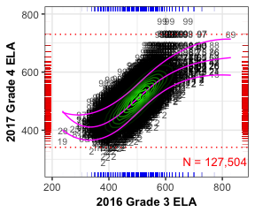 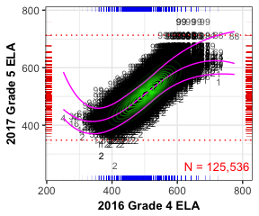 


##### `r figCapNo("Conditional distribution(s) of current and prior scale scores: ELA <em>Continued</em>.")`
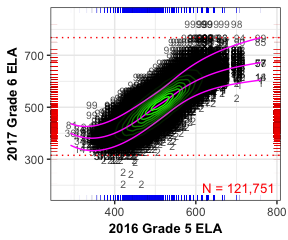 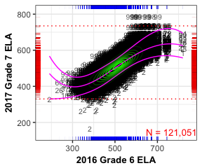 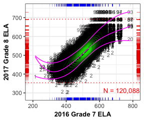

<!-- LaTeX_Start 
\begin{figure}[H]
\caption*{\label{fig:condDistELA} {\bf{Fig. C.1:}} Conditional distribution(s) of current and prior scale scores: ELA.}
  \begin{subfigure}[b]{0.5\textwidth}
    \includegraphics[width=\textwidth]{../img/Appendices/Appendix_C_2017/condDist_EOG-1.png}
  \end{subfigure}
  \begin{subfigure}[b]{0.5\textwidth}
    \includegraphics[width=\textwidth]{../img/Appendices/Appendix_C_2017/condDist_EOG-2.png}
  \end{subfigure}
\end{figure}

\pagebreak

\begin{figure}[H]
\caption*{\label{fig:condDistELA2} {\bf{Fig. C.2:}} Conditional distribution(s) of current and prior scale scores: ELA \textit{Continued}.}
  \begin{subfigure}[b]{0.5\textwidth}
    \includegraphics[width=\textwidth]{../img/Appendices/Appendix_C_2017/condDist_EOG-3.png}
  \end{subfigure}
  \begin{subfigure}[b]{0.5\textwidth}
    \includegraphics[width=\textwidth]{../img/Appendices/Appendix_C_2017/condDist_EOG-4.png}
  \end{subfigure}
  %
  \begin{subfigure}[b]{0.5\textwidth}
    \includegraphics[width=\textwidth]{../img/Appendices/Appendix_C_2017/condDist_EOG-5.png}
  \end{subfigure}
\end{figure}

\pagebreak
LaTeX_End -->


<!-- HTML_Start -->
##### `r figCapNo("Conditional distribution(s) of current and prior scale scores: Mathematics.")`
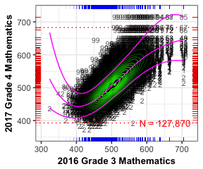 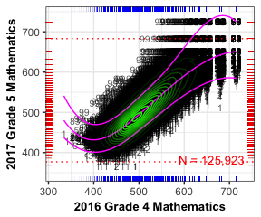 
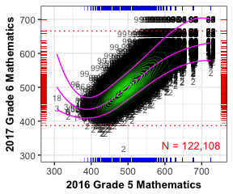 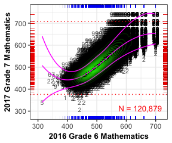 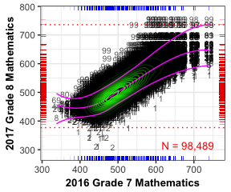

<!-- LaTeX_Start 
\begin{figure}[H]
\caption*{\label{fig:condDistMath} {\bf{Fig. C.3:}} Conditional distribution(s) of current and prior scale scores: Mathematics.}
  \begin{subfigure}[b]{0.5\textwidth}
    \includegraphics[width=\textwidth]{../img/Appendices/Appendix_C_2017/condDist_EOG-6.png}
  \end{subfigure}
  \begin{subfigure}[b]{0.5\textwidth}
    \includegraphics[width=\textwidth]{../img/Appendices/Appendix_C_2017/condDist_EOG-7.png}
  \end{subfigure}
  %
  \begin{subfigure}[b]{0.5\textwidth}
    \includegraphics[width=\textwidth]{../img/Appendices/Appendix_C_2017/condDist_EOG-8.png}
  \end{subfigure}
  \begin{subfigure}[b]{0.5\textwidth}
    \includegraphics[width=\textwidth]{../img/Appendices/Appendix_C_2017/condDist_EOG-9.png}
  \end{subfigure}
  %
  \begin{subfigure}[b]{0.5\textwidth}
    \includegraphics[width=\textwidth]{../img/Appendices/Appendix_C_2017/condDist_EOG-10.png}
  \end{subfigure}
\end{figure}

\pagebreak
LaTeX_End -->


##  End-of-Course Test Subjects

The conditional density plots for the EOC test subjects are displayed below.  The most recent prior is used in each plot to provide insight on the academic peer group based analyses.  Some of these norm groups represent atypical student populations (e.g. course repeaters and skipped-year progressions), which can also cause ceiling effects for different reasons.

Take, for example, the middle-right plot in Figure C.8 below for Algebra I course repeaters, particularly the data point in the upper-right hand corner of the plot.  Here we see that the overall population is low achieving (as would be expected for students retaking the test) but there are seven students that attained the HOSS (785) in 2017.  One of them also had a perfect score in 2016 and has received an unexpectedly low SGP of 14.  Given the sparsity of data points in the high achievement regions, the SGP model has struggled to produce appropriate growth estimates.  Several other individual plots in other subjects also display a similar indicators.^[Note the repeater progressions and progressions with one or more skipped year between current and prior years.]

```{r, echo=FALSE, include=FALSE, cache=TRUE, condDist_EOC, fig.height=2.5, fig.width=3}
# table(long.data[YEAR==current.year & CONTENT_AREA=="GRADE_9_LIT", Most_Recent_Prior])

	condDistPlot(ca="GRADE_9_LIT", g="EOC", prior.ca="2016/ELA_7")
	condDistPlot(ca="GRADE_9_LIT", g="EOC", prior.ca="2016/ELA_8")
	condDistPlot(ca="GRADE_9_LIT", g="EOC", prior.ca="2016/GRADE_9_LIT_EOCT")
	condDistPlot(ca="GRADE_9_LIT", g="EOC", prior.ca="2017/GRADE_9_LIT_EOCT")

	condDistPlot(ca="AMERICAN_LIT", g="EOC", prior.ca="2014/GRADE_9_LIT_EOCT")
	condDistPlot(ca="AMERICAN_LIT", g="EOC", prior.ca="2015/GRADE_9_LIT_EOCT")
	condDistPlot(ca="AMERICAN_LIT", g="EOC", prior.ca="2016/GRADE_9_LIT_EOCT")
	condDistPlot(ca="AMERICAN_LIT", g="EOC", prior.ca="2016/AMERICAN_LIT_EOCT")
	condDistPlot(ca="AMERICAN_LIT", g="EOC", prior.ca="2017/AMERICAN_LIT_EOCT")
	# max.data[CONTENT_AREA %in% "AMERICAN_LIT" & SCALE_SCORE==HOSS_1 & Most_Recent_Prior=="2016/AMERICAN_LIT_EOCT"]

	condDistPlot(ca="COORDINATE_ALGEBRA", g="EOC", prior.ca="2016/MATHEMATICS_7")
	condDistPlot(ca="COORDINATE_ALGEBRA", g="EOC", prior.ca="2015/MATHEMATICS_8")
	condDistPlot(ca="COORDINATE_ALGEBRA", g="EOC", prior.ca="2016/MATHEMATICS_8")
	condDistPlot(ca="COORDINATE_ALGEBRA", g="EOC", prior.ca="2016/COORDINATE_ALGEBRA_EOCT")

	condDistPlot(ca="ANALYTIC_GEOMETRY", g="EOC", prior.ca="2016/COORDINATE_ALGEBRA_EOCT")
	condDistPlot(ca="ANALYTIC_GEOMETRY", g="EOC", prior.ca="2016/ANALYTIC_GEOMETRY_EOCT")

	condDistPlot(ca="ALGEBRA_I", g="EOC", prior.ca="2016/MATHEMATICS_7")
	condDistPlot(ca="ALGEBRA_I", g="EOC", prior.ca="2015/MATHEMATICS_8")
	condDistPlot(ca="ALGEBRA_I", g="EOC", prior.ca="2016/MATHEMATICS_8")
	condDistPlot(ca="ALGEBRA_I", g="EOC", prior.ca="2016/ALGEBRA_I_EOCT")
	condDistPlot(ca="ALGEBRA_I", g="EOC", prior.ca="2017/ALGEBRA_I_EOCT")
	# max.data[CONTENT_AREA %in% "ALGEBRA_I" & SCALE_SCORE==HOSS_1 & Most_Recent_Prior=="2016/ALGEBRA_I_EOCT"]

	condDistPlot(ca="GEOMETRY", g="EOC", prior.ca="2016/ALGEBRA_I_EOCT")
	condDistPlot(ca="GEOMETRY", g="EOC", prior.ca="2017/ALGEBRA_I_EOCT")
	condDistPlot(ca="GEOMETRY", g="EOC", prior.ca="2016/GEOMETRY_EOCT")
	condDistPlot(ca="GEOMETRY", g="EOC", prior.ca="2017/GEOMETRY_EOCT")
```


<!-- HTML_Start -->
##### `r figCapNo("Conditional distribution(s) of current and prior scale scores: 9<sup>th</sup> Grade Lit.")`
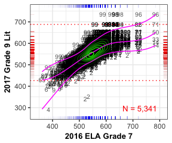 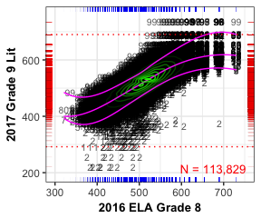 
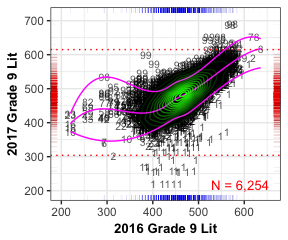 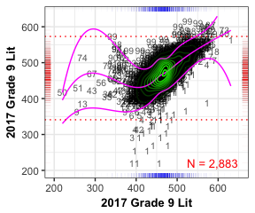

<!-- LaTeX_Start 
\begin{figure}[H]
\caption*{\label{fig:condDistG9L} {\bf{Fig. C.4:}} Conditional distribution(s) of current and prior scale scores: 9<sup>th</sup> Grade Lit.}
  \begin{subfigure}[b]{0.5\textwidth}
    \includegraphics[width=\textwidth]{../img/Appendices/Appendix_C_2017/condDist_EOC-1.png}
  \end{subfigure}
  \begin{subfigure}[b]{0.5\textwidth}
    \includegraphics[width=\textwidth]{../img/Appendices/Appendix_C_2017/condDist_EOC-2.png}
  \end{subfigure}
  %
  \begin{subfigure}[b]{0.5\textwidth}
    \includegraphics[width=\textwidth]{../img/Appendices/Appendix_C_2017/condDist_EOC-3.png}
  \end{subfigure}
  \begin{subfigure}[b]{0.5\textwidth}
    \includegraphics[width=\textwidth]{../img/Appendices/Appendix_C_2017/condDist_EOC-4.png}
  \end{subfigure}
\end{figure}

\pagebreak
LaTeX_End -->


<!-- HTML_Start -->
##### `r figCapNo("Conditional distribution(s) of current and prior scale scores: American Lit.")`
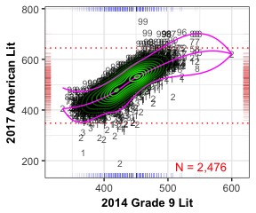 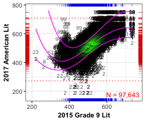 
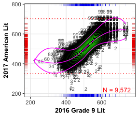 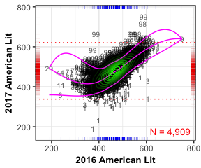
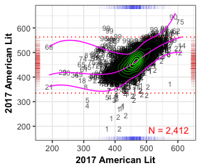

<!-- LaTeX_Start 
\begin{figure}[H]
\caption*{\label{fig:condDistAmLit} {\bf{Fig. C.5:}} Conditional distribution(s) of current and prior scale scores: American Lit.}
  \begin{subfigure}[b]{0.5\textwidth}
    \includegraphics[width=\textwidth]{../img/Appendices/Appendix_C_2017/condDist_EOC-5.png}
  \end{subfigure}
  \begin{subfigure}[b]{0.5\textwidth}
    \includegraphics[width=\textwidth]{../img/Appendices/Appendix_C_2017/condDist_EOC-6.png}
  \end{subfigure}
  %
  \begin{subfigure}[b]{0.5\textwidth}
    \includegraphics[width=\textwidth]{../img/Appendices/Appendix_C_2017/condDist_EOC-7.png}
  \end{subfigure}
  \begin{subfigure}[b]{0.5\textwidth}
    \includegraphics[width=\textwidth]{../img/Appendices/Appendix_C_2017/condDist_EOC-8.png}
  \end{subfigure}
  %
  \begin{subfigure}[b]{0.5\textwidth}
    \includegraphics[width=\textwidth]{../img/Appendices/Appendix_C_2017/condDist_EOC-9.png}
  \end{subfigure}
\end{figure}

\pagebreak
LaTeX_End -->


<!-- HTML_Start -->
##### `r figCapNo("Conditional distribution(s) of current and prior scale scores: Coordinate Algebra.")`
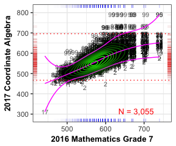 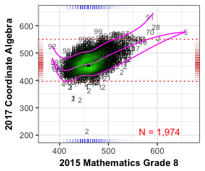 
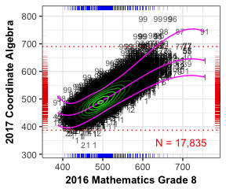 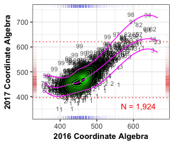

<!-- LaTeX_Start 
\begin{figure}[H]
\caption*{\label{fig:condDistCAlg} {\bf{Fig. C.6:}} Conditional distribution(s) of current and prior scale scores: Coordinate Algebra.}
  \begin{subfigure}[b]{0.5\textwidth}
    \includegraphics[width=\textwidth]{../img/Appendices/Appendix_C_2017/condDist_EOC-10.png}
  \end{subfigure}
  \begin{subfigure}[b]{0.5\textwidth}
    \includegraphics[width=\textwidth]{../img/Appendices/Appendix_C_2017/condDist_EOC-11.png}
  \end{subfigure}
  %
  \begin{subfigure}[b]{0.5\textwidth}
    \includegraphics[width=\textwidth]{../img/Appendices/Appendix_C_2017/condDist_EOC-12.png}
  \end{subfigure}
  \begin{subfigure}[b]{0.5\textwidth}
    \includegraphics[width=\textwidth]{../img/Appendices/Appendix_C_2017/condDist_EOC-13.png}
  \end{subfigure}
\end{figure}

\pagebreak
LaTeX_End -->


<!-- HTML_Start -->
##### `r figCapNo("Conditional distribution(s) of current and prior scale scores: Analytic Geometry.")`
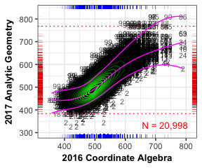 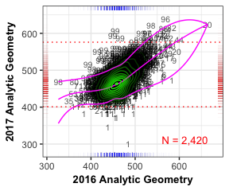 

<!-- LaTeX_Start 
\begin{figure}[H]
\caption*{\label{fig:condDistGeom} {\bf{Fig. C.7:}} Conditional distribution(s) of current and prior scale scores: Analytic Geometry.}
  \begin{subfigure}[b]{0.5\textwidth}
    \includegraphics[width=\textwidth]{../img/Appendices/Appendix_C_2017/condDist_EOC-14.png}
  \end{subfigure}
  \begin{subfigure}[b]{0.5\textwidth}
    \includegraphics[width=\textwidth]{../img/Appendices/Appendix_C_2017/condDist_EOC-15.png}
  \end{subfigure}
\end{figure}

\pagebreak
LaTeX_End -->


<!-- HTML_Start -->
##### `r figCapNo("Conditional distribution(s) of current and prior scale scores: Algebra I.")`
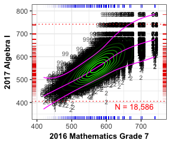 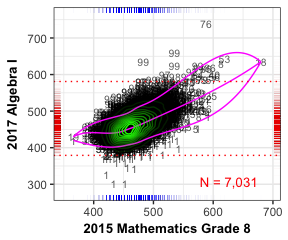 
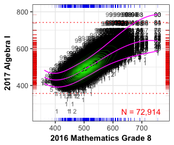 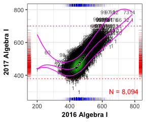 
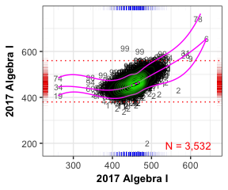 

<!-- LaTeX_Start 
\begin{figure}[H]
\caption*{\label{fig:condDistCAlg} {\bf{Fig. C.8:}} Conditional distribution(s) of current and prior scale scores: Algebra I.}
  \begin{subfigure}[b]{0.5\textwidth}
    \includegraphics[width=\textwidth]{../img/Appendices/Appendix_C_2017/condDist_EOC-16.png}
  \end{subfigure}
  \begin{subfigure}[b]{0.5\textwidth}
    \includegraphics[width=\textwidth]{../img/Appendices/Appendix_C_2017/condDist_EOC-17.png}
  \end{subfigure}
  %
  \begin{subfigure}[b]{0.5\textwidth}
    \includegraphics[width=\textwidth]{../img/Appendices/Appendix_C_2017/condDist_EOC-18.png}
  \end{subfigure}
  \begin{subfigure}[b]{0.5\textwidth}
    \includegraphics[width=\textwidth]{../img/Appendices/Appendix_C_2017/condDist_EOC-19.png}
  \end{subfigure}
  %
  \begin{subfigure}[b]{0.5\textwidth}
    \includegraphics[width=\textwidth]{../img/Appendices/Appendix_C_2017/condDist_EOC-20.png}
  \end{subfigure}
\end{figure}

LaTeX_End -->


<!-- HTML_Start -->
##### `r figCapNo("Conditional distribution(s) of current and prior scale scores: Geometry.")`
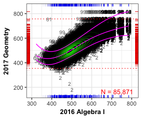 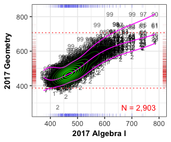
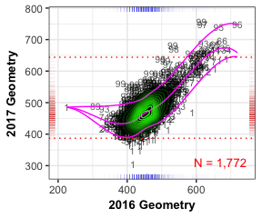 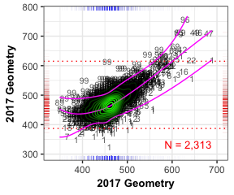

<!-- LaTeX_Start 
\begin{figure}[H]
\caption*{\label{fig:condDistGeom} {\bf{Fig. C.9:}} Conditional distribution(s) of current and prior scale scores: Geometry.}
  \begin{subfigure}[b]{0.5\textwidth}
    \includegraphics[width=\textwidth]{../img/Appendices/Appendix_C_2017/condDist_EOC-21.png}
  \end{subfigure}
  \begin{subfigure}[b]{0.5\textwidth}
    \includegraphics[width=\textwidth]{../img/Appendices/Appendix_C_2017/condDist_EOC-22.png}
  \end{subfigure}
  %
  \begin{subfigure}[b]{0.5\textwidth}
    \includegraphics[width=\textwidth]{../img/Appendices/Appendix_C_2017/condDist_EOC-23.png}
  \end{subfigure}
  \begin{subfigure}[b]{0.5\textwidth}
    \includegraphics[width=\textwidth]{../img/Appendices/Appendix_C_2017/condDist_EOC-24.png}
  \end{subfigure}
\end{figure}

\pagebreak
LaTeX_End -->

# SGP Ranges for the Highest and Lowest Achieving Students

In order to isolate the impact of assessment ceilings/floors on student growth percentile (SGP) calculations, the following section provides box plots of the distribution of SGPs for the highest and lowest achieving students.  We are specifically interested in the growth percentiles for students scoring at the highest/lowest obtainable scale score (HOSS/LOSS - i.e. the test ceiling/floor) on the current year test.  However, in order to assure that an adequate number of students are included, the first set of plots uses, at a *minimum*, the highest/lowest 25 scores.  These plots are provided as a starting point since this roughly corresponds to the number of students in the top and bottom rows of the table included in the SGP model goodness of fit plots.  All students with a score in these students' range of scores are included.  Consequently, the number of students in each box plot may be greater than 25 (the exact number is shown at the margins in red text).

The second set of box plots isolate ***only*** those students scoring the HOSS/LOSS.  These plots may then incorporate a varying number of students depending on the prevalence of a ceiling/floor in the current year.  The Ranked SIMEX measurement error corrected SGP is Georgia's official growth metric, and these values are used exclusively in this report.

The box plots provide several descriptive statistics.  The dark line within the box marks the *median* SGP, while the ends ("hinges") of the boxes correspond to the first and third quartiles (the 25<sup>th</sup> and 75<sup>th</sup> percentiles).  The upper whisker extends from the hinge to the highest value that is within 1.5 $\times$ IQR of the hinge, where IQR is the inter-quartile range, or distance between the first and third quartiles. The lower whisker extends from the hinge to the lowest value within 1.5 $\times$ IQR of the hinge. Data beyond the end of the whiskers are outliers and plotted as individual points.  Evidence of a *lack* of either a ceiling or floor effect would be to have all high achieving students with SGPs near 99 and all low achieving students with SGPs near 1.  That is, the desired visual evidence is a solid line at SGP = 99/1.


```{r, echo=FALSE, include=FALSE, cache=TRUE, HOSS_Box_EOG, fig.height=4, fig.width=7}
	min.ceiling<-min(max.data[CONTENT_AREA %in% GL_subjects]$SGP)-5
	boxPlot(tmp.data=max.data[CONTENT_AREA %in% GL_subjects], min.ceiling, facet="Grade")
	boxPlot(tmp.data=max.data[CONTENT_AREA %in% GL_subjects & SCALE_SCORE==HOSS_1], min.ceiling+5, facet="Grade")
```

```{r, echo=FALSE, include=FALSE, cache=TRUE, LOSS_Box_EOG, fig.height=4, fig.width=7}
	max.floor <- max(min.data[CONTENT_AREA %in% GL_subjects]$SGP)
	boxPlot(tmp.data=min.data[CONTENT_AREA %in% GL_subjects], max.floor+4, LOSS=TRUE, facet="Grade")
	boxPlot(tmp.data=min.data[CONTENT_AREA %in% GL_subjects & SCALE_SCORE==LOSS_1], max.floor, LOSS=TRUE, facet="Grade")
```

## EOG Content Areas

The scatter plots in the previous section showed that it is far more typical for students to score the HOSS on the Mathematics assessment than in ELA, and this translates into a moderate ceiling effect in Mathematics.  Three of the five grade-level analyses return SGPs in the 70s to 80s as shown in Figure C. 11.  As of 2016 the Georgia Department of Education has decided to award students scoring the HOSS an SGP of 99 regardless of their SGP model estimate to address these issues, therefore these students' low SGP estimates will ultimately not present an issue.

<!-- HTML_Start -->
##### `r figCapNo("EOG SGP distributions for highest and lowest 25+ scale scores by content area and grade level.")`
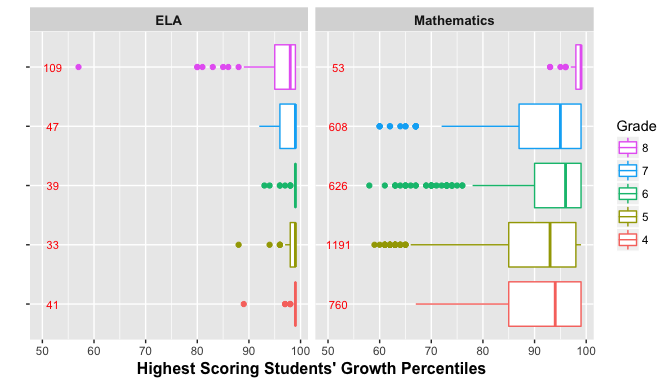 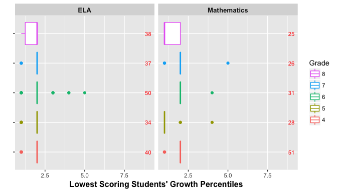


##### `r figCapNo("EOG SGP distributions for the HOSS and LOSS scores by content area and grade level.")`
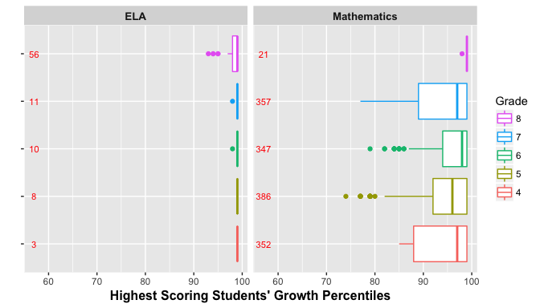 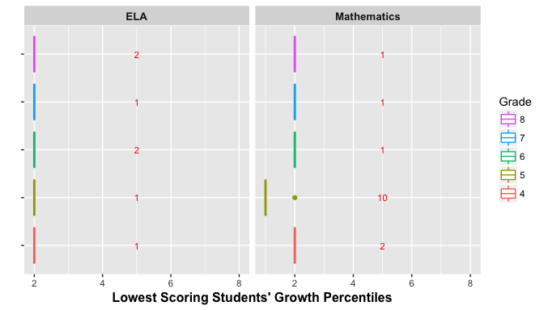

<!-- LaTeX_Start 
\begin{figure}[H]
\caption*{\label{fig:boxPlotEOG} {\bf{Fig. C.10:}} SGP distributions for highest and lowest 25+ scale scores by content area and grade level.}
  \begin{subfigure}[b]{0.9\textwidth}
    \includegraphics[width=\textwidth]{../img/Appendices/Appendix_C_2017/HOSS_Box_EOG-1.png}
  \end{subfigure}
  \begin{subfigure}[b]{0.9\textwidth}
    \includegraphics[width=\textwidth]{../img/Appendices/Appendix_C_2017/LOSS_Box_EOG-1.png}
  \end{subfigure}
\end{figure}

\begin{figure}[H]
\caption*{\label{fig:boxPlotEOG2} {\bf{Fig. C.11:}} SGP distributions for the HOSS and LOSS scores by content area and grade level.}
  \begin{subfigure}[b]{\textwidth}
    \includegraphics[width=\textwidth]{../img/Appendices/Appendix_C_2017/HOSS_Box_EOG-2.png}
  \end{subfigure}
  \begin{subfigure}[b]{\textwidth}
    \includegraphics[width=\textwidth]{../img/Appendices/Appendix_C_2017/LOSS_Box_EOG-2.png}
  \end{subfigure}
\end{figure}

\pagebreak
LaTeX_End -->

## EOC Subjects

The end-of-course subject results are shown here *only for students scoring exactly the HOSS and LOSS* respectively.  There are several subjects for which potential ceiling effects are evident.  All EOC subjects are disaggregated further by the most recent prior test included in each analyses in order to adequately address any concerns.

```{r, echo=FALSE, include=FALSE, cache=TRUE, HOSS_Box_EOC, fig.height=4, fig.width=7}
	min.ceiling<-min(max.data[CONTENT_AREA %in% EOC_subjects]$SGP)
	# boxPlot(tmp.data=max.data[CONTENT_AREA %in% EOC_subjects], min.ceiling)

	boxPlot(tmp.data=max.data[CONTENT_AREA %in% EOC_subjects & SCALE_SCORE==HOSS_1], min.ceiling)
	# boxPlot(tmp.data=max.data[CONTENT_AREA %in% "ANALYTIC_GEOMETRY"], min.ceiling , facet="Most_Recent_Prior")
	boxPlot(tmp.data=max.data[CONTENT_AREA %in% "GRADE_9_LIT" & SCALE_SCORE==HOSS_1], min.ceiling, facet="Most_Recent_Prior")
	boxPlot(tmp.data=max.data[CONTENT_AREA %in% "AMERICAN_LIT" & SCALE_SCORE==HOSS_1], min.ceiling, facet="Most_Recent_Prior")
	boxPlot(tmp.data=max.data[CONTENT_AREA %in% "COORDINATE_ALGEBRA" & SCALE_SCORE==HOSS_1], min.ceiling, facet="Most_Recent_Prior")
	boxPlot(tmp.data=max.data[CONTENT_AREA %in% "ANALYTIC_GEOMETRY" & SCALE_SCORE==HOSS_1], min.ceiling, facet="Most_Recent_Prior")
	boxPlot(tmp.data=max.data[CONTENT_AREA %in% "ALGEBRA_I" & SCALE_SCORE==HOSS_1], min.ceiling, facet="Most_Recent_Prior")
	boxPlot(tmp.data=max.data[CONTENT_AREA %in% "GEOMETRY" & SCALE_SCORE==HOSS_1], min.ceiling, facet="Most_Recent_Prior")
		
	# max.data[CONTENT_AREA %in% "COORDINATE_ALGEBRA" & SCALE_SCORE==HOSS_1 & Most_Recent_Prior=="2016/COORDINATE_ALGEBRA_EOC"] # 2 interesting cases
	# max.data[CONTENT_AREA %in% "BIOLOGY" & SCALE_SCORE==HOSS_1 & Most_Recent_Prior=="2016/BIOLOGY_EOC"]
		
```
```{r, echo=FALSE, include=FALSE, cache=TRUE, LOSS_Box_EOC, fig.height=4, fig.width=7}
	max.floor <- max(min.data[CONTENT_AREA %in% EOC_subjects]$SGP)
	# boxPlot(tmp.data=min.data[CONTENT_AREA %in% EOC_subjects], max.floor +4, LOSS=TRUE)
	boxPlot(tmp.data=min.data[CONTENT_AREA %in% EOC_subjects & SCALE_SCORE==LOSS_1], max.floor, LOSS=TRUE)
	
	boxPlot(tmp.data=min.data[CONTENT_AREA %in% "GRADE_9_LIT" & SCALE_SCORE==LOSS_1], max.floor, LOSS=TRUE, facet="Most_Recent_Prior")
	boxPlot(tmp.data=min.data[CONTENT_AREA %in% "AMERICAN_LIT" & SCALE_SCORE==LOSS_1], max.floor, LOSS=TRUE, facet="Most_Recent_Prior")
	boxPlot(tmp.data=min.data[CONTENT_AREA %in% "COORDINATE_ALGEBRA" & SCALE_SCORE==LOSS_1], max.floor, LOSS=TRUE, facet="Most_Recent_Prior")
	boxPlot(tmp.data=min.data[CONTENT_AREA %in% "ANALYTIC_GEOMETRY" & SCALE_SCORE==LOSS_1], max.floor, LOSS=TRUE, facet="Most_Recent_Prior")
	boxPlot(tmp.data=min.data[CONTENT_AREA %in% "ALGEBRA_I" & SCALE_SCORE==LOSS_1], max.floor, LOSS=TRUE, facet="Most_Recent_Prior")
	boxPlot(tmp.data=min.data[CONTENT_AREA %in% "GEOMETRY" & SCALE_SCORE==LOSS_1], max.floor, LOSS=TRUE, facet="Most_Recent_Prior")
	
```

<!-- HTML_Start -->

##### `r figCapNo("EOC SGP distributions for the HOSS and LOSS scores by content area.")`
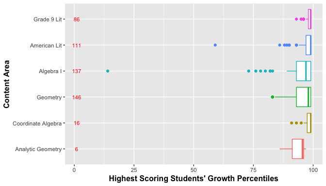

<!-- LaTeX_Start 
\begin{figure}[H]
\caption*{\label{fig:Bidensity} {\bf{Fig. C.12:}} EOC SGP distributions for the HOSS and LOSS scores by content area.}
  \begin{subfigure}[b]{0.95\textwidth}
    \includegraphics[width=\textwidth]{../img/Appendices/Appendix_C_2017/HOSS_Box_EOC-1.png}
  \end{subfigure}
  \begin{subfigure}[b]{0.95\textwidth}
    \includegraphics[width=\textwidth]{../img/Appendices/Appendix_C_2017/LOSS_Box_EOC-1.png}
  \end{subfigure}
\end{figure}

\pagebreak
LaTeX_End -->

The EOC subject box plots can be disaggregated further by the most recent prior to reflect their constituent norm groups more closely.  The following box plots disaggregate each EOC subject by norm groups.  A pattern emerges in these plots suggesting that the course repeater and those that included skipped years have potentially problematic SGP estimates for a handful of students.

<!-- HTML_Start -->
##### `r figCapNo("EOC SGP distributions for the HOSS and LOSS scores by norm group: 9<sup>th</sup> Grade Literature.")`
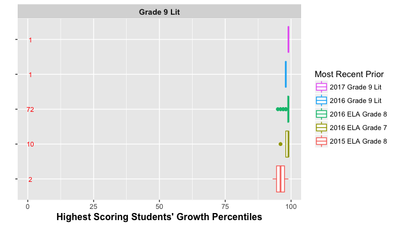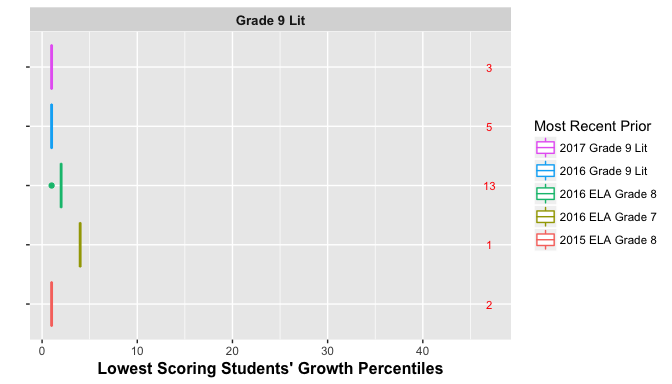

<!-- LaTeX_Start 
\begin{figure}[H]
\caption*{\label{fig:bpG9L} {\bf{Fig. C.13:}} EOC SGP distributions for the HOSS and LOSS scores by norm group: 9<sup>th</sup> Grade Lit.}
  \begin{subfigure}[b]{0.93\textwidth}
    \includegraphics[width=\textwidth]{../img/Appendices/Appendix_C_2017/HOSS_Box_EOC-2.png}
  \end{subfigure}
  \begin{subfigure}[b]{0.93\textwidth}
    \includegraphics[width=\textwidth]{../img/Appendices/Appendix_C_2017/LOSS_Box_EOC-2.png}
  \end{subfigure}
\end{figure}

\pagebreak
LaTeX_End -->


<!-- HTML_Start -->
##### `r figCapNo("EOC SGP distributions for the HOSS and LOSS scores by norm group: American Lit.")`
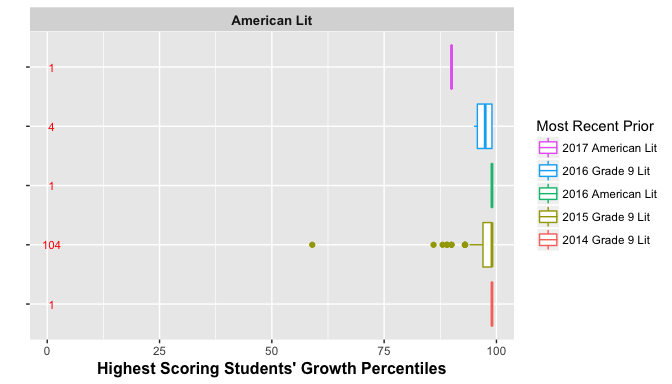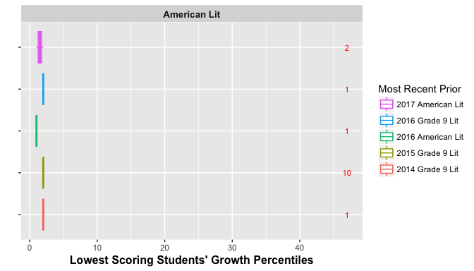

<!-- LaTeX_Start 
\begin{figure}[H]
\caption*{\label{fig:bpAML} {\bf{Fig. C.14:}} EOC SGP distributions for the HOSS and LOSS scores by norm group: American Lit.}
  \begin{subfigure}[b]{\textwidth}
    \includegraphics[width=\textwidth]{../img/Appendices/Appendix_C_2017/HOSS_Box_EOC-3.png}
  \end{subfigure}
  \begin{subfigure}[b]{\textwidth}
    \includegraphics[width=\textwidth]{../img/Appendices/Appendix_C_2017/LOSS_Box_EOC-3.png}
  \end{subfigure}
\end{figure}

\pagebreak
LaTeX_End -->

<!-- HTML_Start -->
<!-- LaTeX_Start 
\clearpage 
LaTeX_End -->


<!-- HTML_Start -->

##### `r figCapNo("EOC SGP distributions for the HOSS and LOSS scores by norm group: Coordinate Algebra.")`
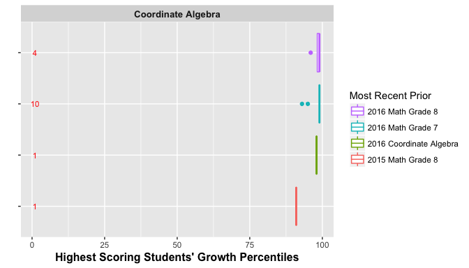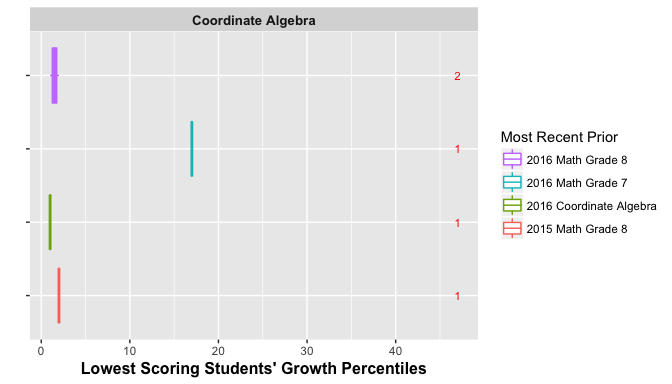

<!-- LaTeX_Start 
\begin{figure}[H]
\caption*{\label{fig:bpCA} {\bf{Fig. C.15:}} EOC SGP distributions for the HOSS and LOSS scores by norm group: Coordinate Algebra.}
  \begin{subfigure}[b]{\textwidth}
    \includegraphics[width=\textwidth]{../img/Appendices/Appendix_C_2017/HOSS_Box_EOC-4.png}
  \end{subfigure}
  \begin{subfigure}[b]{\textwidth}
    \includegraphics[width=\textwidth]{../img/Appendices/Appendix_C_2017/LOSS_Box_EOC-4.png}
  \end{subfigure}
\end{figure}

\pagebreak
LaTeX_End -->


The plots for the Analytic Geometry course repeater progression is notable.  This progression can also be seen in last plot of Figure C.14 above.  Here the student who scored the HOSS consecutively has an unexpectedly low SGP of 28.  Another student of interest in in this analysis scored the HOSS in 2016, and slightly lower in 2017.  This student's SGP was estimated to be 2.  In both cases this is probably an inaccurate assessment of the students' growth since they have attained perfect or near perfect scores two years in a row.  These students are outliers in the data and it is not surprising that the SGP estimates of their growth are questionable.

<!-- HTML_Start -->

##### `r figCapNo("EOC SGP distributions for the HOSS and LOSS scores by norm group: Analytic Geometry.")`
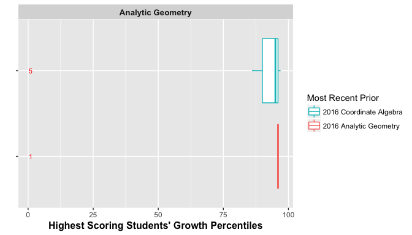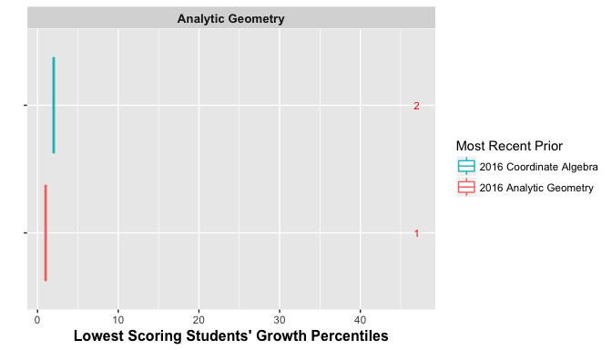

<!-- LaTeX_Start 
\begin{figure}[H]
\caption*{\label{fig:bpAG} {\bf{Fig. C.16:}} EOC SGP distributions for the HOSS and LOSS scores by norm group: Analytic Geometry.}
  \begin{subfigure}[b]{0.9\textwidth}
    \includegraphics[width=\textwidth]{../img/Appendices/Appendix_C_2017/HOSS_Box_EOC-5.png}
  \end{subfigure}
  \begin{subfigure}[b]{0.9\textwidth}
    \includegraphics[width=\textwidth]{../img/Appendices/Appendix_C_2017/LOSS_Box_EOC-5.png}
  \end{subfigure}
\end{figure}

\pagebreak
LaTeX_End -->

The Algebra I analysis using 7<sup>th</sup> Grade Math priors shows some minor ceiling issues.  This is most likely due to the relatively high number of students attaining the HOSS in both years, which deflates the SGPs of the students with higher prior math scores.  Although not as high as the ideal, these students' SGPs are all on the higher end of the spectrum (above 70).
<!-- HTML_Start -->

##### `r figCapNo("EOC SGP distributions for the HOSS and LOSS scores by norm group: Algebra I.")`
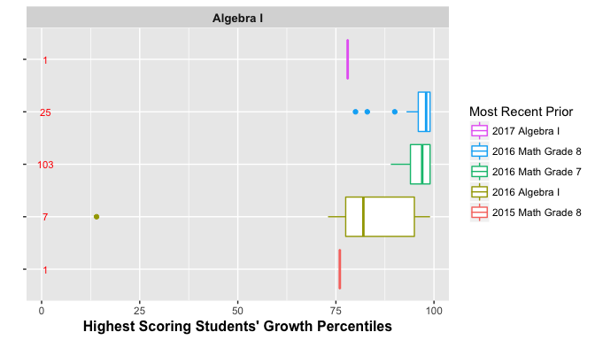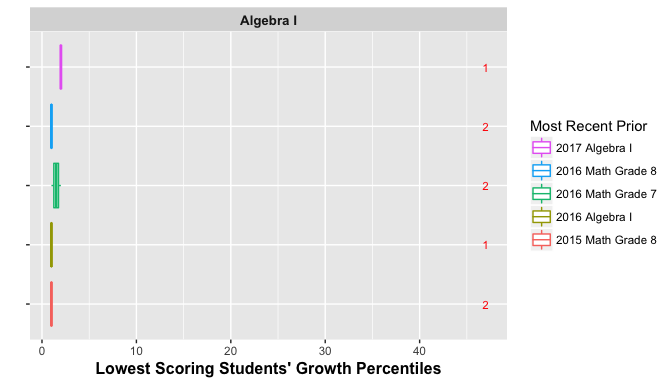

<!-- LaTeX_Start 
\begin{figure}[H]
\caption*{\label{fig:bpAI} {\bf{Fig. C.17:}} EOC SGP distributions for the HOSS and LOSS scores by norm group: Algebra I.}
  \begin{subfigure}[b]{0.93\textwidth}
    \includegraphics[width=\textwidth]{../img/Appendices/Appendix_C_2017/HOSS_Box_EOC-6.png}
  \end{subfigure}
  \begin{subfigure}[b]{0.93\textwidth}
    \includegraphics[width=\textwidth]{../img/Appendices/Appendix_C_2017/LOSS_Box_EOC-6.png}
  \end{subfigure}
\end{figure}

\pagebreak
LaTeX_End -->


<!-- HTML_Start -->

##### `r figCapNo("EOC SGP distributions for the HOSS and LOSS scores by norm group: Geometry.")`
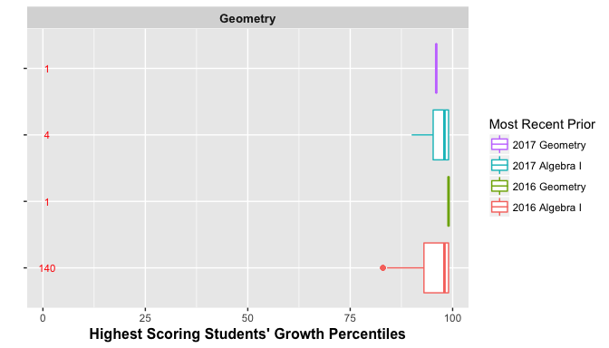

<!-- LaTeX_Start 
\begin{figure}[H]
\caption*{\label{fig:bpGeom} {\bf{Fig. C.18:}} EOC SGP distributions for the HOSS and LOSS scores by norm group:  Geometry.}
  \begin{subfigure}[b]{\textwidth}
    \includegraphics[width=\textwidth]{../img/Appendices/Appendix_C_2017/HOSS_Box_EOC-7.png}
  \end{subfigure}
  \begin{subfigure}[b]{\textwidth}
    \includegraphics[width=\textwidth]{../img/Appendices/Appendix_C_2017/LOSS_Box_EOC-7.png}
  \end{subfigure}
\end{figure}

\pagebreak
LaTeX_End -->

#  Discussion

Overall there is little evidence of floor or ceiling effects in the 2017 Georgia Milestones SGP analyses.  Some scores for EOC test repeaters and skip year progressions suggest that a small number of minor problems may exist that could require changes.  When ceiling or floor effects are encountered, there are several ways in which they can be "corrected" manually or analytically.  These include (but not limited to):

1. Convert all students scoring at the HOSS (LOSS) to 99 (1).
2. Run SGP analyses with more granular scores.  For example, many tests that use Item Response Theory (IRT) to analyse test results provide scaled scores that enforce an artificial ceiling (floor), but also have more granular achievement scores available (IRT $\theta$ estimates).
3. Leave the results without a correction.

